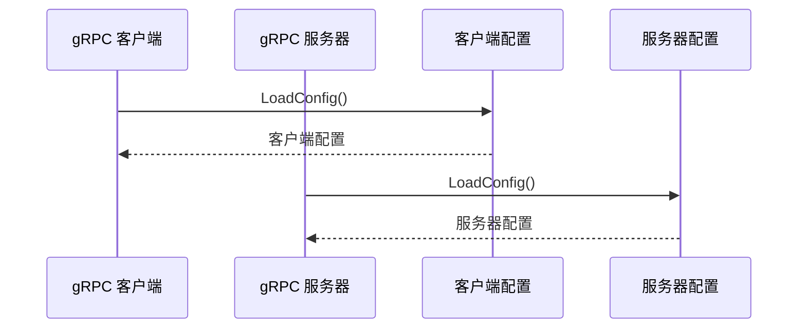

# 配置管理

<cite>
**本文档引用的文件**
- [cmd/grpcclient/config.go](file://cmd/grpcclient/config.go)
- [cmd/grpcclient/config.toml](file://cmd/grpcclient/config.toml)
- [cmd/grpcserver/config.go](file://cmd/grpcserver/config.go)
- [cmd/grpcserver/config.toml](file://cmd/grpcserver/config.toml)
- [utlsclient/utlshotconnpool.go](file://utlsclient/utlshotconnpool.go)
- [logger/logger.go](file://logger/logger.go)
- [logger/interfaces.go](file://logger/interfaces.go)
</cite>

## 更新摘要
**所做更改**
- 移除了原有的全局配置管理模块（config/config.go 和 config/config.toml）
- 更新了配置系统架构，现在采用模块化的配置管理方式
- 删除了连接池配置、IP池配置、GoogleEarth配置等原有配置项
- 重构了日志配置系统，简化为基础的日志级别配置
- 更新了配置文件示例和使用方法

## 目录
1. [简介](#简介)
2. [配置文件结构](#配置文件结构)
3. [配置加载机制](#配置加载机制)
4. [核心配置项详解](#核心配置项详解)
5. [日志配置系统](#日志配置系统)
6. [配置文件示例](#配置文件示例)
7. [配置访问和使用](#配置访问和使用)
8. [配置最佳实践](#配置最佳实践)
9. [常见配置错误排查](#常见配置错误排查)

## 简介

本项目采用模块化的配置管理架构，每个组件都有独立的配置文件和加载机制。配置系统主要包含以下特点：

- **模块化设计**：客户端和服务器分别拥有独立的配置系统
- **简洁高效**：专注于核心功能的配置，避免过度复杂的配置层次
- **类型安全**：使用Go结构体和TOML标签确保配置类型安全
- **易于维护**：每个模块的配置独立管理，便于维护和扩展

## 配置文件结构

### 配置层次架构


```mermaid
graph TD
A[gRPC 客户端配置] --> A1[协议配置]
A --> A2[服务器配置]
A --> A3[客户端配置]
A --> A4[任务配置]
A --> A5[日志配置]
B[gRPC 服务器配置] --> B1[协议配置]
B --> B2[TUIC 配置]
B --> B3[服务器配置]
B --> B4[域名监控配置]
B --> B5[日志配置]
B --> B6[连接池配置]
```

**图表来源**
- [cmd/grpcclient/config.go:11-27](file://cmd/grpcclient/config.go#L11-L27)
- [cmd/grpcserver/config.go:125-140](file://cmd/grpcserver/config.go#L125-L140)

### 配置文件位置

项目支持两种配置文件位置，按优先级顺序加载：

1. **客户端配置**：`cmd/grpcclient/config.toml`（高优先级）
2. **服务器配置**：`cmd/grpcserver/config.toml`（高优先级）
3. **默认路径**：`config.toml`（低优先级）

**章节来源**
- [cmd/grpcclient/config.go:130-147](file://cmd/grpcclient/config.go#L130-L147)
- [cmd/grpcserver/config.go:253-264](file://cmd/grpcserver/config.go#L253-L264)

## 配置加载机制

### 加载策略

配置加载采用独立加载策略，每个模块独立处理自己的配置：


```mermaid
sequenceDiagram
participant Client as gRPC 客户端
participant Server as gRPC 服务器
participant ClientCfg as 客户端配置
participant ServerCfg as 服务器配置
Client->>ClientCfg : LoadConfig()
ClientCfg-->>Client : 客户端配置
Server->>ServerCfg : LoadConfig()
ServerCfg-->>Server : 服务器配置
```

**图表来源**
- [cmd/grpcclient/config.go:115-148](file://cmd/grpcclient/config.go#L115-L148)
- [cmd/grpcserver/config.go:253-264](file://cmd/grpcserver/config.go#L253-L264)

### 配置解析过程

配置解析使用BurntSushi/toml库，支持以下特性：

- **类型映射**：自动将TOML值映射到Go结构体字段
- **标签验证**：通过TOML标签确保字段名称匹配
- **错误处理**：提供详细的解析错误信息
- **默认值处理**：未设置的配置项使用默认值

**章节来源**
- [cmd/grpcclient/config.go:115-148](file://cmd/grpcclient/config.go#L115-L148)
- [cmd/grpcserver/config.go:253-264](file://cmd/grpcserver/config.go#L253-L264)

## 核心配置项详解

### gRPC 客户端配置

gRPC客户端配置包含以下核心字段：

| 配置项 | 类型 | 默认值 | 说明 |
|--------|------|--------|------|
| protocol.type | string | "both" | 协议类型：grpc、tuic、both |
| server.tuic_address | string | "localhost:8443" | TUIC服务器地址 |
| server.grpc_address | string | "localhost:50051" | gRPC服务器地址 |
| server.insecure | bool | false | 是否使用非加密连接 |
| client.name | string | "client-1" | 客户端名称 |
| task.tilekey | string | "0" | 瓦片键 |
| task.epoch | int32 | 1029 | 主版本号 |
| task.tasktype | string | "q2" | 任务类型：q2、imagery、terrain |
| task.repeat | int | 100 | 重复请求次数 |
| task.concurrency | int | 100 | 并发请求数量 |
| logger.enable_debug | bool | true | 是否输出Debug日志 |
| logger.enable_info | bool | true | 是否输出Info日志 |
| logger.enable_warn | bool | true | 是否输出Warn日志 |
| logger.enable_error | bool | true | 是否输出Error日志 |

**章节来源**
- [cmd/grpcclient/config.go:12-106](file://cmd/grpcclient/config.go#L12-L106)
- [cmd/grpcclient/config.toml:1-100](file://cmd/grpcclient/config.toml#L1-L100)

### gRPC 服务器配置

gRPC服务器配置包含以下核心字段：

| 配置项 | 类型 | 默认值 | 说明 |
|--------|------|--------|------|
| protocol.type | string | "grpc" | 协议类型：grpc、tuic、both |
| tuic.enable | bool | false | 是否启用TUIC协议 |
| tuic.address | string | "0.0.0.0" | TUIC服务器监听地址 |
| tuic.port | string | "8443" | TUIC服务器监听端口 |
| server.address | string | "0.0.0.0" | gRPC服务器监听地址 |
| server.port | string | "50051" | gRPC服务器监听端口 |
| logger.enable_debug | bool | true | 是否输出Debug日志 |
| logger.enable_info | bool | true | 是否输出Info日志 |
| logger.enable_warn | bool | true | 是否输出Warn日志 |
| logger.enable_error | bool | true | 是否输出Error日志 |
| utlsclient.max_conns_per_host | int | 10 | 每个主机最大连接数 |
| utlsclient.pre_warm_interval | string | "5m" | 连接池预热间隔 |
| utlsclient.conn_timeout | string | "10s" | 连接超时时间 |

**章节来源**
- [cmd/grpcserver/config.go:125-243](file://cmd/grpcserver/config.go#L125-L243)
- [cmd/grpcserver/config.toml:1-194](file://cmd/grpcserver/config.toml#L1-L194)

## 日志配置系统

### 日志接口设计

项目采用接口驱动的日志系统，支持多种日志实现：

```mermaid
classDiagram
class Logger {
<<interface>>
+Debug(format string, args ...interface{})
+Info(format string, args ...interface{})
+Warn(format string, args ...interface{})
+Error(format string, args ...interface{})
}
class DefaultLogger {
+Debug(format string, args ...interface{})
+Info(format string, args ...interface{})
+Warn(format string, args ...interface{})
+Error(format string, args ...interface{})
}
class ConsoleLogger {
-debug bool
-info bool
-warn bool
-error bool
+Debug(format string, args ...interface{})
+Info(format string, args ...interface{})
+Warn(format string, args ...interface{})
+Error(format string, args ...interface{})
}
class FileLogger {
-file *os.File
-logger *log.Logger
-debug bool
-info bool
-warn bool
-error bool
+Debug(format string, args ...interface{})
+Info(format string, args ...interface{})
+Warn(format string, args ...interface{})
+Error(format string, args ...interface{})
+Close() error
}
class MultiLogger {
-loggers []Logger
+Debug(format string, args ...interface{})
+Info(format string, args ...interface{})
+Warn(format string, args ...interface{})
+Error(format string, args ...interface{})
}
Logger <|.. DefaultLogger
Logger <|.. ConsoleLogger
Logger <|.. FileLogger
Logger <|.. MultiLogger
```

**图表来源**
- [logger/interfaces.go:5-32](file://logger/interfaces.go#L5-L32)
- [logger/logger.go:44-133](file://logger/logger.go#L44-L133)

### 日志级别配置

| 级别 | 用途 | 输出内容 |
|------|------|----------|
| DEBUG | 调试信息 | 详细的执行流程和变量值 |
| INFO | 一般信息 | 关键操作和状态变化 |
| WARN | 警告信息 | 潜在问题但不影响运行 |
| ERROR | 错误信息 | 发生错误但可恢复 |

**章节来源**
- [logger/logger.go:39-42](file://logger/logger.go#L39-L42)

## 配置文件示例

### gRPC 客户端完整配置示例

```toml
# 协议配置
[protocol]
type = "both"

# 服务器配置
[server]
tuic_address = "localhost:8443"
grpc_address = "localhost:50051"
insecure = false
certs_dir = "certs"
uuid = ""
password = ""
nodes = []

# 客户端配置
[client]
name = "client-1"

# 任务配置
[task]
tilekey = "0"
epoch = 1029
tasktype = "q2"
repeat = 100
concurrency = 100

# 日志配置
[logger]
enable_debug = true
enable_info = true
enable_warn = true
enable_error = true
```

**章节来源**
- [cmd/grpcclient/config.toml:1-100](file://cmd/grpcclient/config.toml#L1-L100)

### gRPC 服务器完整配置示例

```toml
# 协议配置
[protocol]
type = "both"

# TUIC 配置
[tuic]
enable = true
address = "0.0.0.0"
port = "8443"
token = ""
uuid = "c1ab9efa-51c0-4e73-b72a-a00251789f8c"
password = "b63bb774-a968-4eb6-9b08-3463a4de2eb8"
congestion = "bbr"
tls_cert_path = ""
tls_key_path = ""

# 服务器配置
[server]
address = "0.0.0.0"
port = "50051"
node_version = "2.0.0"
bootstrap = ["172.93.47.57","107.182.186.123","65.49.192.85","65.49.195.185","65.49.194.100","66.112.211.45","45.78.5.252"]
certs_dir = "certs"

# 日志配置
[logger]
enable_debug = true
enable_info = true
enable_warn = true
enable_error = true

# UTLS 客户端连接池配置
[UtlsClient]
max_conns_per_host = 0
pre_warm_interval = "1h"
max_concurrent_pre_warms = 100
conn_timeout = "60s"
idle_timeout = "30m"
max_conn_lifetime = "100h"
health_check_interval = "10m"
ip_blacklist_timeout = "15m"
hot_connect_path = ""
hot_connect_method = ""
hot_connect_body = []
```

**章节来源**
- [cmd/grpcserver/config.toml:1-194](file://cmd/grpcserver/config.toml#L1-L194)

### 生产环境配置示例

#### gRPC 客户端生产配置

```toml
[protocol]
type = "grpc"

[server]
tuic_address = ""
grpc_address = "production-server:50051"
insecure = false

[task]
repeat = 10
concurrency = 10

[logger]
enable_debug = false
enable_info = true
enable_warn = true
enable_error = true
```

#### gRPC 服务器生产配置

```toml
[protocol]
type = "grpc"

[tuic]
enable = false

[server]
address = "0.0.0.0"
port = "50051"
certs_dir = "/etc/certs"

[logger]
enable_debug = false
enable_info = true
enable_warn = true
enable_error = true

[UtlsClient]
max_conns_per_host = 100
conn_timeout = "30s"
idle_timeout = "60m"
health_check_interval = "30m"
```

## 配置访问和使用

### 配置加载示例

#### gRPC 客户端配置加载

```go
// 加载客户端配置
config, err := LoadConfig("cmd/grpcclient/config.toml")
if err != nil {
    log.Fatalf("加载客户端配置失败: %v", err)
}

// 使用配置
fmt.Printf("服务器地址: %s\n", config.Server.GRPCAddress)
```

**章节来源**
- [cmd/grpcclient/config.go:115-148](file://cmd/grpcclient/config.go#L115-L148)

#### gRPC 服务器配置加载

```go
// 加载服务器配置
config, err := LoadConfig("")
if err != nil {
    log.Fatalf("加载服务器配置失败: %v", err)
}

// 使用配置
fmt.Printf("协议类型: %s\n", config.Protocol.Type)
```

**章节来源**
- [cmd/grpcserver/config.go:253-264](file://cmd/grpcserver/config.go#L253-L264)

### 配置验证

系统提供配置验证机制，确保配置的有效性：

```go
// 配置验证示例
func (c *Config) Validate() error {
    if c.Protocol.Type != "grpc" && c.Protocol.Type != "tuic" && c.Protocol.Type != "both" {
        return fmt.Errorf("无效的协议类型: %s", c.Protocol.Type)
    }
    
    if c.Task.RepeatCount < 0 {
        return fmt.Errorf("重复请求次数不能为负数")
    }
    
    return nil
}
```

**章节来源**
- [cmd/grpcclient/config.go:167-207](file://cmd/grpcclient/config.go#L167-L207)

## 配置最佳实践

### 环境配置策略

#### 1. 开发环境配置

```toml
# 开发环境配置
[protocol]
type = "both"

[server]
insecure = true

[logger]
enable_debug = true
enable_info = true
enable_warn = true
enable_error = true
```

#### 2. 测试环境配置

```toml
# 测试环境配置
[protocol]
type = "grpc"

[server]
insecure = false

[logger]
enable_debug = false
enable_info = true
enable_warn = true
enable_error = true
```

#### 3. 生产环境配置

```toml
# 生产环境配置
[protocol]
type = "grpc"

[server]
insecure = false

[logger]
enable_debug = false
enable_info = true
enable_warn = true
enable_error = true
```

### 配置文件权限

确保配置文件权限设置正确：

```bash
# 设置配置文件权限
chmod 600 cmd/grpcclient/config.toml
chmod 600 cmd/grpcserver/config.toml
chmod 600 config.toml
```

### 性能调优建议

#### 1. 连接池大小优化

根据实际负载调整连接池大小：

```go
// 根据CPU核心数和预期并发调整
cpuCores := runtime.NumCPU()
optimalConnections := cpuCores * 10

config.UtlsClient.MaxConnsPerHost = optimalConnections
```

#### 2. 超时时间设置

根据网络状况调整超时时间：

```go
// 根据网络延迟调整
networkLatency := measureNetworkLatency()
config.UtlsClient.ConnTimeout = fmt.Sprintf("%ds", int(networkLatency * 1.5))
```

#### 3. 日志级别调整

根据运行环境调整日志级别：

```go
// 生产环境关闭Debug日志
config.Logger.EnableDebug = false
config.Logger.EnableInfo = true
config.Logger.EnableWarn = true
config.Logger.EnableError = true
```

## 常见配置错误排查

### 配置文件解析错误

#### 错误现象
```
解析配置文件失败: toml: line 15: unexpected character: '!'
```

#### 排查步骤
1. 检查TOML语法是否正确
2. 确认引号使用是否匹配
3. 验证数值类型是否正确

#### 解决方案
```toml
# 错误：特殊字符未转义
description = "This is a test! Important."

# 正确：使用双引号
description = "This is a test! Important."
```

### 配置项类型错误

#### 错误现象
```
解析失败: cannot unmarshal string into Go struct field ProtocolConfig.type of type string
```

#### 排查步骤
1. 检查配置项的数据类型
2. 确认TOML值格式正确
3. 验证结构体标签匹配

#### 解决方案
```toml
# 错误：数值格式的字符串
type = 100

# 正确：字符串格式
type = "grpc"
```

### 配置验证失败

#### 错误现象
```
无效的协议类型: invalid (支持: grpc, tuic, both)
```

#### 排查步骤
1. 检查配置值是否符合约束条件
2. 确认配置项是否有默认值
3. 验证配置加载顺序

#### 解决方案
```go
// 确保配置值有效
if config.Protocol.Type != "grpc" && config.Protocol.Type != "tuic" && config.Protocol.Type != "both" {
    config.Protocol.Type = "both" // 设置合理默认值
}
```

### 配置文件不存在

#### 错误现象
```
配置文件不存在: cmd/grpcclient/config.toml
```

#### 排查步骤
1. 检查配置文件是否存在
2. 确认文件路径是否正确
3. 验证文件读取权限

#### 解决方案
```go
// 检查文件存在性
if _, err := os.Stat(path); os.IsNotExist(err) {
    fmt.Println("警告：配置文件不存在，使用默认配置")
    return defaultConfig()
}
```

### 日志配置问题

#### 错误现象
```
无法打开日志文件: permission denied
```

#### 排查步骤
1. 检查文件权限设置
2. 确认目录存在且可写
3. 验证路径格式正确

#### 解决方案
```go
// 设置正确的文件权限
logger, err := NewFileLogger("./logs/app.log", true, true, true, true)
if err != nil {
    log.Fatalf("创建日志文件失败: %v", err)
}
```

通过遵循这些最佳实践和排查指南，可以确保配置系统的稳定性和可靠性，为应用程序提供良好的运行环境。