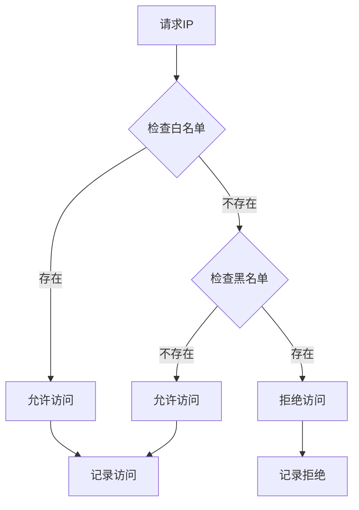
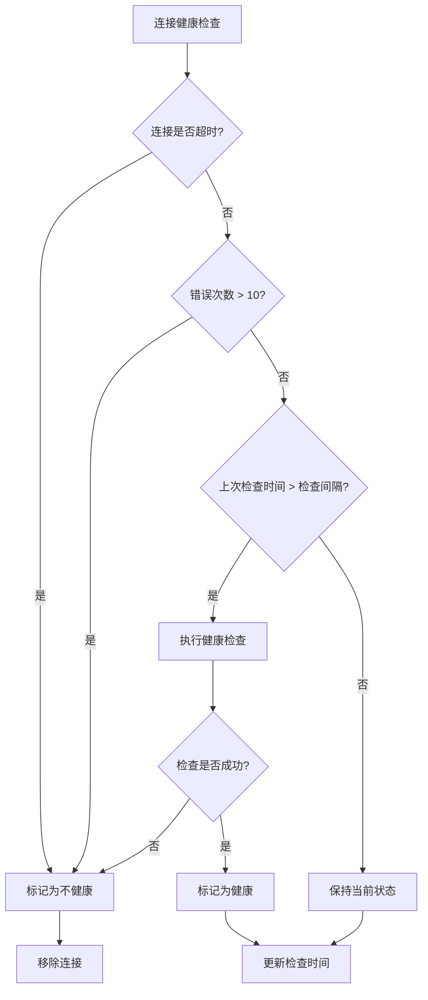
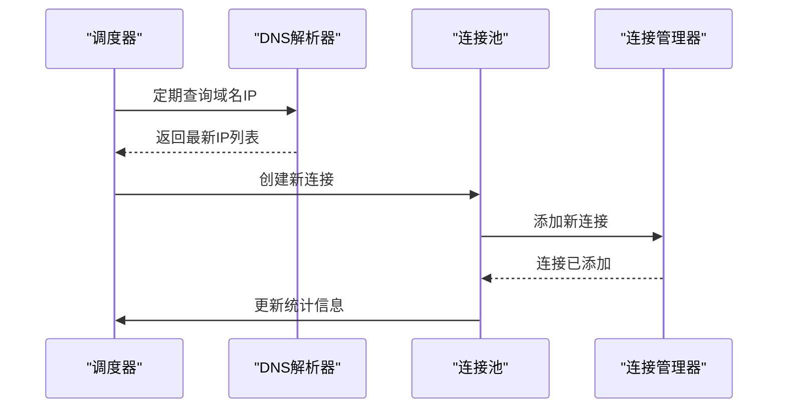
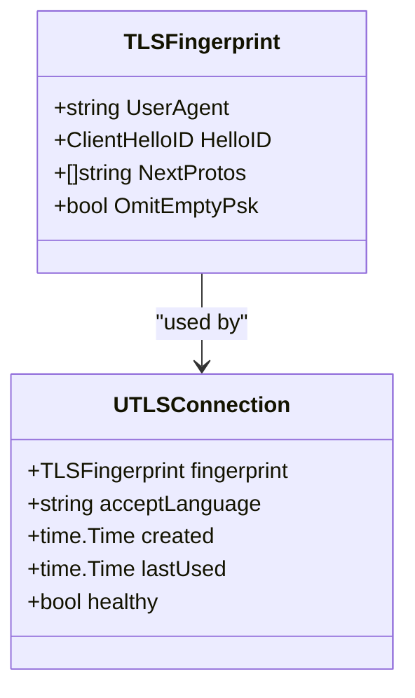
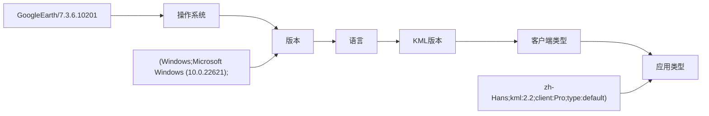
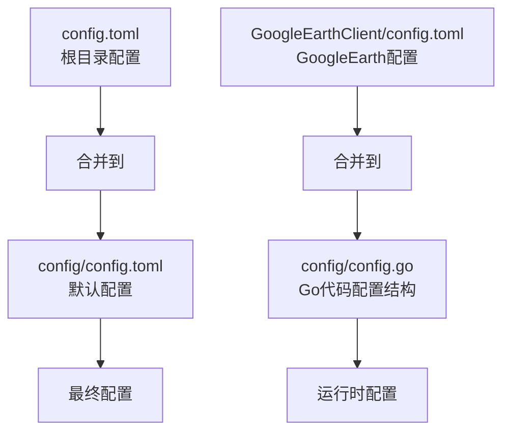
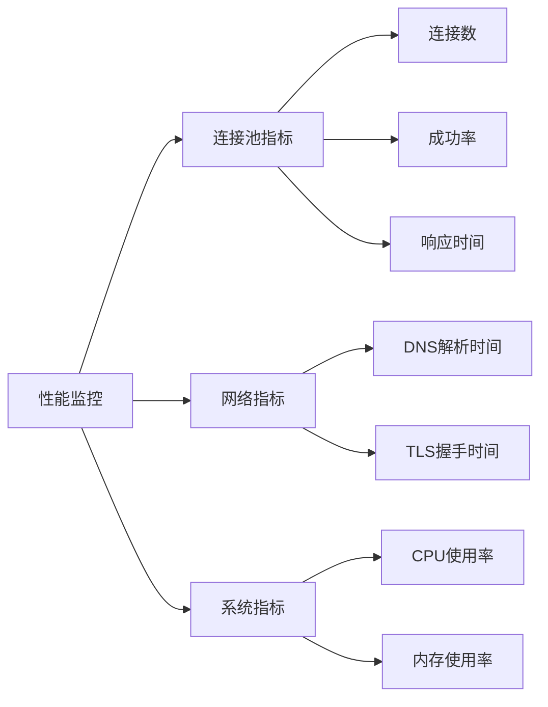

# 配置项说明

<cite>
**本文档引用的文件**
- [config/config.toml](file://config/config.toml)
- [GoogleEarthClient/config/config.toml](file://GoogleEarthClient/config/config.toml)
- [config/config.go](file://config/config.go)
- [utlsclient/utlshotconnpool.go](file://utlsclient/utlshotconnpool.go)
- [utlsclient/connection_manager.go](file://utlsclient/connection_manager.go)
- [utlsclient/ip_access_controller.go](file://utlsclient/ip_access_controller.go)
- [utlsclient/health_checker.go](file://utlsclient/health_checker.go)
- [utlsclient/constants.go](file://utlsclient/constants.go)
- [GoogleEarthClient/client.go](file://GoogleEarthClient/client.go)
- [GoogleEarthClient/geua.go](file://GoogleEarthClient/geua.go)
- [examples/utlsclient/example_hotconnpool_usage.go](file://examples/utlsclient/example_hotconnpool_usage.go)
- [examples/utlsclient/example_basic_usage.go](file://examples/utlsclient/example_basic_usage.go)
</cite>

## 目录
1. [概述](#概述)
2. [连接池配置详解](#连接池配置详解)
3. [GoogleEarth客户端配置](#googleearth客户端配置)
4. [IP访问控制配置](#ip访问控制配置)
5. [健康检查与维护配置](#健康检查与维护配置)
6. [TLS指纹配置](#tls指纹配置)
7. [配置项使用场景与调优建议](#配置项使用场景与调优建议)
8. [配置文件结构说明](#配置文件结构说明)
9. [故障排除指南](#故障排除指南)

## 概述

本项目提供了两个主要的配置文件，分别用于通用的连接池管理和GoogleEarth客户端的特定配置。这些配置项涵盖了连接池管理、IP访问控制、健康检查、DNS更新等多个方面，为系统的稳定运行和性能优化提供了重要保障。

## 连接池配置详解

### 核心连接池参数

连接池配置是整个系统的核心，直接影响系统的并发能力和稳定性。

#### max_connections (最大连接数)
- **类型**: 整数
- **默认值**: 100
- **取值范围**: > 0
- **作用**: 控制连接池中允许的最大连接总数
- **影响**: 
  - 影响系统整体并发能力
  - 过高可能导致资源浪费，过低影响并发性能
- **调优建议**: 
  - 生产环境建议设置为CPU核心数 × 10
  - 根据实际并发需求调整，通常在50-500之间

#### max_conns_per_host (每主机最大连接数)
- **类型**: 整数
- **默认值**: 10
- **取值范围**: > 0
- **作用**: 限制到单个主机的最大连接数
- **影响**:
  - 防止单主机连接过多导致资源耗尽
  - 影响负载均衡效果
- **调优建议**:
  - 根据目标主机的处理能力设置
  - 通常设置为2-20之间

#### max_idle_conns (最大空闲连接数)
- **类型**: 整数
- **默认值**: 20
- **取值范围**: ≥ 0
- **作用**: 控制连接池中保持的最大空闲连接数
- **影响**:
  - 影响内存使用量
  - 空闲连接过多浪费资源，过少增加连接建立开销
- **调优建议**:
  - 通常设置为max_connections的10-20%
  - 根据实际使用情况调整

#### conn_timeout (连接超时时间)
- **类型**: 整数（秒）
- **默认值**: 30
- **取值范围**: > 0
- **作用**: 设置建立连接的超时时间
- **影响**:
  - 影响请求响应速度
  - 过短可能导致正常连接被误判
- **调优建议**:
  - 网络环境较差时可适当延长
  - 通常设置为10-60秒

#### idle_timeout (空闲超时时间)
- **类型**: 整数（秒）
- **默认值**: 60
- **取值范围**: > 0
- **作用**: 空闲连接的最大存活时间
- **影响**:
  - 影响连接复用效率
  - 过短可能导致频繁重建连接
- **调优建议**:
  - 根据业务特点调整
  - 通常设置为30-300秒

#### max_lifetime (连接最大生命周期)
- **类型**: 整数（秒）
- **默认值**: 300
- **取值范围**: > 0
- **作用**: 连接的最大使用时间
- **影响**:
  - 防止连接老化导致的问题
  - 影响连接池的动态更新
- **调优建议**:
  - 通常设置为300-1800秒
  - 根据网络环境和业务需求调整

### 连接验证与测试配置

#### test_timeout (测试请求超时时间)
- **类型**: 整数（秒）
- **默认值**: 10
- **取值范围**: > 0
- **作用**: 连接健康检查的超时时间
- **影响**:
  - 影响健康检查的准确性
  - 过短可能导致误判
- **调优建议**:
  - 通常设置为5-20秒

#### health_check_interval (健康检查间隔)
- **类型**: 整数（秒）
- **默认值**: 30
- **取值范围**: > 0
- **作用**: 健康检查的执行间隔
- **影响**:
  - 影响连接池的实时性
  - 过短增加系统开销
- **调优建议**:
  - 通常设置为30-120秒
  - 根据业务需求调整

### 维护与更新配置

#### cleanup_interval (清理间隔)
- **类型**: 整数（秒）
- **默认值**: 60
- **取值范围**: > 0
- **作用**: 连接池清理任务的执行间隔
- **影响**:
  - 影响资源回收效率
  - 过短增加系统负担
- **调优建议**:
  - 通常设置为60-300秒

#### blacklist_check_interval (黑名单检查间隔)
- **类型**: 整数（秒）
- **默认值**: 300
- **取值范围**: > 0
- **作用**: 黑名单检查的执行间隔
- **影响**:
  - 影响IP访问控制的及时性
  - 过短增加检查频率
- **调优建议**:
  - 通常设置为300-1800秒

#### dns_update_interval (DNS更新间隔)
- **类型**: 整数（秒）
- **默认值**: 1800
- **取值范围**: > 0
- **作用**: DNS解析结果的更新间隔
- **影响**:
  - 影响IP地址的实时性
  - 过短增加DNS查询压力
- **调优建议**:
  - 通常设置为1800-7200秒

#### max_retries (最大重试次数)
- **类型**: 整数
- **默认值**: 3
- **取值范围**: ≥ 0
- **作用**: 请求失败时的最大重试次数
- **影响**:
  - 影响请求的成功率
  - 过多重试增加系统负担
- **调优建议**:
  - 通常设置为2-5次
  - 根据网络稳定性调整

**章节来源**
- [config/config.toml](file://config/config.toml#L3-L37)
- [utlsclient/utlshotconnpool.go](file://utlsclient/utlshotconnpool.go#L60-L167)

## GoogleEarth客户端配置

### 基础配置参数

#### HostName (主机名配置)
- **类型**: 字符串
- **默认值**: "kh.google.com"
- **作用**: 指定GoogleEarth服务的基础主机名
- **使用场景**:
  - 用于构建请求URL的基本域名
  - 影响所有API请求的目标主机
- **注意事项**:
  - 通常不需要修改，除非使用自定义服务
  - 需要配合BaseURL一起使用

#### BaseURL (基础URL)
- **类型**: 字符串
- **默认值**: "https://kh.google.com"
- **作用**: 指定GoogleEarth服务的基础URL
- **使用场景**:
  - 作为所有API请求的前缀
  - 影响完整的请求地址构建
- **注意事项**:
  - 必须包含协议头（https://）
  - 通常不需要修改

### 认证与会话配置

#### session_expire_seconds (Session过期时间)
- **类型**: 整数（秒）
- **默认值**: 3600
- **取值范围**: > 0
- **作用**: GoogleEarth Session的过期时间
- **影响**:
  - 影响认证的有效期
  - 过短导致频繁重新认证
- **调优建议**:
  - 通常设置为3600-7200秒
  - 根据安全需求调整

### 数据端点配置

#### 认证端点配置
- **auth_endpoint**: "/geauth"
- **作用**: GoogleEarth认证API的端点路径
- **使用场景**: 用户认证和会话获取

#### dbRoot端点配置
- **dbroot_endpoint**: "/dbRoot.v5"
- **dbroot_with_db_endpoint**: "/dbRoot.v5?db=%s"
- **作用**: 数据库根信息获取的API端点
- **使用场景**: 获取数据库版本和密钥信息

#### Q2数据端点配置
- **q2_earth_endpoint**: "/flatfile?q2-%s-q.%d"
- **q2_with_db_endpoint**: "/flatfile?db=%s&q2-%s-q.%d"
- **作用**: Quadtree结构数据的获取端点
- **使用场景**: 地球地形和影像数据获取

#### 影像数据端点配置
- **imagery_earth_endpoint**: "/flatfile?f1-%s-i.%d"
- **作用**: 影像瓦片数据的获取端点
- **使用场景**: 地球表面影像数据获取

#### QP数据端点配置
- **qp_with_db_endpoint**: "/flatfile?db=%s&qp-%s-q.%d"
- **qp_tm_endpoint**: "/flatfile?db=tm&qp-%s-q.%d"
- **作用**: Protobuf格式数据的获取端点
- **使用场景**: 结构化数据获取

### 数据库配置

#### database (支持的数据库列表)
- **类型**: 字符串数组
- **默认值**: ["earth", "tm", "mars", "sky", "moon"]
- **作用**: 系统支持的数据库名称列表
- **使用场景**: 数据库路由和选择

**章节来源**
- [GoogleEarthClient/config/config.toml](file://GoogleEarthClient/config/config.toml#L4-L53)
- [GoogleEarthClient/client.go](file://GoogleEarthClient/client.go#L155-L182)

## IP访问控制配置

### 白名单配置

#### whitelist配置段
- **作用**: 定义允许访问的IP地址白名单
- **配置格式**: 
  ```toml
  [whitelist]
  ips = ["1.1.1.1", "8.8.8.8", "114.114.114.114"]
  ```
- **使用场景**:
  - 限制特定IP地址的访问
  - 提高安全性
  - 适用于受信任的IP池

### 黑名单配置

#### blacklist配置段
- **作用**: 定义禁止访问的IP地址黑名单
- **配置格式**:
  ```toml
  [blacklist]
  ips = ["192.168.1.1", "10.0.0.1"]
  ```
- **使用场景**:
  - 屏蔽恶意IP
  - 防止攻击
  - 应急处理

### IP访问控制机制

#### 自动黑白名单转换
系统具备智能的IP访问控制机制：
- **黑名单转白名单**: 当IP返回200状态码时，自动从黑名单移到白名单
- **白名单转黑名单**: 当IP返回403状态码时，自动加入黑名单
- **动态更新**: 支持运行时动态添加和移除IP

#### IP访问验证流程


**图表来源**
- [utlsclient/ip_access_controller.go](file://utlsclient/ip_access_controller.go#L22-L41)

**章节来源**
- [config/config.toml](file://config/config.toml#L29-L36)
- [utlsclient/ip_access_controller.go](file://utlsclient/ip_access_controller.go#L1-L184)

## 健康检查与维护配置

### 健康检查机制

#### 健康检查触发条件
系统采用多种策略进行健康检查：

1. **定时检查**: 每隔health_check_interval秒检查一次
2. **错误驱动检查**: 当连接错误次数超过阈值时立即检查
3. **使用后检查**: 连接长时间未使用时进行检查

#### 健康检查算法


**图表来源**
- [utlsclient/health_checker.go](file://utlsclient/health_checker.go#L24-L60)

### 连接池维护机制

#### 自动清理机制
系统提供多种自动清理功能：

1. **空闲连接清理**: 清理超过idle_timeout的空闲连接
2. **过期连接清理**: 清理超过max_lifetime的连接
3. **不健康连接清理**: 清理健康状态异常的连接

#### DNS热更新机制


**图表来源**
- [utlsclient/connection_manager.go](file://utlsclient/connection_manager.go#L141-L218)

### 统计监控配置

#### 连接池统计指标
系统提供丰富的统计信息：
- **总连接数**: 当前连接池中的连接总数
- **活跃连接数**: 正在使用的连接数
- **空闲连接数**: 空闲状态的连接数
- **健康连接数**: 健康状态的连接数
- **成功率**: 请求成功的百分比
- **平均响应时间**: 平均响应时间统计

**章节来源**
- [utlsclient/health_checker.go](file://utlsclient/health_checker.go#L1-L165)
- [utlsclient/connection_manager.go](file://utlsclient/connection_manager.go#L1-L218)

## TLS指纹配置

### TLS指纹库配置

#### 默认TLS指纹
系统支持多种TLS指纹，用于模拟不同的浏览器行为：

- **指纹选择策略**: 系统会随机选择合适的TLS指纹
- **指纹库**: 包含主流浏览器的TLS配置
- **动态切换**: 支持运行时切换TLS指纹

#### TLS配置参数


**图表来源**
- [utlsclient/utlshotconnpool.go](file://utlsclient/utlshotconnpool.go#L204-L234)

### User-Agent配置

#### GoogleEarth User-Agent
系统支持两种User-Agent生成策略：

1. **GoogleEarth专用**: 生成标准的GoogleEarth客户端User-Agent
2. **浏览器指纹**: 使用TLS指纹库中的浏览器User-Agent

#### User-Agent格式


**图表来源**
- [GoogleEarthClient/geua.go](file://GoogleEarthClient/geua.go#L114-L149)

**章节来源**
- [GoogleEarthClient/geua.go](file://GoogleEarthClient/geua.go#L1-L283)

## 配置项使用场景与调优建议

### 高并发场景配置

#### 场景描述
适用于需要处理大量并发请求的场景，如大规模数据爬取、API服务等。

#### 推荐配置
```toml
[pool]
max_connections = 500
max_conns_per_host = 20
max_idle_conns = 100
conn_timeout = 15
idle_timeout = 120
max_lifetime = 600
health_check_interval = 60
cleanup_interval = 120
blacklist_check_interval = 600
dns_update_interval = 3600
max_retries = 2
```

#### 调优要点
- 增大max_connections提升并发能力
- 适当延长idle_timeout减少连接重建
- 增加health_check_interval降低检查频率

### 低资源环境配置

#### 场景描述
适用于资源受限的环境，如嵌入式设备、容器化部署等。

#### 推荐配置
```toml
[pool]
max_connections = 20
max_conns_per_host = 2
max_idle_conns = 5
conn_timeout = 30
idle_timeout = 30
max_lifetime = 300
health_check_interval = 120
cleanup_interval = 300
blacklist_check_interval = 1800
dns_update_interval = 7200
max_retries = 1
```

#### 调优要点
- 减少max_connections避免资源耗尽
- 缩短idle_timeout和max_lifetime释放资源
- 降低检查频率减少系统开销

### 高稳定性场景配置

#### 场景描述
适用于对稳定性要求极高的生产环境。

#### 推荐配置
```toml
[pool]
max_connections = 100
max_conns_per_host = 5
max_idle_conns = 20
conn_timeout = 20
idle_timeout = 90
max_lifetime = 450
health_check_interval = 30
cleanup_interval = 60
blacklist_check_interval = 300
dns_update_interval = 1800
max_retries = 3
```

#### 调优要点
- 平衡性能与稳定性
- 保持合理的健康检查频率
- 适度的重试次数

### 特殊业务场景配置

#### 地理位置敏感场景
```toml
[pool]
max_connections = 50
max_conns_per_host = 10
blacklist_check_interval = 300
dns_update_interval = 3600

[whitelist]
ips = ["1.1.1.1", "8.8.8.8", "114.114.114.114"]

[blacklist]
ips = ["192.168.1.1", "10.0.0.1"]
```

#### 高安全要求场景
```toml
[pool]
max_connections = 30
max_conns_per_host = 3
max_retries = 1
health_check_interval = 15
cleanup_interval = 30
blacklist_check_interval = 60
```

**章节来源**
- [examples/utlsclient/example_hotconnpool_usage.go](file://examples/utlsclient/example_hotconnpool_usage.go#L1-L277)
- [examples/utlsclient/example_basic_usage.go](file://examples/utlsclient/example_basic_usage.go#L1-L83)

## 配置文件结构说明

### 配置文件层次结构



**图表来源**
- [config/config.go](file://config/config.go#L40-L67)

### 配置加载顺序

1. **默认配置加载**: 优先加载config/config.toml
2. **用户配置覆盖**: 加载根目录的config.toml
3. **配置合并**: 用户配置覆盖默认配置
4. **验证检查**: 验证配置的有效性

### 配置文件格式

#### TOML格式规范
```toml
# UTLSHotConnPool 连接池配置

[pool]
# 最大连接数
max_connections = 100
# 每个主机最大连接数  
max_conns_per_host = 10
# 最大空闲连接数
max_idle_conns = 20
# 连接超时时间 (秒)
conn_timeout = 30
# 空闲超时时间 (秒) 
idle_timeout = 60
# 连接最大生命周期 (秒)
max_lifetime = 300
# 测试请求超时时间 (秒)
test_timeout = 10
# 健康检查间隔 (秒)
health_check_interval = 30
# 清理间隔 (秒)
cleanup_interval = 60
# 黑名单检查间隔 (秒)
blacklist_check_interval = 300
# DNS更新间隔 (秒)
dns_update_interval = 1800
# 最大重试次数
max_retries = 3

# 可选：白名单IP列表
[whitelist]
ips = ["1.1.1.1", "8.8.8.8", "114.114.114.114"]

# 可选：黑名单IP列表  
[blacklist]
ips = ["192.168.1.1", "10.0.0.1"]
```

**章节来源**
- [config/config.toml](file://config/config.toml#L1-L38)
- [GoogleEarthClient/config/config.toml](file://GoogleEarthClient/config/config.toml#L1-L108)

## 故障排除指南

### 常见配置问题

#### 连接池问题

**问题**: 连接池无法获取连接
- **可能原因**: max_connections设置过小
- **解决方案**: 增加max_connections值
- **检查命令**: 查看连接池统计信息

**问题**: 连接频繁断开
- **可能原因**: idle_timeout设置过短
- **解决方案**: 增加idle_timeout值
- **检查命令**: 监控连接生命周期

#### 健康检查问题

**问题**: 健康检查过于频繁
- **可能原因**: health_check_interval设置过短
- **解决方案**: 增加health_check_interval值
- **影响**: 减少系统开销

**问题**: 健康检查不准确
- **可能原因**: test_timeout设置过短
- **解决方案**: 增加test_timeout值
- **影响**: 提高检查准确性

#### IP访问控制问题

**问题**: IP被错误地加入黑名单
- **可能原因**: 黑名单检查过于严格
- **解决方案**: 调整黑名单检查策略
- **检查方法**: 查看IP访问日志

**问题**: 白名单IP无法访问
- **可能原因**: 白名单配置错误
- **解决方案**: 检查IP格式和配置语法
- **验证方法**: 使用ping命令测试

### 性能监控指标

#### 关键性能指标
- **连接成功率**: 成功连接数/总连接数
- **平均响应时间**: 请求处理的平均时间
- **连接复用率**: 复用连接数/总连接数
- **错误率**: 错误连接数/总连接数

#### 监控告警设置


### 调试配置

#### 启用调试模式
```toml
[Global]
debug = true
log_level = "debug"
```

#### 调试输出示例
```
DEBUG: 连接已添加到管理器: kh.google.com -> 1.1.1.1
DEBUG: 复用现有连接: kh.google.com -> 1.1.1.1
DEBUG: 健康检查通过: 1.1.1.1
INFO: 新连接已添加到连接池: kh.google.com -> 1.1.1.1
```

**章节来源**
- [utlsclient/constants.go](file://utlsclient/constants.go#L1-L86)

## 总结

本配置项说明文档详细介绍了项目中所有配置项的具体含义、取值范围、默认值及其对系统行为的影响。通过合理配置这些参数，可以显著提升系统的性能、稳定性和安全性。

### 关键要点
1. **连接池配置**是系统性能的核心，需要根据实际需求进行调优
2. **IP访问控制**提供了强大的安全防护机制
3. **健康检查**确保了系统的可靠性
4. **TLS指纹**模拟真实浏览器行为，提高兼容性
5. **配置文件结构**支持灵活的配置管理

### 最佳实践
- 根据具体使用场景选择合适的配置组合
- 定期监控系统性能指标
- 根据实际运行情况调整配置参数
- 保持配置文件的版本控制

通过深入理解和合理运用这些配置项，可以构建出高性能、高可靠性的网络应用程序。