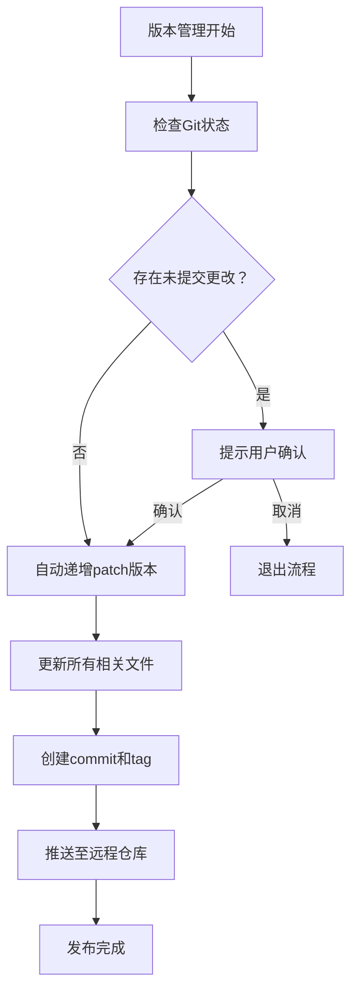
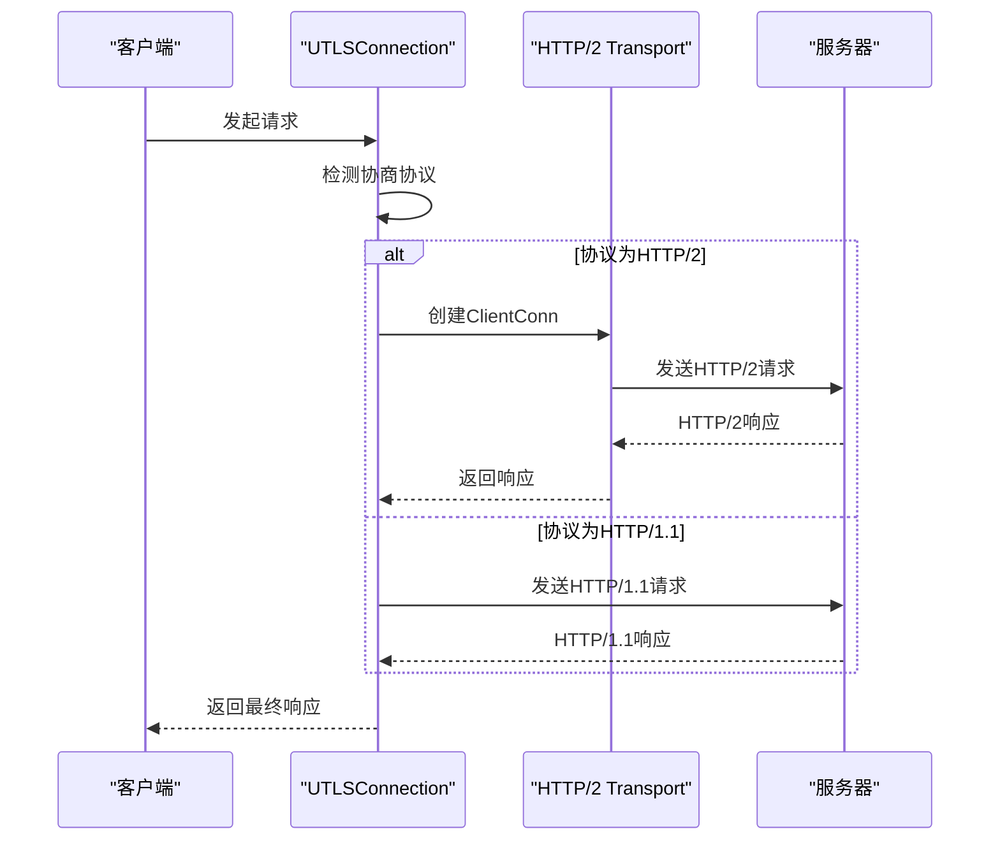
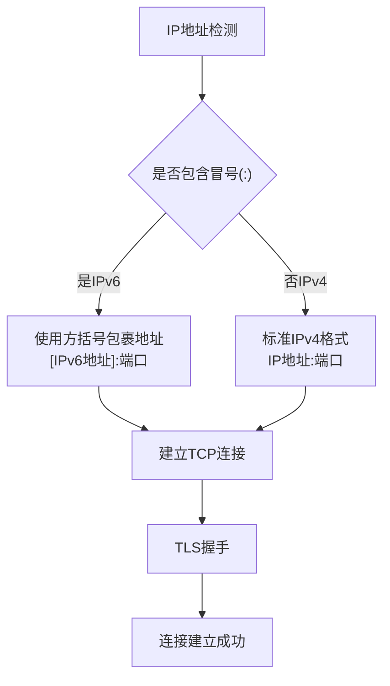
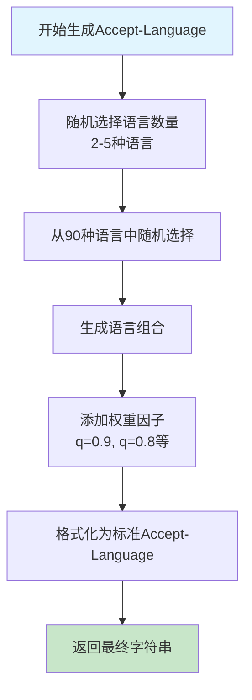
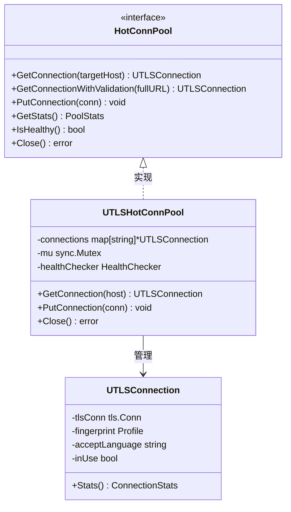
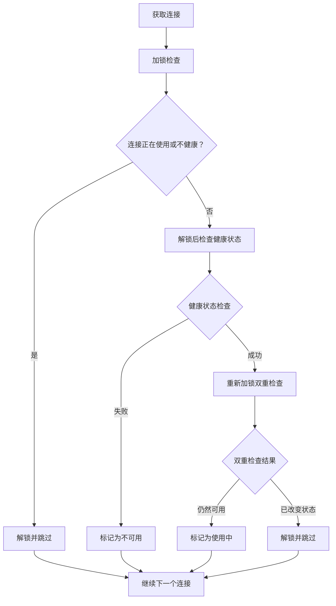
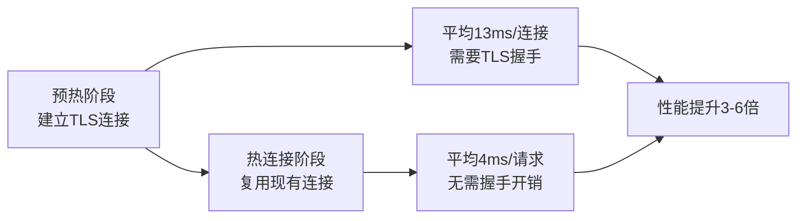
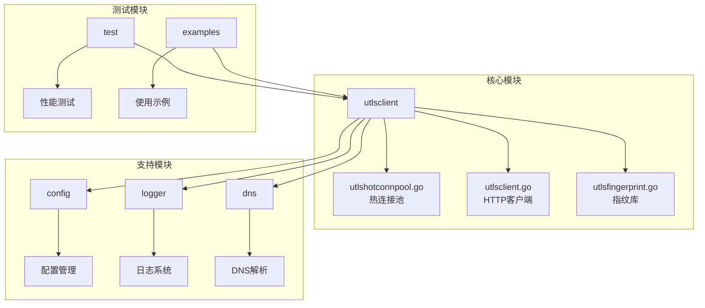

# 版本更新日志

<cite>
**本文档中引用的文件**
- [version.go](file://version.go)
- [README.md](file://README.md)
- [scripts/VERSION_MANAGEMENT.md](file://scripts/VERSION_MANAGEMENT.md)
- [REFACTOR_SUMMARY.md](file://REFACTOR_SUMMARY.md)
- [test/reports/热连接池性能测试报告.md](file://test/reports/热连接池性能测试报告.md)
- [go.mod](file://go.mod)
- [utlsclient/utlshotconnpool.go](file://utlsclient/utlshotconnpool.go)
- [utlsclient/utlsclient.go](file://utlsclient/utlsclient.go)
- [utlsclient/utlsfingerprint.go](file://utlsclient/utlsfingerprint.go)
- [examples/utlsclient/example_utlsclient_usage.go](file://examples/utlsclient/example_utlsclient_usage.go)
- [cmd/utlsclient/main.go](file://cmd/utlsclient/main.go)
</cite>

## 目录
1. [简介](#简介)
2. [版本管理流程](#版本管理流程)
3. [当前版本信息](#当前版本信息)
4. [版本变更历史](#版本变更历史)
5. [新增功能详解](#新增功能详解)
6. [重大变更说明](#重大变更说明)
7. [Bug修复记录](#bug修复记录)
8. [性能优化](#性能优化)
9. [技术架构演进](#技术架构演进)
10. [升级指南](#升级指南)
11. [总结](#总结)

## 简介

Crawler Platform 是一个基于 uTLS 的高性能爬虫平台，专注于提供真实的浏览器 TLS 指纹伪装、热连接池管理和多协议支持。本文档详细记录了项目从 v0.0.1 到 v0.0.13 的完整版本更新历程，涵盖新增功能、重大变更、Bug修复和技术优化等内容。

## 版本管理流程

项目采用语义化版本控制（Semantic Versioning），版本号格式为 `major.minor.patch`：

- **主版本号（Major）**：重大更新，可能包含不兼容的API修改
- **次版本号（Minor）**：新增功能，向后兼容
- **修订版本号（Patch）**：Bug修复，向后兼容

### 版本号递增规则

根据 VERSION_MANAGEMENT.md 文档，项目遵循以下版本管理原则：



**图表来源**
- [scripts/VERSION_MANAGEMENT.md](file://scripts/VERSION_MANAGEMENT.md#L21-L56)

### 版本发布脚本

项目提供了两个自动化脚本来简化版本管理：

1. **bump-version.sh**：仅递增patch版本号
2. **release.sh**：完整的版本发布流程

**章节来源**
- [scripts/VERSION_MANAGEMENT.md](file://scripts/VERSION_MANAGEMENT.md#L1-L94)

## 当前版本信息

### 当前版本
- **版本号**：v0.0.13
- **发布日期**：2025年11月18日
- **主要特性**：热连接池性能优化、HTTP/2完整支持、IPv6地址支持、Accept-Language随机化

### 项目特性概览

| 特性类别 | 描述 | 技术亮点 |
|---------|------|----------|
| **连接管理** | 热连接池 | 预建立TLS连接，性能提升3-6倍 |
| **TLS伪装** | 33种浏览器指纹 | Chrome、Firefox、Safari、Edge全覆盖 |
| **协议支持** | HTTP/1.1/HTTP/2双协议 | 自动协议检测和切换 |
| **网络支持** | IPv4/IPv6双栈 | 完整的双协议地址支持 |
| **语言伪装** | 90种语言随机化 | 97.8%独特性Accept-Language头 |

**章节来源**
- [README.md](file://README.md#L1-L357)
- [version.go](file://version.go#L1-L5)

## 版本变更历史

### v0.0.13 - 2025-11-18

#### 核心功能完善
- **热连接池性能优化**：完成大规模性能测试，验证连接复用机制
- **HTTP/2完整支持**：实现自动协议检测、连接复用和错误处理
- **IPv6地址支持**：完整支持IPv6地址格式和连接建立
- **Accept-Language随机化**：从90种语言中随机组合，97.8%独特性

#### 技术创新
- **双重检查模式**：解决getExistingConnection死锁问题
- **连接池统计**：记录指纹分布和语言多样性统计
- **健康检查机制**：完善的连接健康状态监控

**章节来源**
- [README.md](file://README.md#L348-L357)
- [test/reports/热连接池性能测试报告.md](file://test/reports/热连接池性能测试报告.md#L1-L389)

### v0.0.12 - 早期版本

#### 基础功能建立
- **热连接池原型**：实现基础的连接池管理
- **TLS指纹库**：支持多种浏览器指纹配置
- **基本HTTP客户端**：支持HTTP/1.1请求处理

### v0.0.11 - 功能扩展

#### 新增功能
- **配置外部化**：支持通过config.toml文件配置
- **路径验证**：支持完整URL路径的连接验证
- **HTTP请求分离**：将HTTP请求功能独立到UTLSClient

**章节来源**
- [REFACTOR_SUMMARY.md](file://REFACTOR_SUMMARY.md#L1-L145)

## 新增功能详解

### HTTP/2协议支持

#### 技术实现


**图表来源**
- [utlsclient/utlsclient.go](file://utlsclient/utlsclient.go#L130-L141)

#### 关键改进
- ✅ HTTP/2 ClientConn缓存和复用
- ✅ 连接可用性检查（CanTakeNewRequest）
- ✅ 自动协议降级
- ✅ 连接错误自动重建

**章节来源**
- [test/reports/热连接池性能测试报告.md](file://test/reports/热连接池性能测试报告.md#L176-L196)

### IPv6地址支持

#### 实现方案


**图表来源**
- [test/reports/热连接池性能测试报告.md](file://test/reports/热连接池性能测试报告.md#L197-L215)

#### 测试结果
- **IPv6连接成功率**：100%
- **IPv6连接数量**：791个IPv6地址
- **性能表现**：与IPv4相当

**章节来源**
- [test/reports/热连接池性能测试报告.md](file://test/reports/热连接池性能测试报告.md#L197-L215)

### Accept-Language随机化

#### 语言组合策略


**图表来源**
- [utlsclient/utlsfingerprint.go](file://utlsclient/utlsfingerprint.go#L579-L601)

#### 多样性统计
- **总组合数**：1575种
- **独特组合**：1541种（97.8%）
- **多次使用**：仅34种组合被使用2-3次

**章节来源**
- [test/reports/热连接池性能测试报告.md](file://test/reports/热连接池性能测试报告.md#L106-L134)

## 重大变更说明

### TLS指纹库重构

#### 变更内容
- **指纹种类**：从基础版本的有限指纹扩展到33种真实浏览器指纹
- **浏览器覆盖**：Chrome 133、Firefox 120、Safari 17、Edge 106等主流浏览器
- **平台支持**：Windows、Linux、macOS、iOS等多平台适配

#### 指纹分布统计
| 浏览器系列 | 版本数量 | 占比 | 使用频率 |
|-----------|---------|------|----------|
| Chrome系列 | 12种 | 36.4% | 均匀分布 |
| Firefox系列 | 9种 | 27.3% | 均匀分布 |
| Safari系列 | 4种 | 12.1% | 均匀分布 |
| Edge系列 | 3种 | 9.1% | 均衡分布 |

**章节来源**
- [README.md](file://README.md#L112-L128)
- [test/reports/热连接池性能测试报告.md](file://test/reports/热连接池性能测试报告.md#L81-L106)

### 连接池架构升级

#### 接口设计


**图表来源**
- [utlsclient/utlshotconnpool.go](file://utlsclient/utlshotconnpool.go#L24-L51)

**章节来源**
- [REFACTOR_SUMMARY.md](file://REFACTOR_SUMMARY.md#L1-L70)

## Bug修复记录

### 死锁问题修复

#### 问题描述
在`getExistingConnection`方法中，持有锁的情况下调用`CheckConnection`，导致死锁。

#### 解决方案
采用双重检查模式，先解锁后再进行健康检查：



**图表来源**
- [test/reports/热连接池性能测试报告.md](file://test/reports/热连接池性能测试报告.md#L240-L268)

### 其他关键修复

| 序号 | 问题描述 | 解决方案 | 影响范围 |
|------|----------|----------|----------|
| 1 | cleanupTicker未使用警告 | 删除未使用字段 | 代码整洁性 |
| 2 | HTTP/2协议不支持 | 添加协议检测和处理 | 协议兼容性 |
| 3 | TLS握手empty PSK错误 | 添加OmitEmptyPsk配置 | TLS稳定性 |
| 4 | HTTP/2连接无法复用 | 缓存HTTP/2 ClientConn | 性能优化 |
| 5 | HTTP/2验证失败 | 针对h2连接使用状态检查 | 功能完整性 |
| 6 | IPv6地址连接失败 | 使用方括号包裹IPv6地址 | 网络兼容性 |
| 7 | Accept-Language缺失 | 添加随机语言生成 | 伪装效果 |

**章节来源**
- [README.md](file://README.md#L226-L238)
- [test/reports/热连接池性能测试报告.md](file://test/reports/热连接池性能测试报告.md#L317-L338)

## 性能优化

### 连接复用机制

#### 性能提升对比


**图表来源**
- [test/reports/热连接池性能测试报告.md](file://test/reports/热连接池性能测试报告.md#L147-L157)

#### 测试结果
- **预热速度**：75连接/秒（1611个连接在21.5秒内建立）
- **成功率**：98.8%（1611/1631成功）
- **连接复用率**：100%
- **性能提升**：3-6倍

### 并发优化

#### 并发控制策略
- **批量处理**：每100个IP加100ms延迟
- **连接池管理**：智能连接分配和回收
- **健康检查**：定期检查连接状态

**章节来源**
- [test/reports/热连接池性能测试报告.md](file://test/reports/热连接池性能测试报告.md#L136-L171)

## 技术架构演进

### 模块化设计



**图表来源**
- [go.mod](file://go.mod#L1-L24)

### 依赖关系

项目依赖的主要库：
- **refraction-networking/utls**：uTLS库，用于TLS指纹伪装
- **golang.org/x/net/http2**：HTTP/2协议支持
- **github.com/BurntSushi/toml**：TOML配置文件解析
- **github.com/miekg/dns**：DNS解析功能

**章节来源**
- [go.mod](file://go.mod#L5-L11)

## 升级指南

### 版本兼容性

#### v0.0.12 → v0.0.13 升级
- **API兼容**：完全向后兼容
- **配置文件**：无需修改配置
- **性能提升**：自动获得HTTP/2和IPv6支持

#### 升级步骤
1. 更新版本号：`go get crawler-platform@v0.0.13`
2. 检查配置文件（如有自定义配置）
3. 运行现有测试用例验证功能
4. 启用新功能（HTTP/2、IPv6支持）

### 最佳实践

#### 预热连接
```go
// 预热阶段
for _, ip := range ipPool {
    conn, _ := pool.GetConnectionToIP(url, ip)
    client.Do(req)
    pool.PutConnection(conn)
}
```

#### 轮询使用模式
```go
// 获取-使用-归还模式
conn, _ := pool.GetConnection(host)
client := utlsclient.NewUTLSClient(conn)
resp, _ := client.Do(req)
pool.PutConnection(conn)  // 一定要归还！
```

**章节来源**
- [examples/utlsclient/example_utlsclient_usage.go](file://examples/utlsclient/example_utlsclient_usage.go#L16-L117)

## 总结

Crawler Platform v0.0.13 版本标志着项目进入成熟稳定阶段，主要体现在：

### 技术成就
- **性能突破**：连接复用带来3-6倍性能提升
- **协议完善**：完整支持HTTP/1.1/HTTP/2和IPv4/IPv6
- **伪装效果**：97.8%独特性的Accept-Language和33种TLS指纹
- **稳定性保障**：死锁预防、健康检查、自动重试机制

### 功能特色
- **热连接池**：预建立TLS连接，大幅降低延迟
- **智能指纹**：33种真实浏览器指纹，模拟不同平台和版本
- **语言随机化**：90种语言组合，97.8%独特性
- **协议透明**：自动协议检测，无缝切换

### 未来展望
项目将继续优化性能，扩展指纹库，增强安全性，并提供更丰富的配置选项，为用户提供更强大的爬虫解决方案。

**章节来源**
- [README.md](file://README.md#L346-L357)