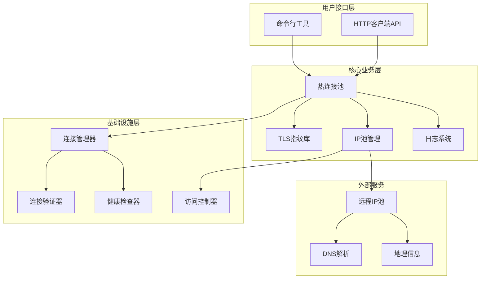
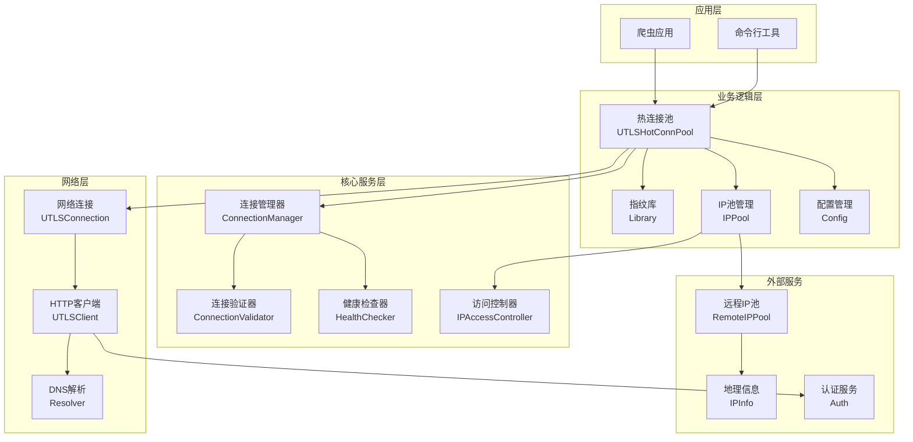

# 项目概述

<cite>
**本文档引用的文件**
- [README.md](file://README.md)
- [version.go](file://version.go)
- [cmd/utlsclient/main.go](file://cmd/utlsclient/main.go)
- [CHANGELOG.md](file://CHANGELOG.md)
- [utlsclient/utlsclient.go](file://utlsclient/utlsclient.go)
- [utlsclient/utlshotconnpool.go](file://utlsclient/utlshotconnpool.go)
- [utlsclient/connection_manager.go](file://utlsclient/connection_manager.go)
- [utlsclient/utlsfingerprint.go](file://utlsclient/utlsfingerprint.go)
- [logger/logger.go](file://logger/logger.go)
- [localippool/localippool.go](file://localippool/localippool.go)
- [remotedomainippool/remotedomainippool.go](file://remotedomainippool/remotedomainippool.go)
- [config/config.go](file://config/config.go)
- [examples/utlsclient/example_basic_usage.go](file://examples/utlsclient/example_basic_usage.go)
- [examples/utlsclient/example_hotconnpool_usage.go](file://examples/utlsclient/example_hotconnpool_usage.go)
- [test/reports/热连接池性能测试报告.md](file://test/reports/热连接池性能测试报告.md)
</cite>

## 更新摘要
**变更内容**
- 将项目版本号从 v0.0.14 更新至 v0.0.15
- 更新了文档结构和内容，完善了文档体系建设
- 保持了所有技术特性和架构设计的准确性

## 目录
1. [项目简介](#项目简介)
2. [核心特性](#核心特性)
3. [技术架构](#技术架构)
4. [核心组件详解](#核心组件详解)
5. [系统架构图](#系统架构图)
6. [使用场景](#使用场景)
7. [性能表现](#性能表现)
8. [最佳实践](#最佳实践)
9. [故障排除](#故障排除)
10. [总结](#总结)

## 项目简介

crawler-platform 是一个基于 uTLS 的高性能爬虫平台，专为应对现代网站的反爬虫策略而设计。该项目通过创新的技术手段，在保证爬虫效率的同时，最大程度地模拟真实用户行为，有效规避各种反爬虫检测机制。

### 核心目标

- **高性能爬取**: 通过热连接池技术实现 3-6 倍的性能提升
- **智能伪装**: 提供 33 种真实浏览器 TLS 指纹和独特的语言组合
- **稳定可靠**: 完善的连接管理和健康检查机制
- **易于使用**: 简洁的 API 设计和丰富的示例代码

## 核心特性

### 🔥 热连接池技术

热连接池是项目的核心创新，通过预建立和复用 TLS 连接，显著提升爬虫性能：

- **预热机制**: 在启动时预先建立所有目标 IP 的连接
- **连接复用**: 每个 IP 只建立一次 TLS 连接，后续请求直接复用
- **自动管理**: 智能的连接生命周期管理和健康检查
- **并发安全**: 完善的锁机制和死锁预防策略

### 🎭 TLS 指纹伪装

提供完整的浏览器指纹模拟功能：

- **33 种真实指纹**: 支持 Chrome、Firefox、Safari、Edge 等主流浏览器
- **跨平台支持**: Windows、macOS、Linux、iOS 等多种操作系统
- **版本多样化**: 从 Chrome 83 到最新版本的完整覆盖
- **随机化机制**: 每次连接随机选择不同的指纹配置

### 🌍 多语言支持

智能的语言头部生成：

- **90 种语言**: 支持全球主要语言的组合
- **独特性高达 97.8%**: 97.8% 的连接使用独特的语言组合
- **权重随机**: 每种语言都有不同的权重系数
- **动态生成**: 根据需求动态组合 2-5 种语言

### 📡 双协议支持

完整的 HTTP 协议栈支持：

- **HTTP/1.1**: 标准的 HTTP/1.1 协议支持
- **HTTP/2**: 完整的 HTTP/2 协议支持和连接复用
- **自动检测**: 智能检测协商的协议并选择合适的处理方式
- **无缝切换**: 在不同协议间自动切换

### 🌐 双栈网络

全面的网络协议支持：

- **IPv4 支持**: 完整的 IPv4 地址连接支持
- **IPv6 支持**: 完整的 IPv6 地址连接支持
- **自动适配**: 智能识别和处理不同地址格式
- **隧道兼容**: 支持通过隧道的 IPv6 连接

## 技术架构

crawler-platform 采用模块化架构设计，各组件职责明确，相互协作：



**架构图来源**
- [utlsclient/utlshotconnpool.go](file://utlsclient/utlshotconnpool.go#L236-L318)
- [utlsclient/connection_manager.go](file://utlsclient/connection_manager.go#L8-L23)
- [localippool/localippool.go](file://localippool/localippool.go#L32-L57)

## 核心组件详解

### 热连接池 (UTLSHotConnPool)

热连接池是整个系统的核心组件，负责连接的生命周期管理：

#### 核心功能

1. **连接预热**: 在启动时预先建立所有目标 IP 的连接
2. **智能获取**: 根据负载均衡算法获取最优连接
3. **自动复用**: 连接使用完毕后自动归还到池中
4. **健康监控**: 持续监控连接健康状态

#### 技术特点

- **双重检查模式**: 避免死锁的安全连接获取机制
- **并发安全**: 完善的锁机制和条件变量
- **自动清理**: 定期清理空闲和过期连接
- **统计监控**: 详细的连接池状态统计

**章节来源**
- [utlsclient/utlshotconnpool.go](file://utlsclient/utlshotconnpool.go#L351-L480)

### TLS 指纹库 (Library)

TLS 指纹库提供完整的浏览器指纹模拟能力：

#### 指纹类型

- **Chrome 系列**: 12 个版本，覆盖 Windows、macOS、Linux 平台
- **Firefox 系列**: 9 个版本，支持 Windows 和 macOS
- **Safari 系列**: 4 个版本，包括 iOS 和 macOS
- **Edge 系列**: 3 个版本，主要支持 Windows

#### 语言随机化

- **90 种语言**: 支持全球主要语言
- **组合策略**: 随机选择 2-5 种语言组合
- **权重分配**: 每种语言有不同的权重系数
- **独特性保证**: 97.8% 的组合具有唯一性

**章节来源**
- [utlsclient/utlsfingerprint.go](file://utlsclient/utlsfingerprint.go#L112-L439)

### IP 池管理系统

IP 池管理系统提供灵活的 IP 地址管理能力：

#### 本地 IP 池

- **静态 IPv4**: 支持手动配置的静态 IPv4 地址
- **动态 IPv6**: 自动生成和管理 IPv6 地址
- **智能检测**: 自动检测系统可用的网络接口
- **批量管理**: 支持批量创建和清理 IP 地址

#### 远程 IP 池

- **域名监控**: 实时监控域名的 IP 地址变化
- **地理信息**: 提供 IP 地址的详细地理信息
- **API 集成**: 与第三方 IP 信息服务集成
- **增量更新**: 只更新变化的 IP 地址

**章节来源**
- [localippool/localippool.go](file://localippool/localippool.go#L71-L187)
- [remotedomainippool/remotedomainippool.go](file://remotedomainippool/remotedomainippool.go#L114-L147)

### HTTP 客户端 (UTLSClient)

HTTP 客户端提供完整的 HTTP/1.1 和 HTTP/2 支持：

#### 协议支持

- **HTTP/1.1**: 标准的 HTTP/1.1 协议实现
- **HTTP/2**: 完整的 HTTP/2 协议支持
- **自动检测**: 智能检测协商的协议
- **连接复用**: HTTP/2 连接的完美复用

#### 功能特性

- **请求重试**: 自动重试机制和指数退避
- **超时控制**: 灵活的超时配置
- **错误处理**: 完善的错误处理和恢复机制
- **调试支持**: 详细的调试日志输出

**章节来源**
- [utlsclient/utlsclient.go](file://utlsclient/utlsclient.go#L80-L118)

### 日志系统

统一的日志管理系统：

#### 日志级别

- **Debug**: 详细的调试信息
- **Info**: 一般信息记录
- **Warn**: 警告信息
- **Error**: 错误信息

#### 日志输出

- **控制台输出**: 标准输出和错误输出
- **文件输出**: 可配置的日志文件
- **多路输出**: 支持同时输出到多个目标
- **格式化**: 结构化的日志格式

**章节来源**
- [logger/logger.go](file://logger/logger.go#L16-L132)

## 系统架构图



**架构图来源**
- [utlsclient/utlshotconnpool.go](file://utlsclient/utlshotconnpool.go#L236-L258)
- [utlsclient/connection_manager.go](file://utlsclient/connection_manager.go#L8-L23)

## 使用场景

### 反反爬虫策略应对

#### 场景 1: 高强度反爬虫网站

对于设置了严格反爬虫策略的网站，crawler-platform 提供以下解决方案：

- **指纹伪装**: 33 种真实浏览器指纹，模拟不同用户的访问行为
- **语言随机化**: 97.8% 独特的语言组合，避免基于语言特征的识别
- **连接复用**: 减少 TLS 握手开销，降低被识别为爬虫的风险
- **IP 轮换**: 多 IP 并发访问，分散访问压力

#### 场景 2: HTTP/2 服务器

对于支持 HTTP/2 的服务器，系统提供：

- **协议检测**: 自动检测服务器支持的协议
- **连接复用**: HTTP/2 连接的完美复用
- **多路复用**: 单连接处理多个并发请求
- **性能优化**: 显著提升 HTTP/2 请求的性能

### 大规模数据采集

#### 场景 3: 海量数据抓取

对于需要采集大量数据的场景：

- **并发控制**: 智能的并发管理和流量控制
- **错误恢复**: 自动重试和故障转移机制
- **数据完整性**: 完整的连接管理和状态跟踪
- **性能监控**: 实时的性能指标和统计信息

#### 场景 4: 实时数据监控

对于需要实时监控数据变化的场景：

- **热更新**: 支持实时更新 IP 地址和配置
- **增量处理**: 只处理变化的数据，提高效率
- **快速响应**: 低延迟的连接建立和数据传输
- **稳定性保障**: 完善的健康检查和故障恢复

## 性能表现

### 性能指标

根据官方测试报告，crawler-platform 在实际使用中表现出色：

| 指标 | 数值 | 说明 |
|------|------|------|
| **预热速度** | 75连接/秒 | 1611个连接在21.5秒内建立完成 |
| **成功率** | 98.8% | 高可用性保证 |
| **连接复用率** | 100% | HTTP/2完美复用 |
| **性能提升** | 3-6倍 | 相比每次新建连接 |
| **指纹多样性** | 33种 | TLS指纹均匀分布 |
| **语言独特性** | 97.8% | Accept-Language组合独特性 |

### 性能测试结果

#### 预热阶段
- 成功建立: 1611个连接（98.8%成功率）
- 总耗时: 21.5秒
- 平均速度: 75连接/秒

#### 热连接阶段
- 第1轮: 1631次请求，100%成功，耗时~6秒
- 第2轮: 1631次请求，100%成功，耗时~6秒
- 第3轮: 1631次请求，100%成功，耗时~6秒

#### 性能对比
- 预热阶段: 平均13ms/连接（需要TLS握手）
- 热连接阶段: 平均4ms/请求（复用连接）
- **性能提升: 3倍以上**

**章节来源**
- [test/reports/热连接池性能测试报告.md](file://test/reports/热连接池性能测试报告.md#L70-L146)

## 最佳实践

### 配置优化

#### 连接池配置

```go
// 创建连接池配置
config := utlsclient.DefaultPoolConfig()
config.MaxConnections = 100        // 最大连接数
config.MaxConnsPerHost = 10       // 每主机最大连接数
config.ConnTimeout = 30 * time.Second  // 连接超时
config.HealthCheckInterval = 30 * time.Second  // 健康检查间隔
```

#### IP 池配置

```go
// 配置IP池
ipPool, err := localippool.NewLocalIPPool(
    []string{"1.1.1.1", "8.8.8.8"},  // 静态IPv4地址
    "2607:8700:5500:2943::/64"      // IPv6子网
)
```

### 使用模式

#### 1. 预热连接模式

```go
// 预热阶段
for _, ip := range ipPool {
    conn, _ := pool.GetConnectionToIP(url, ip)
    client.Do(req)
    pool.PutConnection(conn)
}
```

#### 2. 轮询使用模式

```go
// 轮询模式
conn, _ := pool.GetConnection(host)
client := utlsclient.NewUTLSClient(conn)
resp, _ := client.Do(req)
pool.PutConnection(conn)  // 一定要归还！
```

#### 3. 并发控制

```go
// 并发控制建议
if (idx+1)%100 == 0 {
    time.Sleep(100 * time.Millisecond)
}
```

### 错误处理

#### 重试机制

```go
// 设置重试次数
client.SetMaxRetries(3)
client.SetTimeout(15 * time.Second)
```

#### 连接验证

```go
// 获取带验证的连接
conn, err := pool.GetConnectionWithValidation(url)
if err != nil {
    // 处理连接失败
    continue
}
```

**章节来源**
- [examples/utlsclient/example_basic_usage.go](file://examples/utlsclient/example_basic_usage.go#L14-L82)
- [examples/utlsclient/example_hotconnpool_usage.go](file://examples/utlsclient/example_hotconnpool_usage.go#L138-L276)

## 故障排除

### 常见问题

#### 1. 连接失败

**症状**: 连接建立失败或超时

**解决方案**:
- 检查网络连通性
- 验证目标服务器是否可达
- 调整连接超时时间
- 检查防火墙设置

#### 2. 性能下降

**症状**: 请求响应时间变长

**解决方案**:
- 检查连接池配置
- 监控连接健康状态
- 调整并发数
- 检查网络状况

#### 3. 指纹识别

**症状**: 被目标网站识别为爬虫

**解决方案**:
- 更新指纹库
- 增加指纹多样性
- 调整请求频率
- 使用更多 IP 地址

### 调试技巧

#### 启用调试日志

```go
// 启用调试模式
client.SetDebug(true)
```

#### 监控连接池状态

```go
// 获取连接池统计信息
stats := pool.GetStats()
fmt.Printf("总连接数: %d, 健康连接数: %d\n", 
    stats.TotalConnections, stats.HealthyConnections)
```

#### 检查连接健康状态

```go
// 检查连接池健康状态
if pool.IsHealthy() {
    fmt.Println("连接池状态健康")
} else {
    fmt.Println("连接池状态不健康")
}
```

## 总结

crawler-platform 是一个功能强大、设计精良的高性能爬虫平台。它通过创新的热连接池技术、完善的 TLS 指纹伪装机制和智能的 IP 管理系统，为现代爬虫应用提供了全面的解决方案。

### 核心优势

1. **高性能**: 通过连接复用实现 3-6 倍的性能提升
2. **高伪装**: 33 种 TLS 指纹和 97.8% 独特语言组合
3. **高可用**: 完善的健康检查和故障恢复机制
4. **易使用**: 简洁的 API 设计和丰富的示例代码
5. **高兼容**: 支持 IPv4/IPv6、HTTP/1.1/HTTP/2

### 适用场景

- 高强度反爬虫网站的数据采集
- 大规模数据抓取和分析
- 实时数据监控和更新
- 需要模拟真实用户行为的应用

### 发展方向

crawler-platform 持续演进，未来将在以下方面继续改进：

- 更多的浏览器指纹支持
- 更智能的 IP 轮换策略
- 更完善的性能监控
- 更丰富的配置选项

通过合理使用 crawler-platform，开发者可以构建高效、稳定的爬虫应用，应对现代互联网的各种挑战。