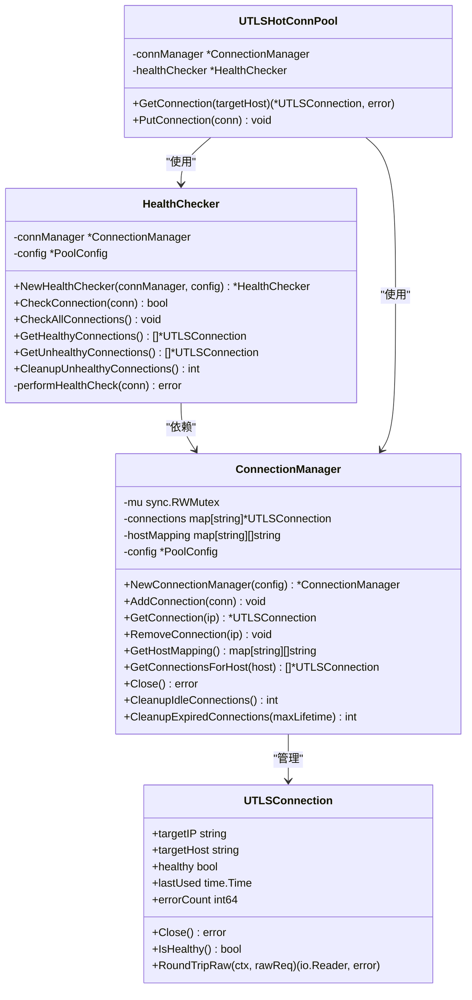
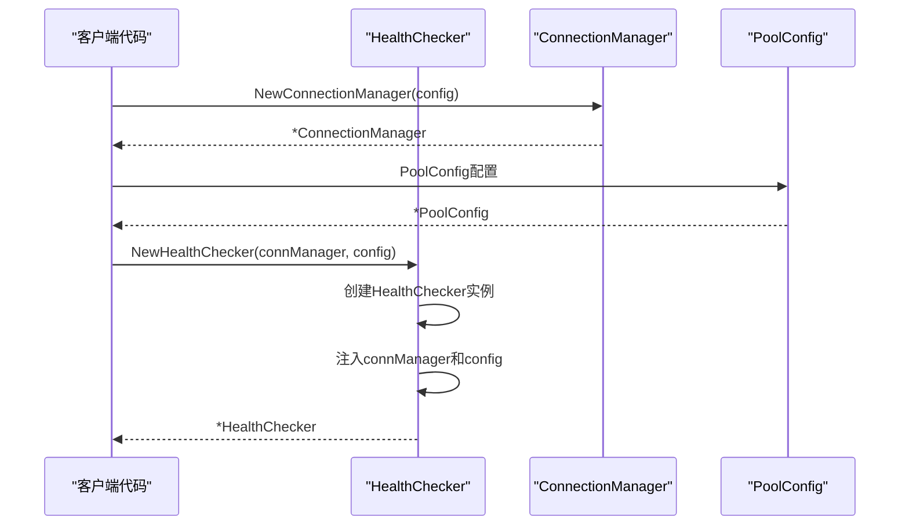
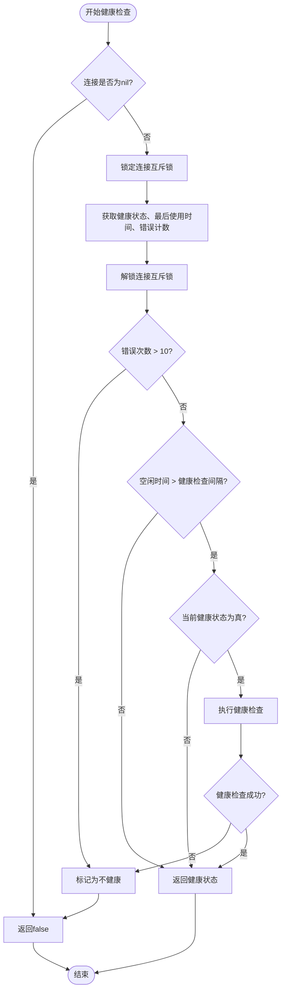
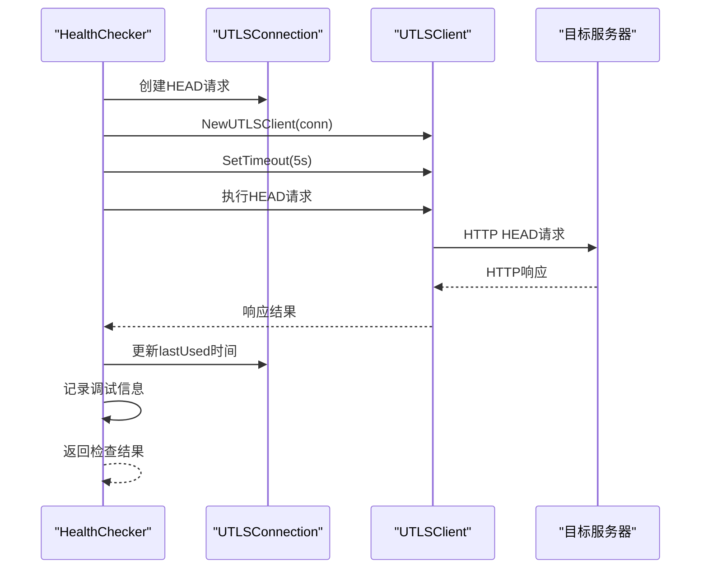
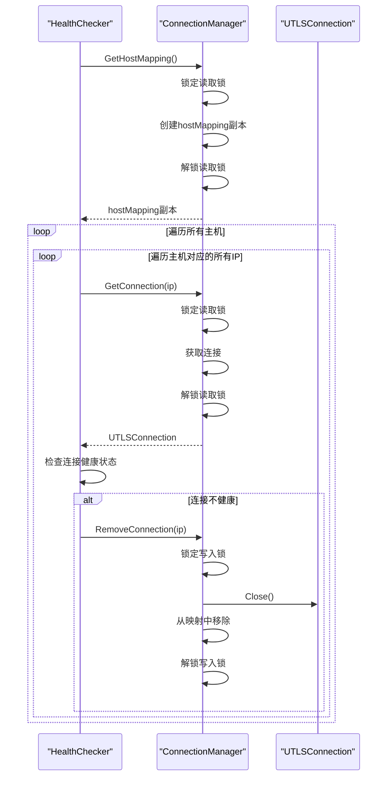
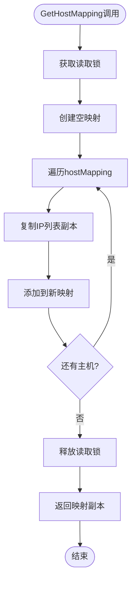
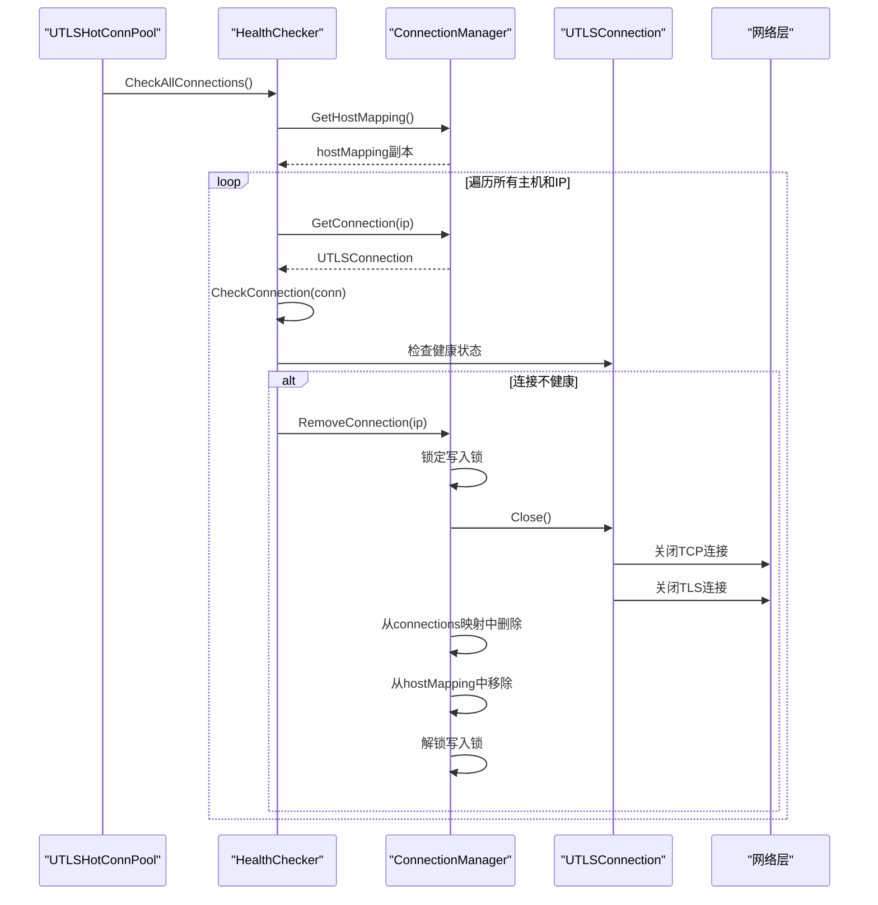
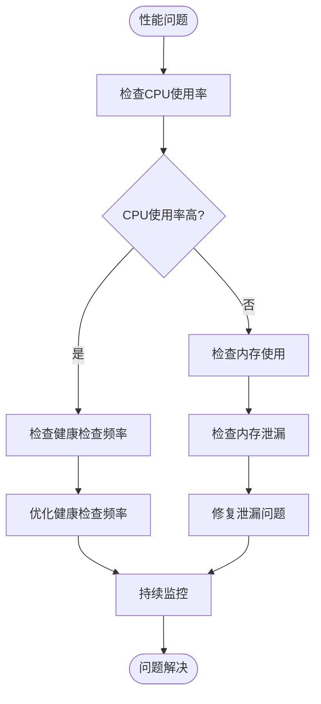

# HealthChecker与ConnectionManager集成文档

<cite>
**本文档引用的文件**
- [health_checker.go](file://utlsclient/health_checker.go)
- [connection_manager.go](file://utlsclient/connection_manager.go)
- [utlshotconnpool.go](file://utlsclient/utlshotconnpool.go)
- [interfaces.go](file://utlsclient/interfaces.go)
- [constants.go](file://utlsclient/constants.go)
- [utlsclient.go](file://utlsclient/utlsclient.go)
</cite>

## 目录
1. [概述](#概述)
2. [架构设计](#架构设计)
3. [依赖注入机制](#依赖注入机制)
4. [健康检查流程](#健康检查流程)
5. [连接管理协作](#连接管理协作)
6. [数据竞争防护](#数据竞争防护)
7. [完整调用链路](#完整调用链路)
8. [常见问题排查](#常见问题排查)
9. [最佳实践建议](#最佳实践建议)

## 概述

HealthChecker与ConnectionManager是爬虫平台连接池系统中的两个核心组件，它们通过紧密协作实现连接的健康状态监控和生命周期管理。HealthChecker负责定期检查连接的健康状态，而ConnectionManager负责连接的存储、检索和销毁。

这种设计遵循了单一职责原则，HealthChecker专注于健康检查逻辑，ConnectionManager专注于连接管理，两者通过接口进行松耦合通信。

## 架构设计

**图表来源**
- [health_checker.go](file://utlsclient/health_checker.go#L10-L13)
- [connection_manager.go](file://utlsclient/connection_manager.go#L9-L14)
- [utlshotconnpool.go](file://utlsclient/utlshotconnpool.go#L204-L233)

## 依赖注入机制

### NewHealthChecker初始化过程

HealthChecker的创建过程体现了清晰的依赖注入模式：

**图表来源**
- [health_checker.go](file://utlsclient/health_checker.go#L15-L21)
- [utlshotconnpool.go](file://utlsclient/utlshotconnpool.go#L291-L348)

### 依赖注入的关键特点

1. **明确的接口依赖**：HealthChecker只依赖ConnectionManager接口，不依赖具体实现
2. **配置驱动**：通过PoolConfig传递配置参数，支持运行时配置调整
3. **不可变性**：一旦创建，HealthChecker的依赖关系不可更改

**章节来源**
- [health_checker.go](file://utlsclient/health_checker.go#L15-L21)
- [utlshotconnpool.go](file://utlsclient/utlshotconnpool.go#L291-L348)

## 健康检查流程

### 单连接健康检查

HealthChecker的健康检查采用分层策略，首先检查连接的基本状态，然后根据需要执行深度健康检查：

**图表来源**
- [health_checker.go](file://utlsclient/health_checker.go#L24-L61)

### 深度健康检查实现

当连接空闲时间超过健康检查间隔时，HealthChecker会执行实际的健康检查：

**图表来源**
- [health_checker.go](file://utlsclient/health_checker.go#L64-L88)

**章节来源**
- [health_checker.go](file://utlsclient/health_checker.go#L24-L88)

## 连接管理协作

### CheckAllConnections工作流程

HealthChecker的CheckAllConnections方法展示了与ConnectionManager的深度协作：

**图表来源**
- [health_checker.go](file://utlsclient/health_checker.go#L91-L111)
- [connection_manager.go](file://utlsclient/connection_manager.go#L101-L113)

### 连接获取与移除机制

ConnectionManager提供了线程安全的连接管理方法：

| 方法 | 功能 | 线程安全性 | 主要用途 |
|------|------|------------|----------|
| `GetConnection(ip)` | 获取指定IP的连接 | 读锁保护 | 健康检查时查找连接 |
| `RemoveConnection(ip)` | 移除指定IP的连接 | 写锁保护 | 清理不健康连接 |
| `GetHostMapping()` | 获取域名映射 | 读锁保护 | 遍历所有连接 |
| `AddConnection(conn)` | 添加新连接 | 写锁保护 | 新建连接时注册 |

**章节来源**
- [health_checker.go](file://utlsclient/health_checker.go#L91-L111)
- [connection_manager.go](file://utlsclient/connection_manager.go#L41-L74)

## 数据竞争防护

### GetHostMapping副本设计

GetHostMapping方法返回域名映射的副本，这是防止数据竞争的关键设计：

**图表来源**
- [connection_manager.go](file://utlsclient/connection_manager.go#L101-L113)

### 数据竞争防护策略

1. **读写分离**：使用RWMutex区分读写操作
2. **副本机制**：返回数据的副本，避免外部修改
3. **细粒度锁定**：在必要时使用连接级锁

**章节来源**
- [connection_manager.go](file://utlsclient/connection_manager.go#L101-L113)

## 完整调用链路

### 从CheckAllConnections到conn.Close()的完整流程

**图表来源**
- [health_checker.go](file://utlsclient/health_checker.go#L91-L111)
- [connection_manager.go](file://utlsclient/connection_manager.go#L49-L74)
- [utlshotconnpool.go](file://utlsclient/utlshotconnpool.go#L1248-L1271)

### 关键调用点说明

1. **健康检查触发**：通过`CheckAllConnections`主动触发
2. **连接状态评估**：通过`CheckConnection`评估单个连接
3. **资源清理**：通过`RemoveConnection`执行连接销毁
4. **网络层关闭**：通过`UTLSConnection.Close()`关闭底层连接

**章节来源**
- [health_checker.go](file://utlsclient/health_checker.go#L91-L111)
- [connection_manager.go](file://utlsclient/connection_manager.go#L49-L74)
- [utlshotconnpool.go](file://utlsclient/utlshotconnpool.go#L1248-L1271)

## 常见问题排查

### 健康检查失败问题

| 问题症状 | 可能原因 | 排查方法 | 解决方案 |
|----------|----------|----------|----------|
| 连接频繁被标记为不健康 | 错误计数超过10次 | 检查`errorCount`字段 | 重置连接或增加错误容忍度 |
| 健康检查超时 | 网络延迟或服务器响应慢 | 检查`HealthCheckInterval`配置 | 增加超时时间或优化网络 |
| 连接泄漏 | RemoveConnection未正确调用 | 检查连接池统计信息 | 确保正确调用清理方法 |
| 数据竞争错误 | 直接修改GetHostMapping返回值 | 检查并发访问代码 | 使用副本或适当同步 |

### 性能问题诊断

### 调试技巧

1. **启用调试日志**：通过`Debug`函数查看详细执行信息
2. **监控连接统计**：观察连接创建、销毁和重用情况
3. **检查配置参数**：确保健康检查间隔和超时时间合理
4. **压力测试**：模拟高并发场景验证系统稳定性

**章节来源**
- [health_checker.go](file://utlsclient/health_checker.go#L36-L44)
- [constants.go](file://utlsclient/constants.go#L48-L56)

## 最佳实践建议

### 配置优化

1. **健康检查间隔**：根据业务需求平衡检查频率和性能影响
2. **错误容忍度**：合理设置最大错误次数阈值
3. **超时配置**：确保超时时间足够覆盖正常响应时间

### 监控指标

- **连接健康率**：监控健康连接占总连接的比例
- **错误率**：跟踪连接错误的发生频率
- **清理效率**：监控不健康连接的清理速度
- **资源使用**：跟踪内存和CPU使用情况

### 故障恢复

1. **自动重试机制**：在健康检查失败时自动重试
2. **连接池重建**：在严重故障时重建整个连接池
3. **降级策略**：在极端情况下降低服务质量要求

通过遵循这些最佳实践，可以确保HealthChecker与ConnectionManager的协作更加稳定和高效，为爬虫平台提供可靠的连接管理服务。