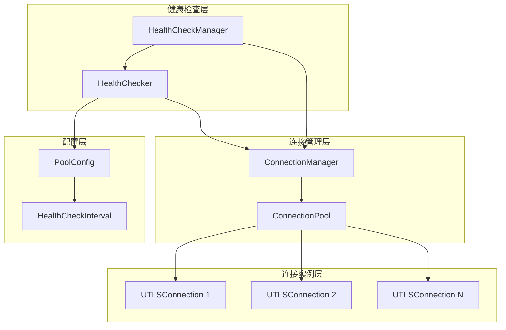
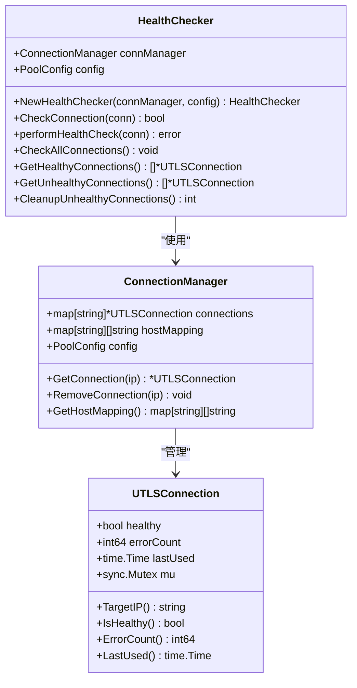
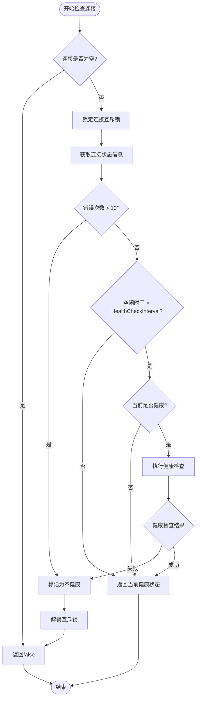
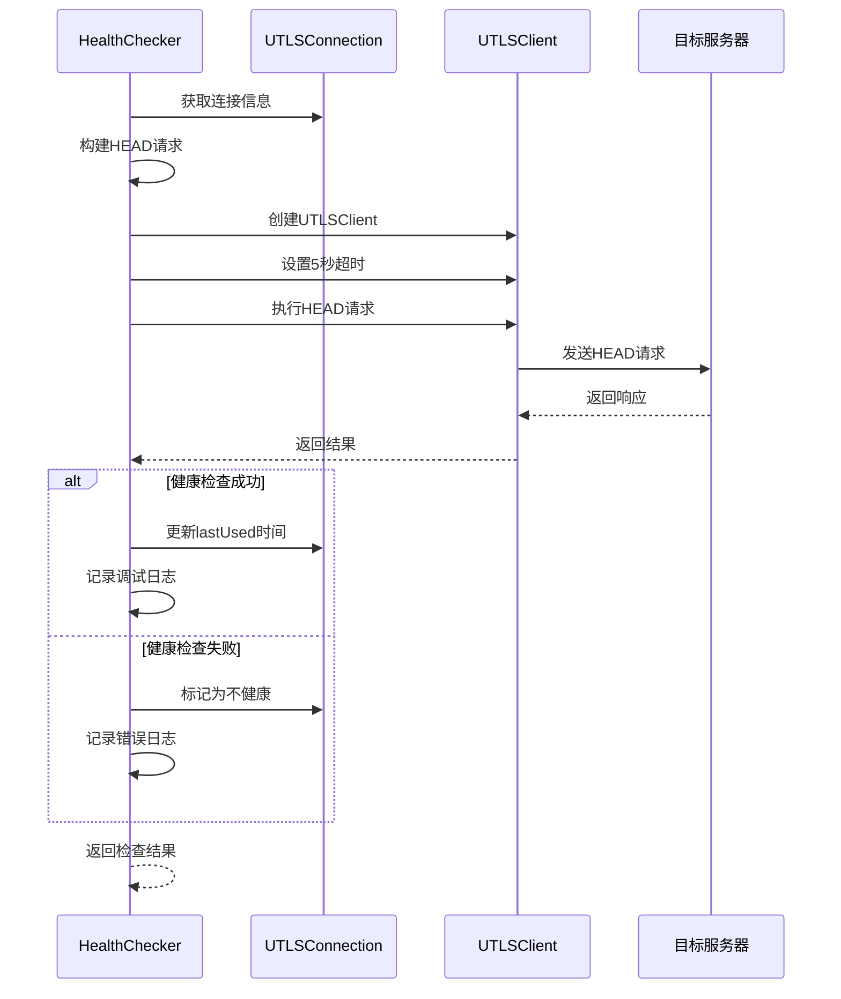
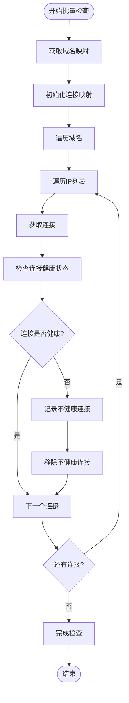
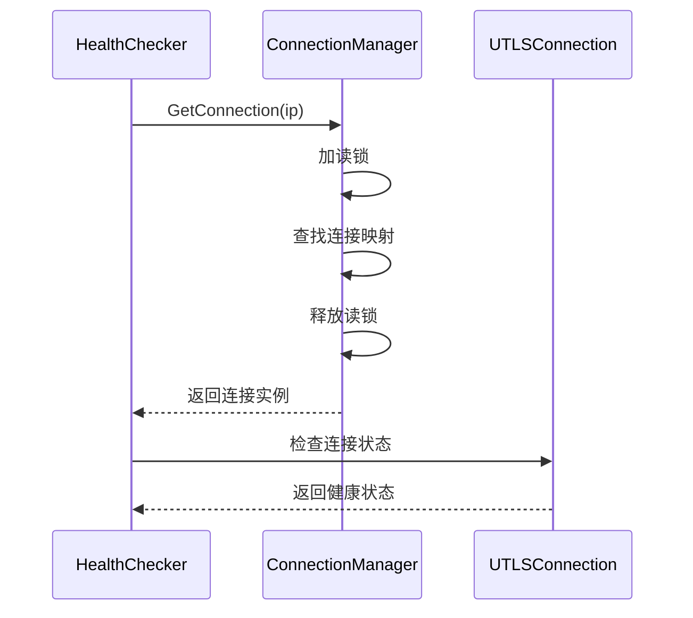
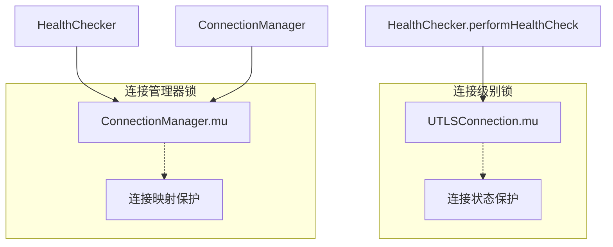

# 健康检查机制

<cite>
**本文档引用的文件**
- [health_checker.go](file://utlsclient/health_checker.go)
- [connection_manager.go](file://utlsclient/connection_manager.go)
- [utlshotconnpool.go](file://utlsclient/utlshotconnpool.go)
- [constants.go](file://utlsclient/constants.go)
- [interfaces.go](file://utlsclient/interfaces.go)
- [test_helpers.go](file://utlsclient/test_helpers.go)
- [config.toml](file://config/config.toml)
</cite>

## 目录
1. [简介](#简介)
2. [系统架构概览](#系统架构概览)
3. [HealthChecker核心组件](#healthchecker核心组件)
4. [连接健康状态评估机制](#连接健康状态评估机制)
5. [健康检查执行流程](#健康检查执行流程)
6. [批量操作实现](#批量操作实现)
7. [与连接管理器的协作](#与连接管理器的协作)
8. [配置最佳实践](#配置最佳实践)
9. [并发安全性设计](#并发安全性设计)
10. [故障排除指南](#故障排除指南)
11. [总结](#总结)

## 简介

健康检查机制是爬虫平台连接池系统中的关键组件，负责监控和维护连接的健康状态。该机制通过定期检查连接的有效性，确保系统始终使用高质量的网络连接，从而提高系统的稳定性和可靠性。

HealthChecker组件采用主动检查策略，结合错误计数和空闲超时两种维度来评估连接健康状态，并提供批量健康检查和连接清理功能。

## 系统架构概览

健康检查机制在整体架构中扮演着监控和维护的角色，与连接管理器紧密协作形成完整的连接生命周期管理体系。

**图表来源**
- [health_checker.go](file://utlsclient/health_checker.go#L9-L13)
- [connection_manager.go](file://utlsclient/connection_manager.go#L8-L14)
- [utlshotconnpool.go](file://utlsclient/utlshotconnpool.go#L170-L184)

## HealthChecker核心组件

HealthChecker是健康检查机制的核心组件，负责连接健康状态的检测和维护。

### 结构体定义

HealthChecker结构体包含连接管理器引用和配置信息：

**图表来源**
- [health_checker.go](file://utlsclient/health_checker.go#L9-L13)
- [connection_manager.go](file://utlsclient/connection_manager.go#L8-L14)
- [utlshotconnpool.go](file://utlsclient/utlshotconnpool.go#L204-L233)

### 初始化机制

HealthChecker通过工厂函数进行初始化，接收连接管理器和配置作为依赖：

**章节来源**
- [health_checker.go](file://utlsclient/health_checker.go#L15-L21)

## 连接健康状态评估机制

### CheckConnection方法详解

CheckConnection方法是健康检查的核心入口，采用双重检查策略来评估连接健康状态。

**图表来源**
- [health_checker.go](file://utlsclient/health_checker.go#L23-L61)

### 错误计数机制

系统通过维护每个连接的错误计数来判断连接的稳定性：

- **阈值设定**：当错误次数超过10次时，连接被标记为不健康
- **自动标记**：一旦达到阈值，连接立即被标记为不健康状态
- **状态持久化**：健康状态会持续保持直到下次健康检查

**章节来源**
- [health_checker.go](file://utlsclient/health_checker.go#L36-L44)

### 空闲超时机制

基于HealthCheckInterval配置的空闲超时检查：

- **检查触发**：当连接空闲时间超过配置的健康检查间隔时触发
- **预防性检查**：即使连接当前显示为健康，也会进行预防性检查
- **动态调整**：可以根据网络环境和业务需求调整检查频率

**章节来源**
- [health_checker.go](file://utlsclient/health_checker.go#L46-L58)

## 健康检查执行流程

### performHealthCheck方法实现

performHealthCheck方法执行实际的健康检查操作，使用HEAD请求进行轻量级验证：

**图表来源**
- [health_checker.go](file://utlsclient/health_checker.go#L63-L89)

### HEAD请求验证机制

健康检查使用HTTP HEAD请求进行验证：

- **请求类型**：使用HEAD方法避免传输响应体
- **超时设置**：设置5秒超时防止长时间阻塞
- **验证内容**：检查服务器响应状态码和连接可用性
- **资源消耗**：最小化网络带宽和处理资源消耗

**章节来源**
- [health_checker.go](file://utlsclient/health_checker.go#L64-L82)

## 批量操作实现

### CheckAllConnections方法

批量检查所有连接的健康状态，提供全面的连接健康状况评估：

**图表来源**
- [health_checker.go](file://utlsclient/health_checker.go#L91-L112)

### GetHealthyConnections方法

获取所有健康的连接，支持负载均衡和连接选择：

**章节来源**
- [health_checker.go](file://utlsclient/health_checker.go#L114-L130)

### GetUnhealthyConnections方法

获取所有不健康的连接，支持故障诊断和清理：

**章节来源**
- [health_checker.go](file://utlsclient/health_checker.go#L132-L152)

### CleanupUnhealthyConnections方法

清理不健康的连接，维护连接池的质量：

**章节来源**
- [health_checker.go](file://utlsclient/health_checker.go#L154-L165)

## 与连接管理器的协作

### GetConnection方法集成

HealthChecker通过ConnectionManager的GetConnection方法获取连接实例：

**图表来源**
- [health_checker.go](file://utlsclient/health_checker.go#L94-L101)
- [connection_manager.go](file://utlsclient/connection_manager.go#L41-L47)

### RemoveConnection方法协作

当发现不健康连接时，HealthChecker调用ConnectionManager的RemoveConnection方法进行清理：

**章节来源**
- [health_checker.go](file://utlsclient/health_checker.go#L109)
- [connection_manager.go](file://utlsclient/connection_manager.go#L49-L74)

## 配置最佳实践

### HealthCheckInterval参数配置

HealthCheckInterval是健康检查机制的核心配置参数，其设置直接影响系统性能和可靠性：

| 配置值 | 性能影响 | 可靠性影响 | 适用场景 |
|--------|----------|------------|----------|
| 10秒 | 高频检查，资源消耗大 | 最高可靠性，及时发现问题 | 对连接质量要求极高的生产环境 |
| 30秒 | 平衡模式，适中资源消耗 | 中等可靠性，适度问题发现速度 | 一般生产环境 |
| 60秒 | 较低频检查，资源节省 | 相对较低可靠性，可能错过部分问题 | 开发测试环境或资源受限环境 |

### 配置建议

1. **生产环境**：建议设置为30-60秒，平衡性能和可靠性
2. **开发环境**：可设置为10-30秒，快速发现问题
3. **特殊场景**：对于高延迟网络，可适当延长检查间隔

**章节来源**
- [config.toml](file://config/config.toml#L18-L20)
- [utlshotconnpool.go](file://utlsclient/utlshotconnpool.go#L179)

## 并发安全性设计

### 互斥锁保护机制

健康检查机制采用多层锁保护确保并发安全性：

**图表来源**
- [health_checker.go](file://utlsclient/health_checker.go#L30-L34)
- [connection_manager.go](file://utlsclient/connection_manager.go#L10-L11)

### 读写锁优化

ConnectionManager使用读写锁优化并发性能：

- **读操作**：多个goroutine可以同时读取连接信息
- **写操作**：写操作需要独占锁，确保数据一致性
- **性能提升**：显著提高并发读取场景的性能

**章节来源**
- [connection_manager.go](file://utlsclient/connection_manager.go#L10)

### 原子操作保护

对于计数器等共享变量，使用原子操作保证线程安全：

**章节来源**
- [utlshotconnpool.go](file://utlsclient/utlshotconnpool.go#L1222-L1231)

## 故障排除指南

### 常见问题诊断

1. **健康检查频繁失败**
   - 检查网络连接稳定性
   - 验证目标服务器响应能力
   - 调整健康检查超时时间

2. **连接池中全是不健康连接**
   - 检查HealthCheckInterval配置
   - 验证目标服务器状态
   - 检查防火墙和网络策略

3. **性能下降**
   - 调整健康检查频率
   - 优化连接池大小配置
   - 检查系统资源使用情况

### 调试信息

系统提供了详细的调试日志，帮助诊断健康检查问题：

- **连接错误次数过多**：记录具体错误数量和IP地址
- **健康检查失败**：记录失败原因和时间戳
- **连接移除操作**：记录被移除的连接信息

**章节来源**
- [health_checker.go](file://utlsclient/health_checker.go#L39-L51)

## 总结

健康检查机制是爬虫平台连接池系统的重要组成部分，通过以下特性确保连接质量：

1. **双重检查策略**：结合错误计数和空闲超时机制
2. **主动预防性检查**：及时发现和处理连接问题
3. **批量操作支持**：提供全面的连接健康状况管理
4. **并发安全保障**：采用多层锁机制确保线程安全
5. **灵活配置选项**：支持根据环境需求调整检查策略

该机制与连接管理器紧密协作，形成了完整的连接生命周期管理体系，为系统的稳定运行提供了重要保障。通过合理的配置和监控，可以有效提高系统的可靠性和性能表现。