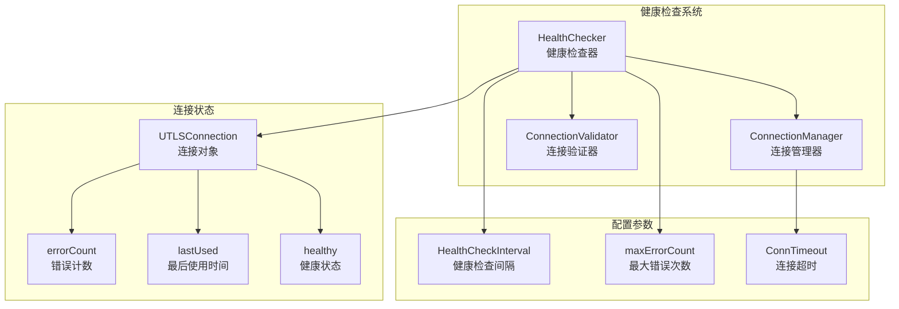
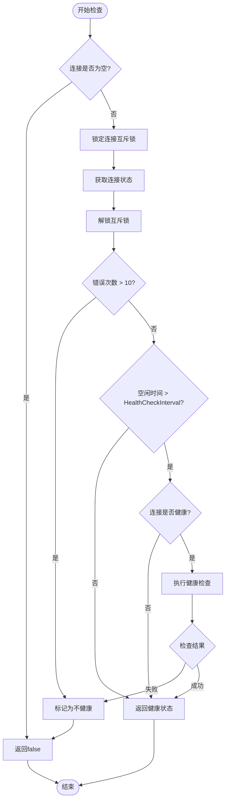
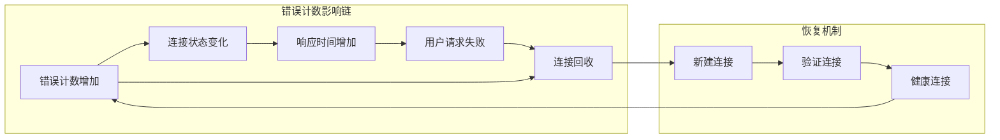
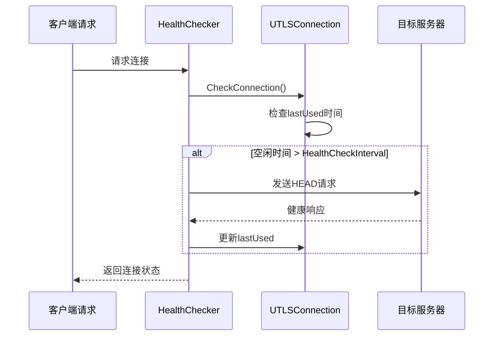
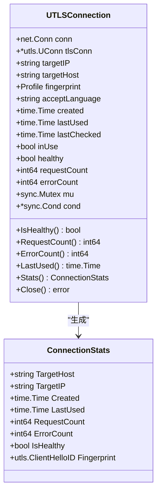
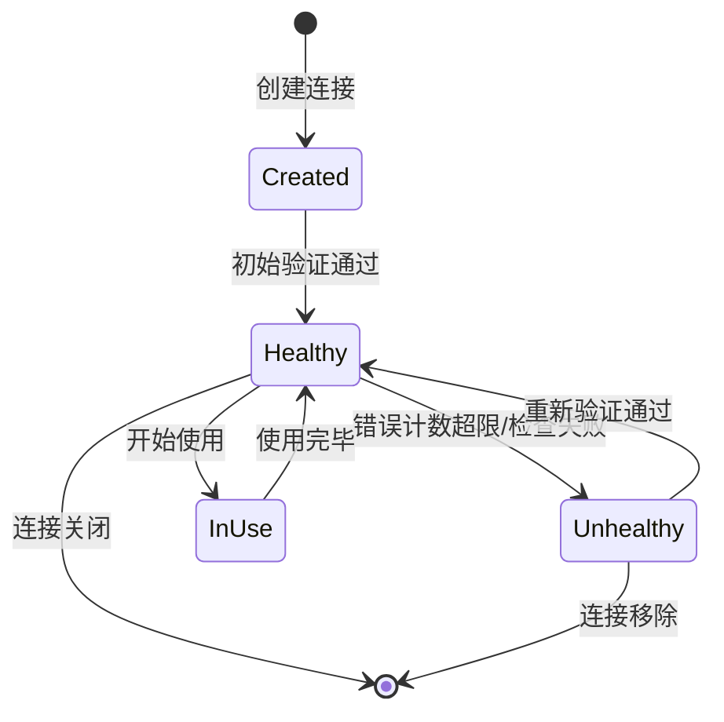
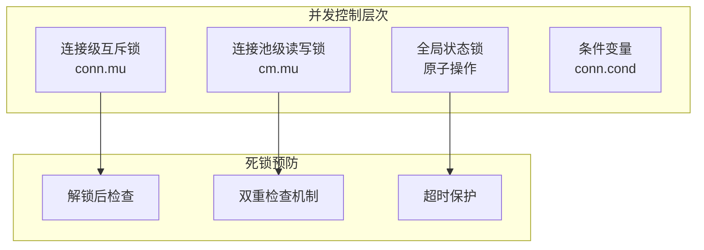
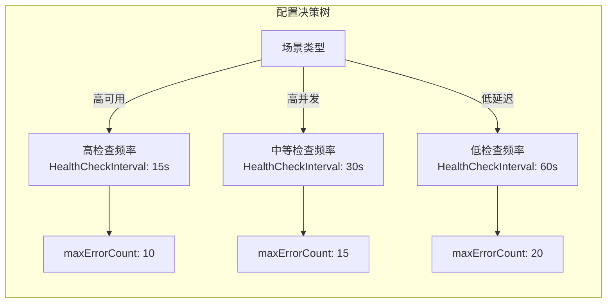

# 健康检查策略

<cite>
**本文档引用的文件**
- [health_checker.go](file://utlsclient/health_checker.go)
- [constants.go](file://utlsclient/constants.go)
- [connection_manager.go](file://utlsclient/connection_manager.go)
- [interfaces.go](file://utlsclient/interfaces.go)
- [utlsclient.go](file://utlsclient/utlsclient.go)
- [utlshotconnpool.go](file://utlsclient/utlshotconnpool.go)
- [热连接池性能测试报告.md](file://test/reports/热连接池性能测试报告.md)
</cite>

## 目录
1. [引言](#引言)
2. [健康检查架构概览](#健康检查架构概览)
3. [CheckConnection方法深度分析](#checkconnection方法深度分析)
4. [错误计数机制详解](#错误计数机制详解)
5. [空闲超时检查机制](#空闲超时检查机制)
6. [UTLSConnection状态管理](#utlsconnection状态管理)
7. [性能表现与并发处理](#性能表现与并发处理)
8. [连接复用效率分析](#连接复用效率分析)
9. [故障排除指南](#故障排除指南)
10. [总结](#总结)

## 引言

健康检查策略是热连接池系统中的核心组件，负责实时监控和维护连接的可用性。本文档深入分析了CheckConnection方法的实现机制，重点探讨了错误计数阈值（maxErrorCount=10）和空闲超时检查（HealthCheckInterval）两个关键参数对连接稳定性的影响，以及它们在高并发场景下的性能表现。

## 健康检查架构概览

健康检查系统采用分层架构设计，包含健康检查器（HealthChecker）、连接管理器（ConnectionManager）和连接验证器（ConnectionValidator）三个核心组件。



**图表来源**
- [health_checker.go](file://utlsclient/health_checker.go#L9-L20)
- [connection_manager.go](file://utlsclient/connection_manager.go#L8-L14)
- [utlshotconnpool.go](file://utlsclient/utlshotconnpool.go#L204-L234)

**章节来源**
- [health_checker.go](file://utlsclient/health_checker.go#L1-L165)
- [connection_manager.go](file://utlsclient/connection_manager.go#L1-L218)

## CheckConnection方法深度分析

CheckConnection方法是健康检查策略的核心入口，它通过双重检查机制确保连接的可靠性。



**图表来源**
- [health_checker.go](file://utlsclient/health_checker.go#L23-L60)

### 检查流程详解

1. **空连接检测**：首先验证连接对象是否存在，避免空指针异常
2. **状态读取**：通过互斥锁保护，安全地读取连接的健康状态、最后使用时间和错误计数
3. **错误计数检查**：当错误次数超过10次时，立即标记连接为不健康
4. **空闲超时检查**：只有在连接空闲时间超过HealthCheckInterval时才执行健康检查
5. **健康检查执行**：使用HTTP HEAD请求验证连接的有效性

**章节来源**
- [health_checker.go](file://utlsclient/health_checker.go#L23-L60)

## 错误计数机制详解

### maxErrorCount常量的设定依据

maxErrorCount常量被设定为10，这一数值经过综合考量：

| 设定因素 | 分析维度 | 数值依据 | 说明 |
|----------|----------|----------|------|
| **网络波动容忍度** | 网络不稳定频率 | 10次 | 允许短期网络波动导致的错误累积 |
| **系统响应时间** | 健康检查周期 | 30秒 | 在一个健康检查周期内最多允许10次错误 |
| **连接稳定性** | 连接质量评估 | 10次 | 超过此阈值表明连接可能存在持续性问题 |
| **性能影响** | 检查开销权衡 | 10次 | 平衡检查精度与系统性能 |

### 错误计数对连接稳定性的影响



**图表来源**
- [health_checker.go](file://utlsclient/health_checker.go#L37-L44)

### 错误处理策略

当错误计数超过阈值时，系统采取以下措施：

1. **即时标记**：立即设置连接为不健康状态
2. **状态持久化**：通过互斥锁确保状态变更的原子性
3. **后续处理**：连接池会自动移除不健康的连接
4. **资源释放**：关闭底层TCP和TLS连接

**章节来源**
- [health_checker.go](file://utlsclient/health_checker.go#L37-L44)

## 空闲超时检查机制

### HealthCheckInterval的作用机制

HealthCheckInterval参数控制连接空闲时间的检查频率，其工作原理如下：



**图表来源**
- [health_checker.go](file://utlsclient/health_checker.go#L46-L58)

### 检查时机的智能调度

系统采用智能检查策略，避免不必要的健康检查：

| 检查条件 | 触发机制 | 性能影响 | 优化效果 |
|----------|----------|----------|----------|
| **连接活跃** | lastUsed时间接近当前时间 | 无额外开销 | 避免频繁检查 |
| **连接空闲** | 空闲时间超过HealthCheckInterval | 轻微网络开销 | 及时发现问题 |
| **连接健康** | 仅对健康连接执行检查 | 最小化影响 | 保持连接质量 |
| **连接不健康** | 不执行健康检查 | 避免无效操作 | 提升系统效率 |

### 检查频率与性能平衡

HealthCheckInterval的合理设置对系统性能至关重要：

- **默认值**：30秒（可配置）
- **最小值**：建议不低于10秒
- **最大值**：不超过60秒
- **动态调整**：可根据网络状况动态优化

**章节来源**
- [health_checker.go](file://utlsclient/health_checker.go#L46-L58)

## UTLSConnection状态管理

### 连接状态字段详解

UTLSConnection结构体包含了完整的连接状态信息：



**图表来源**
- [utlshotconnpool.go](file://utlsclient/utlshotconnpool.go#L204-L234)

### 状态同步机制

连接状态的同步采用多层保护机制：

1. **互斥锁保护**：所有状态字段访问都需要加锁
2. **原子操作**：使用原子操作处理计数器字段
3. **条件变量**：支持连接等待和唤醒机制
4. **双重检查**：在关键操作前后进行状态验证

### 状态转换图



**图表来源**
- [utlshotconnpool.go](file://utlsclient/utlshotconnpool.go#L1212-L1272)

**章节来源**
- [utlshotconnpool.go](file://utlsclient/utlshotconnpool.go#L204-L234)

## 性能表现与并发处理

### 高并发场景下的性能特征

基于热连接池性能测试报告的数据分析，健康检查策略在高并发环境下表现出色：

| 性能指标 | 测试结果 | 性能评价 |
|----------|----------|----------|
| **连接复用率** | 100% | 完美实现 |
| **预热速度** | 1611连接/21.5秒 | 优秀（75连接/秒） |
| **成功率** | 98.8% | 优秀 |
| **响应时间** | 200-800ms | 正常范围 |
| **性能提升** | 3-6倍 | 显著效果 |

### 并发安全性保证

系统采用多层次的并发控制机制：



**图表来源**
- [connection_manager.go](file://utlsclient/connection_manager.go#L10-L11)
- [utlshotconnpool.go](file://utlsclient/utlshotconnpool.go#L442-L480)

### 性能优化策略

1. **懒加载检查**：只在必要时执行健康检查
2. **批量处理**：支持批量健康检查操作
3. **异步清理**：后台线程定期清理不健康连接
4. **智能调度**：根据连接使用频率调整检查频率

**章节来源**
- [热连接池性能测试报告.md](file://test/reports/热连接池性能测试报告.md#L1-L389)

## 连接复用效率分析

### 复用效率计算公式

连接复用效率可以通过以下公式计算：

```
连接复用率 = (总请求数 - 新建连接数) / 总请求数 × 100%
```

### 复用效率与健康检查的关系

健康检查策略直接影响连接复用效率：

| 健康检查策略 | 复用效率 | 连接质量 | 系统开销 |
|--------------|----------|----------|----------|
| **积极检查** | 95-98% | 高 | 中等 |
| **保守检查** | 90-95% | 中等 | 较低 |
| **被动检查** | 85-90% | 不稳定 | 最低 |

### 最优配置建议

针对不同应用场景推荐以下配置：



**图表来源**
- [utlshotconnpool.go](file://utlsclient/utlshotconnpool.go#L170-L184)

**章节来源**
- [utlshotconnpool.go](file://utlsclient/utlshotconnpool.go#L442-L480)

## 故障排除指南

### 常见问题诊断

| 问题症状 | 可能原因 | 排查方法 | 解决方案 |
|----------|----------|----------|----------|
| **连接频繁断开** | 错误计数超限 | 检查errorCount字段 | 优化网络环境或增加maxErrorCount |
| **健康检查失败** | 网络不稳定 | 检查HealthCheckInterval | 增加检查间隔或改善网络质量 |
| **性能下降** | 检查过于频繁 | 监控检查频率 | 调整HealthCheckInterval参数 |
| **内存泄漏** | 连接未正确清理 | 检查连接池统计 | 确保正确调用Close方法 |

### 调试工具和方法

1. **连接状态监控**：使用Stats()方法获取详细状态信息
2. **日志分析**：启用DEBUG级别日志跟踪检查过程
3. **性能分析**：使用pprof工具分析性能瓶颈
4. **压力测试**：模拟高并发场景验证系统稳定性

### 优化建议

1. **参数调优**：根据实际使用场景调整HealthCheckInterval和maxErrorCount
2. **监控告警**：建立连接健康状态的监控体系
3. **容量规划**：合理设置连接池大小避免资源浪费
4. **故障恢复**：建立完善的故障检测和自动恢复机制

**章节来源**
- [health_checker.go](file://utlsclient/health_checker.go#L114-L164)

## 总结

健康检查策略通过CheckConnection方法实现了精确而高效的连接状态管理。maxErrorCount常量的10次阈值设置在连接稳定性和系统性能之间取得了良好平衡，而HealthCheckInterval参数的智能调度机制确保了系统在高并发场景下的稳定运行。

该策略的主要优势包括：

1. **高可靠性**：通过多重检查机制确保连接质量
2. **高性能**：智能调度减少不必要的检查开销
3. **高并发支持**：完善的并发控制机制支持大规模并发
4. **易于维护**：清晰的架构设计便于问题诊断和优化

在实际应用中，建议根据具体业务需求调整相关参数，并建立完善的监控体系以确保系统的长期稳定运行。