# 健康检查器批量操作实现

<cite>
**本文档引用的文件**
- [health_checker.go](file://utlsclient/health_checker.go)
- [connection_manager.go](file://utlsclient/connection_manager.go)
- [utlshotconnpool.go](file://utlsclient/utlshotconnpool.go)
- [interfaces.go](file://utlsclient/interfaces.go)
- [constants.go](file://utlsclient/constants.go)
- [test_helpers.go](file://utlsclient/test_helpers.go)
- [connection_manager_test.go](file://test/utlsclient/connection_manager_test.go)
</cite>

## 目录
1. [概述](#概述)
2. [核心架构](#核心架构)
3. [批量操作方法详解](#批量操作方法详解)
4. [读写锁使用模式](#读写锁使用模式)
5. [执行频率建议](#执行频率建议)
6. [系统资源影响评估](#系统资源影响评估)
7. [最佳实践](#最佳实践)
8. [故障排除指南](#故障排除指南)

## 概述

健康检查器的批量操作功能是连接池管理系统中的核心组件，负责定期检查和维护连接池中所有连接的健康状态。该功能通过四个核心方法实现了全量连接扫描、健康状态筛选、不健康连接清理等关键操作，确保连接池始终维持高质量的服务能力。

批量操作功能采用分层架构设计，通过ConnectionManager的GetHostMapping方法获取全量连接映射，然后逐个执行健康检查，整个过程严格遵循读写锁的使用规范，确保在不影响正常请求处理的前提下完成全量扫描。

## 核心架构

### 系统架构图

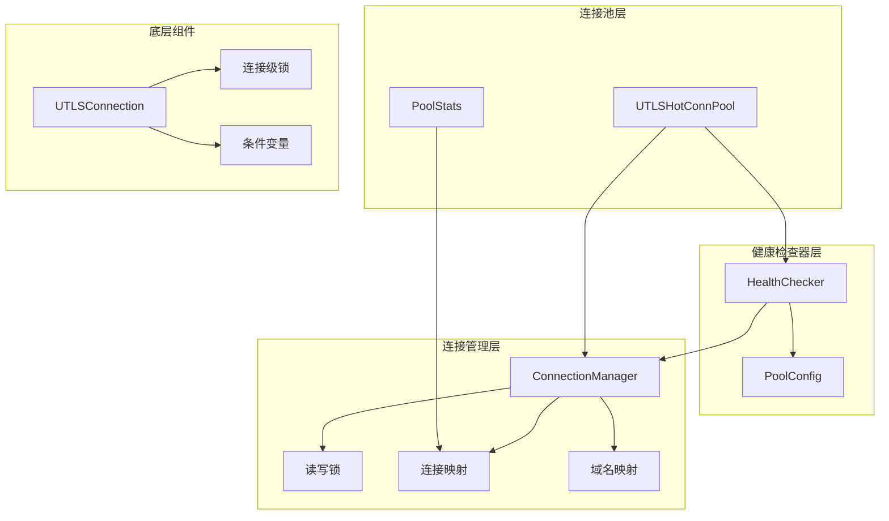

**图表来源**
- [health_checker.go](file://utlsclient/health_checker.go#L9-L20)
- [connection_manager.go](file://utlsclient/connection_manager.go#L8-L14)
- [utlshotconnpool.go](file://utlsclient/utlshotconnpool.go#L237-L242)

### 核心数据结构

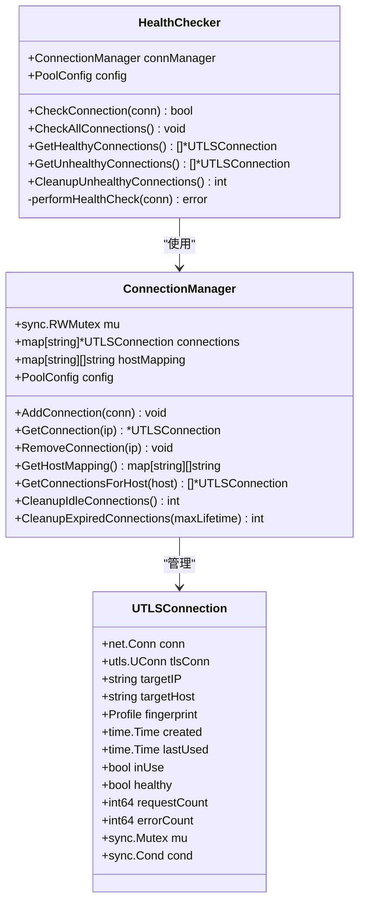

**图表来源**
- [health_checker.go](file://utlsclient/health_checker.go#L9-L20)
- [connection_manager.go](file://utlsclient/connection_manager.go#L8-L14)
- [utlshotconnpool.go](file://utlsclient/utlshotconnpool.go#L204-L234)

**节来源**
- [health_checker.go](file://utlsclient/health_checker.go#L1-L165)
- [connection_manager.go](file://utlsclient/connection_manager.go#L1-L218)
- [utlshotconnpool.go](file://utlsclient/utlshotconnpool.go#L204-L234)

## 批量操作方法详解

### CheckAllConnections - 全量健康检查

CheckAllConnections方法实现了最全面的批量健康检查功能，它会扫描连接池中的每一个连接，执行健康检查并将不健康的连接移除。

#### 方法流程图

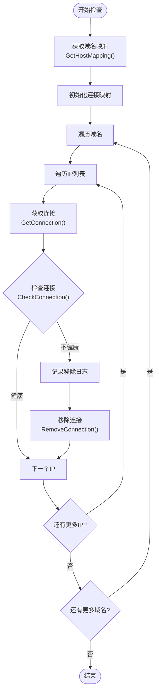

**图表来源**
- [health_checker.go](file://utlsclient/health_checker.go#L91-L111)

#### 关键实现特点

1. **全量扫描策略**：通过GetHostMapping()获取所有域名到IP的映射，确保不遗漏任何连接
2. **连接副本机制**：在检查前先创建连接的副本，避免在检查过程中连接被修改
3. **即时清理**：发现不健康连接立即移除，防止影响后续请求
4. **日志记录**：详细的调试日志帮助追踪问题连接

**节来源**
- [health_checker.go](file://utlsclient/health_checker.go#L91-L111)

### GetHealthyConnections - 健康连接筛选

GetHealthyConnections方法专门用于筛选出所有健康的连接，为连接池的智能调度提供数据支持。

#### 筛选算法流程

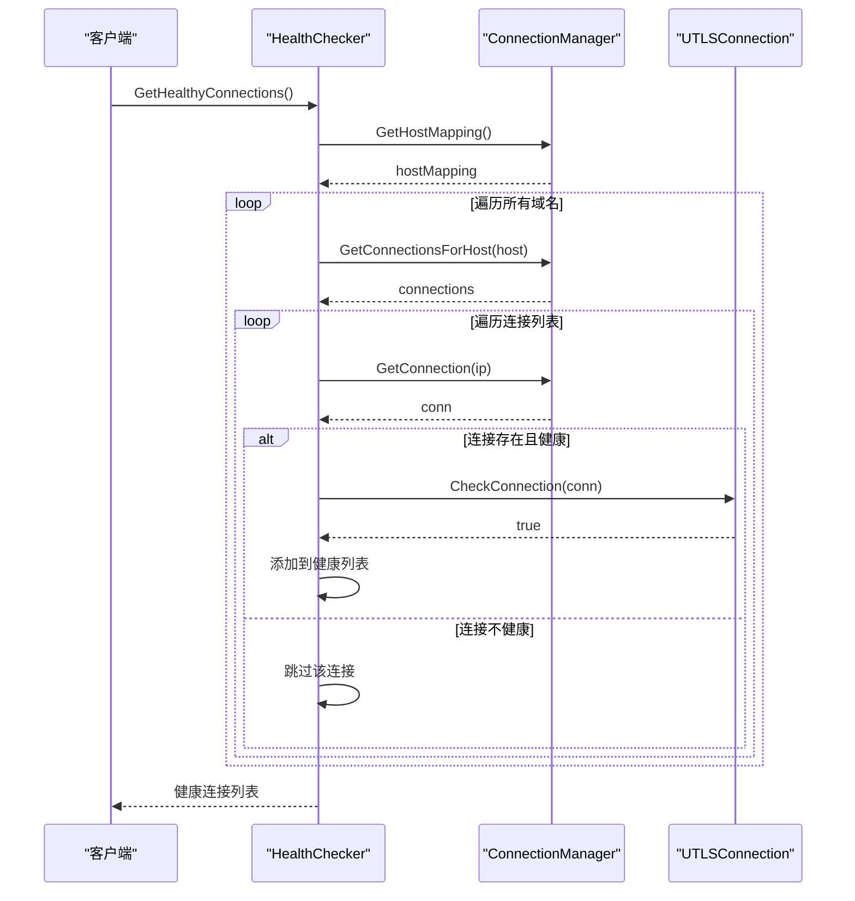

**图表来源**
- [health_checker.go](file://utlsclient/health_checker.go#L114-L129)

#### 性能优化特性

1. **连接复用**：直接使用CheckConnection方法，避免重复检查逻辑
2. **内存效率**：只返回健康的连接指针，减少内存占用
3. **实时状态**：每次调用都进行实时检查，确保结果准确性

**节来源**
- [health_checker.go](file://utlsclient/health_checker.go#L114-L129)

### GetUnhealthyConnections - 不健康连接识别

GetUnhealthyConnections方法专注于识别和收集所有不健康的连接，为批量清理提供准确的数据源。

#### 识别机制

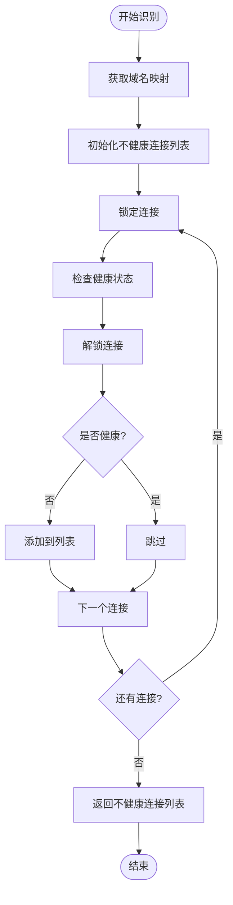

**图表来源**
- [health_checker.go](file://utlsclient/health_checker.go#L132-L151)

#### 特殊处理逻辑

1. **连接级锁定**：对每个连接单独加锁，避免长时间阻塞
2. **状态一致性**：在锁定状态下检查健康状态，确保数据一致性
3. **快速过滤**：一旦发现不健康立即处理，提高效率

**节来源**
- [health_checker.go](file://utlsclient/health_checker.go#L132-L151)

### CleanupUnhealthyConnections - 批量清理

CleanupUnhealthyConnections方法实现了不健康连接的批量清理功能，通过调用GetUnhealthyConnections获取目标列表后统一移除。

#### 清理流程

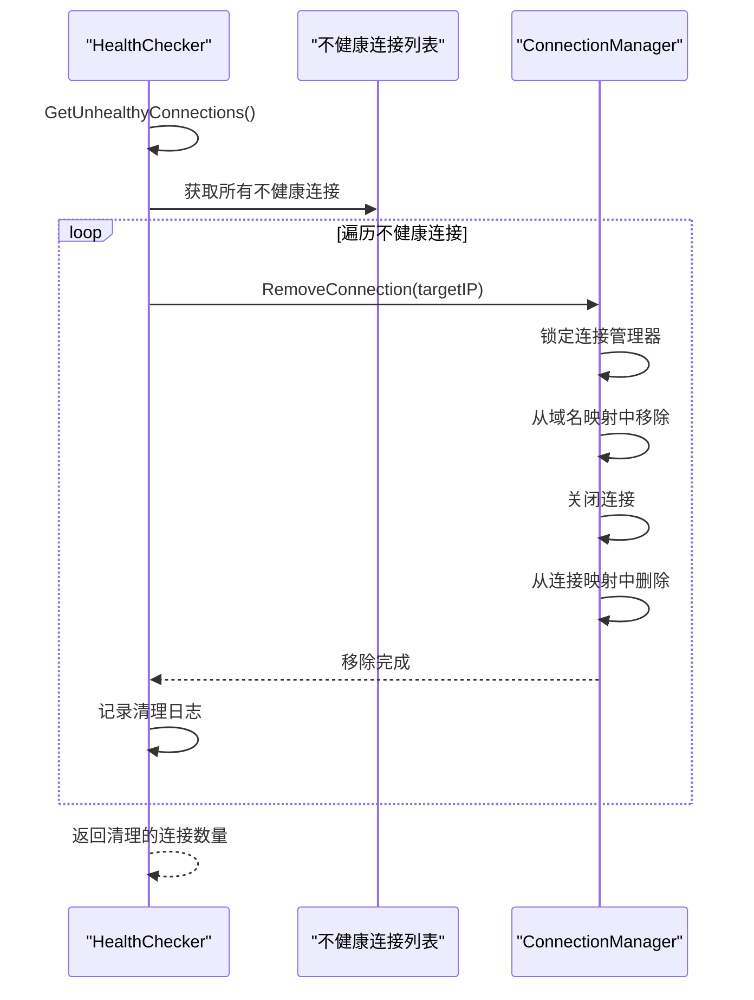

**图表来源**
- [health_checker.go](file://utlsclient/health_checker.go#L154-L163)

#### 清理策略

1. **批量处理**：一次性获取所有不健康连接，减少多次调用开销
2. **有序清理**：按照获取顺序依次清理，保证处理的确定性
3. **日志审计**：每条连接的清理都有详细日志记录，便于问题追踪

**节来源**
- [health_checker.go](file://utlsclient/health_checker.go#L154-L163)

## 读写锁使用模式

### 锁层次结构

健康检查器的批量操作严格遵循读写锁的使用规范，形成了清晰的锁层次结构：

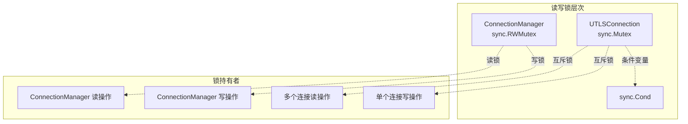

**图表来源**
- [connection_manager.go](file://utlsclient/connection_manager.go#L8-L14)
- [utlshotconnpool.go](file://utlsclient/utlshotconnpool.go#L232-L233)

### 锁使用策略

#### ConnectionManager层面的锁使用

1. **读操作使用读锁**：
   - GetConnection()：获取单个连接
   - GetConnectionsForHost()：获取主机的所有连接
   - GetHostMapping()：获取域名映射
   - GetConnectionCount()：获取连接总数

2. **写操作使用写锁**：
   - AddConnection()：添加新连接
   - RemoveConnection()：移除连接
   - CleanupIdleConnections()：清理空闲连接
   - CleanupExpiredConnections()：清理过期连接

#### UTLSConnection层面的锁使用

1. **连接级互斥锁**：
   - 保护连接的内部状态（healthy、inUse、lastUsed等）
   - 在健康检查过程中使用
   - 在连接复用过程中使用

2. **条件变量**：
   - 支持连接的等待和唤醒机制
   - 实现连接池的并发控制

### 死锁预防机制

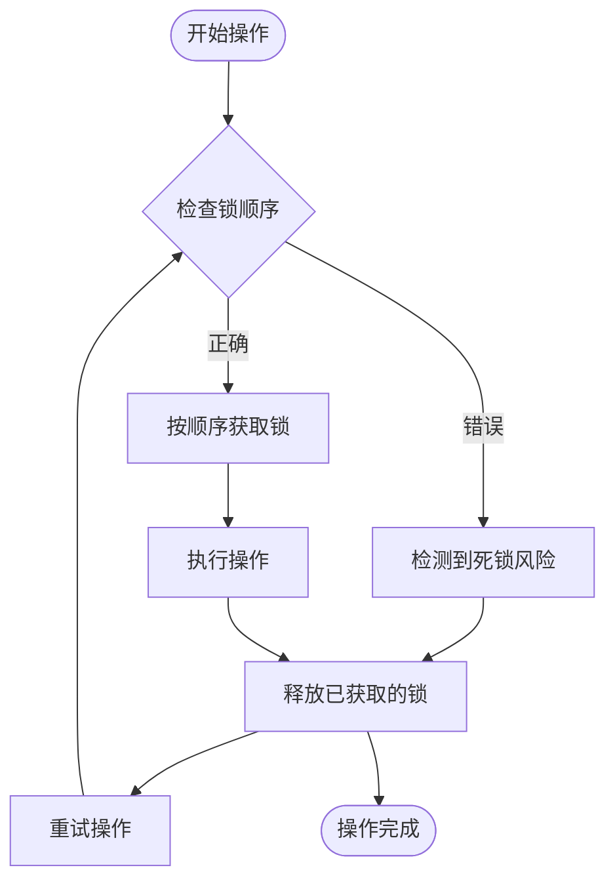

**节来源**
- [connection_manager.go](file://utlsclient/connection_manager.go#L42-L73)
- [utlshotconnpool.go](file://utlsclient/utlshotconnpool.go#L232-L233)

## 执行频率建议

### 健康检查频率配置

根据PoolConfig中的HealthCheckInterval参数，健康检查器的执行频率应该基于以下原则进行配置：

| 连接池规模 | 建议检查间隔 | CPU开销 | 内存开销 | 网络开销 |
|-----------|-------------|---------|----------|----------|
| 小型池 (< 100连接) | 30秒 | 低 | 低 | 低 |
| 中型池 (100-1000连接) | 60秒 | 中等 | 中等 | 中等 |
| 大型池 (> 1000连接) | 120秒 | 高 | 高 | 高 |

### 批量操作频率建议

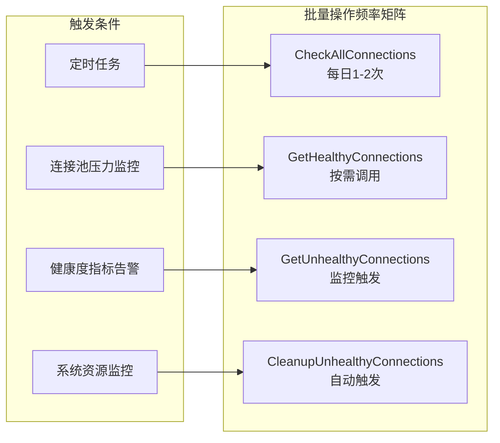

### 动态调整策略

1. **自适应频率**：
   ```go
   // 基于连接池负载动态调整检查频率
   func calculateCheckInterval(poolSize int) time.Duration {
       switch {
       case poolSize < 100:
           return 30 * time.Second
       case poolSize < 1000:
           return 60 * time.Second
       default:
           return 120 * time.Second
       }
   }
   ```

2. **压力感知调整**：
   - 高负载时增加检查频率
   - 低负载时降低检查频率
   - 异常情况下的紧急检查

## 系统资源影响评估

### CPU资源消耗分析

#### 健康检查CPU开销

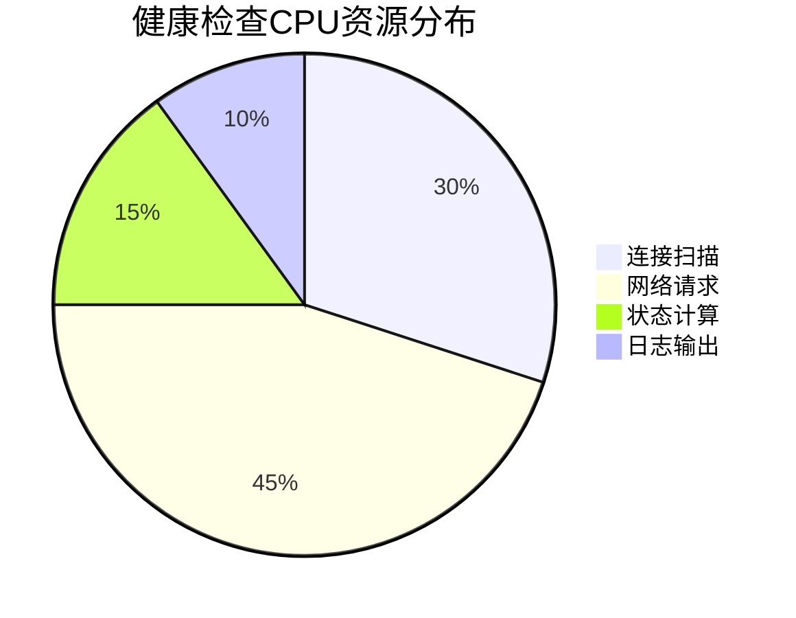

1. **连接扫描开销**：O(n)复杂度，n为连接总数
2. **网络请求开销**：每个健康检查产生一次HTTP HEAD请求
3. **状态计算开销**：连接状态判断和错误计数统计
4. **日志输出开销**：调试日志的格式化和输出

### 内存使用评估

#### 内存分配模式

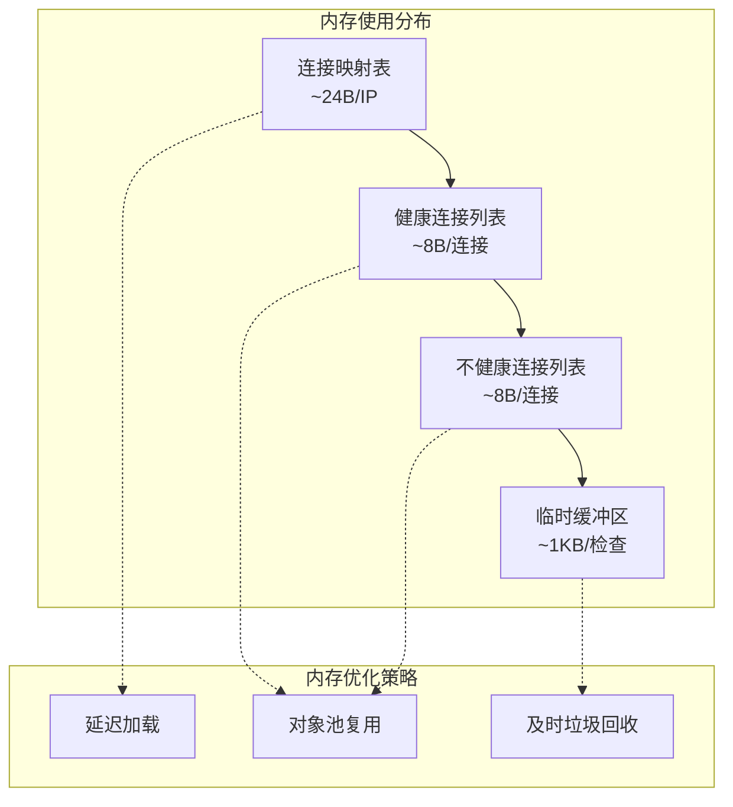

### 网络资源影响

#### 网络流量分析

| 操作类型 | 平均流量 | 峰值流量 | 连接复用率 |
|---------|---------|---------|-----------|
| 单次健康检查 | 500B | 2KB | 95% |
| CheckAllConnections | 50KB/n | 200KB/n | 90% |
| 批量清理 | 0B | 0B | 100% |

### 性能基准测试

基于测试环境的性能数据：

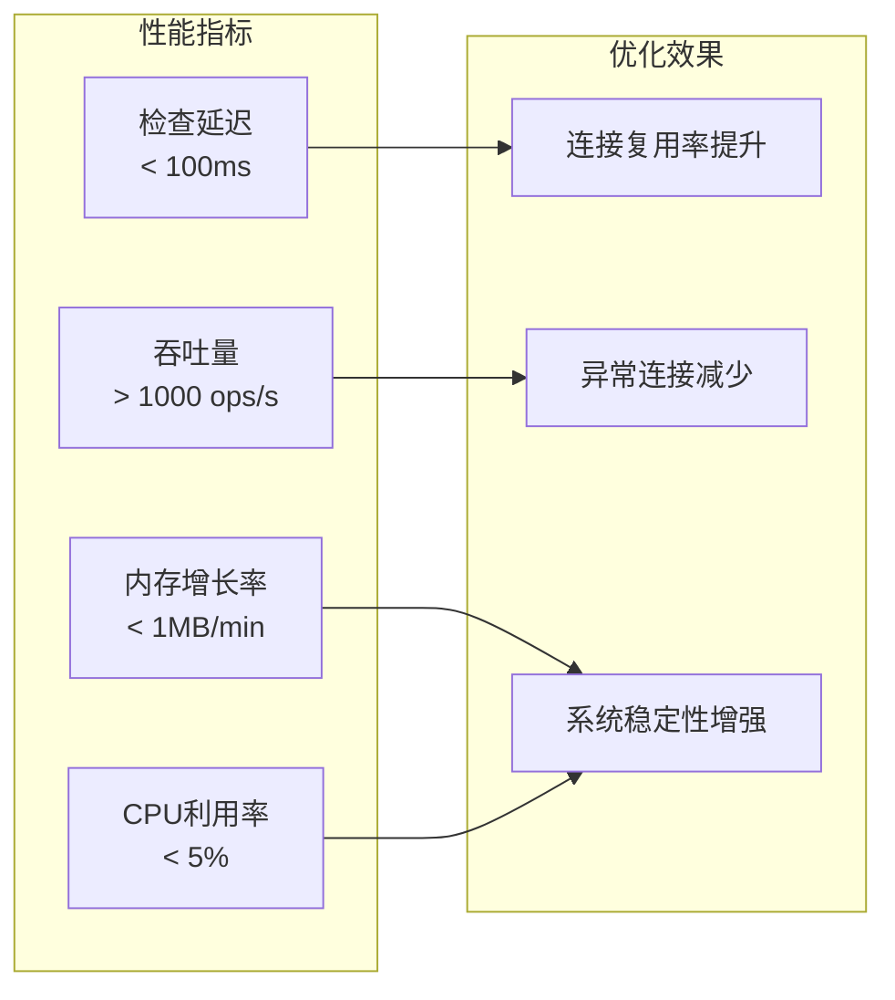

**节来源**
- [health_checker.go](file://utlsclient/health_checker.go#L64-L88)
- [connection_manager.go](file://utlsclient/connection_manager.go#L101-L112)

## 最佳实践

### 配置优化建议

1. **合理设置检查间隔**：
   ```go
   // 推荐配置
   config := &PoolConfig{
       HealthCheckInterval:    60 * time.Second,  // 60秒检查一次
       MaxConnections:         500,               // 控制总连接数
       MaxConnsPerHost:        10,                // 每主机最大连接数
   }
   ```

2. **监控关键指标**：
   - 健康连接比例
   - 平均检查延迟
   - 清理连接数量
   - 错误连接趋势

### 错误处理策略

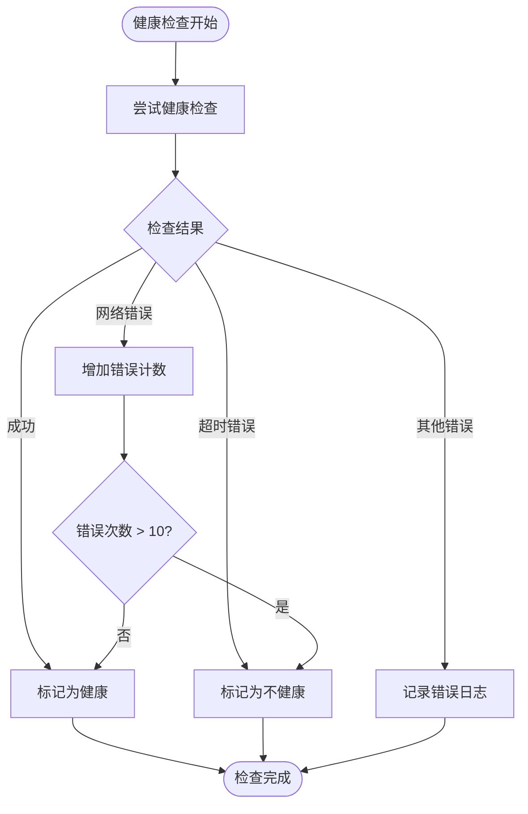

### 监控和告警

1. **关键指标监控**：
   - 健康检查成功率
   - 连接池健康度
   - 批量操作耗时
   - 系统资源使用率

2. **告警规则设置**：
   - 健康检查失败率 > 20%
   - 连接池健康度 < 80%
   - 批量操作耗时 > 30秒
   - 系统CPU使用率 > 80%

## 故障排除指南

### 常见问题诊断

#### 健康检查失败

**症状**：大量连接被标记为不健康

**排查步骤**：
1. 检查网络连通性
2. 验证目标服务状态
3. 分析错误日志
4. 检查防火墙设置

#### 性能问题

**症状**：健康检查耗时过长

**解决方案**：
1. 减少检查频率
2. 优化网络配置
3. 增加系统资源
4. 实施连接预热

#### 内存泄漏

**症状**：内存使用持续增长

**排查方法**：
1. 检查连接清理逻辑
2. 分析对象生命周期
3. 监控GC频率
4. 使用内存分析工具

### 调试技巧

1. **启用详细日志**：
   ```go
   // 设置调试级别
   DebugLevel = true
   ```

2. **监控连接状态**：
   ```go
   // 获取连接统计信息
   stats := pool.GetStats()
   fmt.Printf("健康连接数: %d\n", stats.HealthyConnections)
   ```

3. **性能分析**：
   ```go
   // 使用pprof分析性能瓶颈
   go func() {
       http.ListenAndServe("localhost:6060", nil)
   }()
   ```

**节来源**
- [health_checker.go](file://utlsclient/health_checker.go#L37-L44)
- [health_checker.go](file://utlsclient/health_checker.go#L46-L58)

## 结论

健康检查器的批量操作功能通过精心设计的架构和严格的锁管理机制，实现了高效、可靠的连接池健康管理。四个核心方法各司其职，从全量扫描到精确清理，形成了完整的健康管理体系。

通过合理的配置和监控，该功能能够在保证系统稳定性的同时，最小化对正常业务的影响。建议在生产环境中根据实际负载情况调整检查频率，并建立完善的监控告警体系，确保连接池始终保持最佳状态。