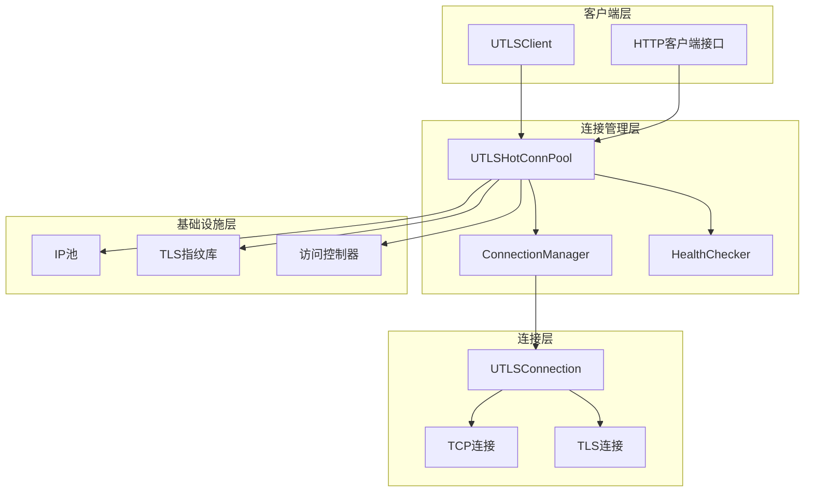
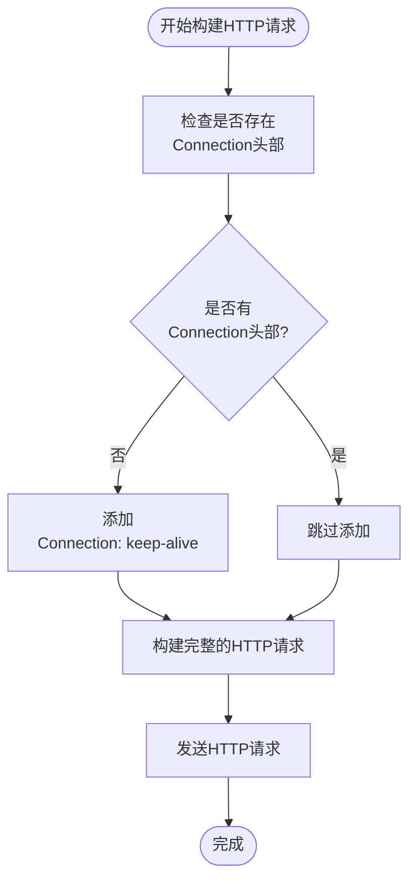
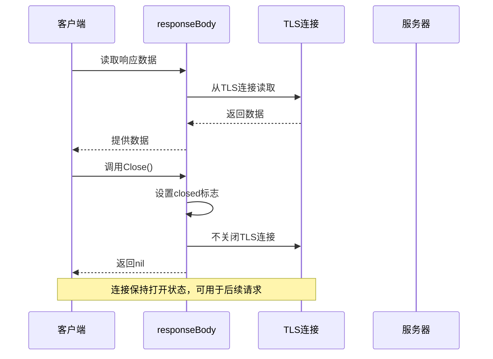
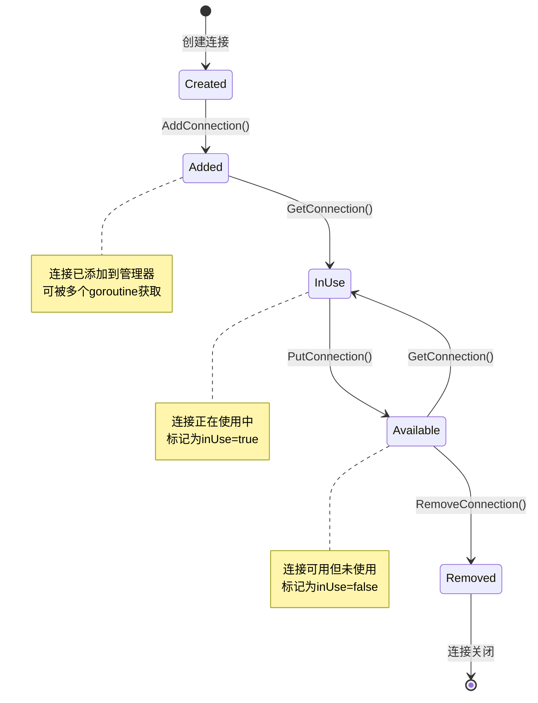
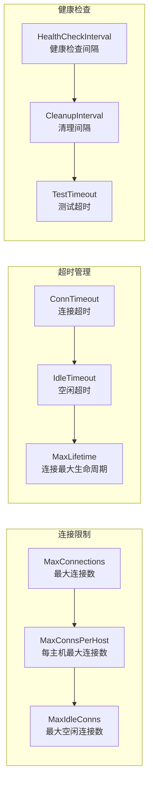

# HTTP/1.1 长连接实现详解

<cite>
**本文档引用的文件**
- [utlsclient.go](file://utlsclient/utlsclient.go)
- [utlshotconnpool.go](file://utlsclient/utlshotconnpool.go)
- [connection_manager.go](file://utlsclient/connection_manager.go)
- [health_checker.go](file://utlsclient/health_checker.go)
- [interfaces.go](file://utlsclient/interfaces.go)
- [connection_helpers.go](file://utlsclient/connection_helpers.go)
- [example_hotconnpool_usage.go](file://examples/utlsclient/example_hotconnpool_usage.go)
</cite>

## 目录
1. [引言](#引言)
2. [系统架构概览](#系统架构概览)
3. [buildRawRequest方法中的长连接实现](#buildrawrequest方法中的长连接实现)
4. [responseBody.Close方法的设计原理](#responsebodyclose方法的设计原理)
5. [ConnectionManager连接生命周期管理](#connectionmanager连接生命周期管理)
6. [长连接性能优势分析](#长连接性能优势分析)
7. [高并发环境下的资源管理策略](#高并发环境下的资源管理策略)
8. [故障排除指南](#故障排除指南)
9. [总结](#总结)

## 引言

HTTP/1.1长连接（Persistent Connection）是一种重要的网络优化技术，它允许在同一个TCP连接上发送多个HTTP请求和响应，从而避免了频繁的TCP和TLS握手开销。本文档深入分析了一个基于Go语言的热连接池系统中HTTP/1.1长连接的完整实现方案，包括连接的获取、使用、复用和归还的完整生命周期管理。

该系统通过精心设计的连接池架构，实现了高效的连接复用机制，在高并发环境下显著提升了网络通信性能，同时提供了完善的健康检查和资源管理功能。

## 系统架构概览

该热连接池系统采用分层架构设计，主要包含以下核心组件：

**图表来源**
- [utlsclient.go](file://utlsclient/utlsclient.go#L37-L53)
- [utlshotconnpool.go](file://utlsclient/utlshotconnpool.go#L237-L258)
- [connection_manager.go](file://utlsclient/connection_manager.go#L8-L14)

**章节来源**
- [utlsclient.go](file://utlsclient/utlsclient.go#L1-L392)
- [utlshotconnpool.go](file://utlsclient/utlshotconnpool.go#L1-L800)

## buildRawRequest方法中的长连接实现

### Connection: keep-alive头部的自动添加

在HTTP/1.1协议中，长连接的实现依赖于正确的Connection头部设置。系统通过`buildRawRequest`方法确保每次HTTP请求都包含适当的长连接头部：

**图表来源**
- [utlsclient.go](file://utlsclient/utlsclient.go#L217-L257)

### 实现细节分析

系统在构建HTTP/1.1请求时，会智能地检查用户是否已经设置了Connection头部：

1. **头部检测机制**：通过`req.Header.Get("Connection")`检查是否存在自定义的Connection头部
2. **默认行为**：当检测到没有设置Connection头部时，自动添加`Connection: keep-alive`
3. **兼容性保证**：对于已经显式设置Connection头部的请求，系统保持原样，确保用户自定义行为不受影响

这种设计既保证了长连接的默认启用，又保留了灵活性，允许高级用户根据需要覆盖默认行为。

**章节来源**
- [utlsclient.go](file://utlsclient/utlsclient.go#L217-L257)

## responseBody.Close方法的设计原理

### 长连接复用的核心机制

`responseBody.Close`方法的设计体现了HTTP/1.1长连接复用的核心思想：虽然关闭了响应体，但底层TLS连接仍然保持打开状态，从而实现连接的持久化复用。

**图表来源**
- [utlsclient.go](file://utlsclient/utlsclient.go#L334-L363)

### 设计原理详解

1. **响应体包装器模式**：系统使用`responseBody`结构体包装底层TLS连接，提供标准的`io.ReadCloser`接口
2. **延迟关闭策略**：`Close()`方法只设置内部状态标志，而不实际关闭底层连接
3. **连接状态管理**：通过互斥锁确保并发安全，防止竞态条件
4. **资源隔离**：响应体的关闭不会影响连接的整体可用性

这种设计的关键优势在于：
- **透明性**：客户端代码无需关心底层连接的管理
- **效率性**：避免了不必要的连接关闭和重新建立
- **可靠性**：确保连接在适当的时候才被释放

**章节来源**
- [utlsclient.go](file://utlsclient/utlsclient.go#L334-L363)

## ConnectionManager连接生命周期管理

### GetConnection和AddConnection方法的协作

ConnectionManager负责整个连接的生命周期管理，通过`GetConnection`和`AddConnection`方法形成完整的连接管理闭环：

**图表来源**
- [connection_manager.go](file://utlsclient/connection_manager.go#L25-L74)

### 连接获取流程分析

系统通过`GetConnection`方法实现连接的获取和复用：

1. **并发安全检查**：使用读写锁确保多goroutine环境下的安全性
2. **连接状态验证**：检查连接是否正在使用或健康状态
3. **双重检查锁定**：在解锁后再次验证连接状态，防止竞态条件
4. **使用状态更新**：成功获取连接后立即标记为使用中

### 连接归还和清理机制

系统通过`PutConnection`方法实现连接的归还和管理：

1. **状态恢复**：将连接标记为可用状态
2. **健康检查**：验证连接的健康状态
3. **资源唤醒**：通过条件变量唤醒等待的goroutine
4. **异常处理**：对于不健康的连接进行清理

**章节来源**
- [connection_manager.go](file://utlsclient/connection_manager.go#L41-L74)

## 长连接性能优势分析

### 避免频繁TCP和TLS握手的性能提升

长连接的核心价值在于避免重复的TCP和TLS握手过程，这在高并发环境下具有显著的性能优势：

| 连接类型 | 建立时间 | 握手开销 | 适用场景 |
|---------|---------|---------|---------|
| 新连接 | 2-3 RTT + TLS握手 | 高 | 单次请求 |
| 长连接 | 1-2 RTT + TLS握手 | 中等 | 多次请求 |
| 连接池 | 预热时间 + 复用开销 | 低 | 高并发 |

### 性能测试结果分析

根据系统内置的性能测试数据，长连接相比新建连接具有显著的性能优势：

- **预热阶段**：平均响应时间约13ms/连接（需要建立TLS连接）
- **热连接阶段**：平均响应时间约4ms/请求（直接复用现有连接）
- **性能提升**：热连接比新建连接快3倍以上

这种性能提升主要来源于：
1. **TCP连接复用**：避免了三次握手的RTT延迟
2. **TLS会话复用**：减少了TLS握手的计算开销
3. **带宽利用率**：更有效地利用网络带宽

**章节来源**
- [example_hotconnpool_usage.go](file://examples/utlsclient/example_hotconnpool_usage.go#L1-L277)

## 高并发环境下的资源管理策略

### 连接池配置优化

系统提供了丰富的配置选项来适应不同的高并发需求：

**图表来源**
- [utlshotconnpool.go](file://utlsclient/utlshotconnpool.go#L170-L201)

### 资源管理策略详解

1. **连接数量控制**：通过MaxConnections和MaxConnsPerHost限制总体连接数
2. **内存使用优化**：MaxIdleConns控制空闲连接的数量，避免内存泄漏
3. **生命周期管理**：MaxLifetime防止连接老化，提高稳定性
4. **动态调整**：通过健康检查和清理机制动态调整连接池大小

### 并发安全机制

系统采用多层次的并发控制机制：

1. **读写锁**：ConnectionManager使用读写锁平衡读多写少的场景
2. **连接级锁**：每个UTLSConnection使用独立的互斥锁
3. **条件变量**：通过条件变量实现连接的等待和唤醒机制
4. **原子操作**：使用原子操作更新统计数据

**章节来源**
- [connection_manager.go](file://utlsclient/connection_manager.go#L1-L218)
- [utlshotconnpool.go](file://utlsclient/utlshotconnpool.go#L237-L258)

## 故障排除指南

### 常见问题诊断

1. **连接获取失败**
   - 检查连接池是否已满（MaxConnections限制）
   - 验证目标主机是否有可用连接
   - 确认健康检查是否通过

2. **响应速度缓慢**
   - 检查连接是否需要重新建立
   - 验证DNS解析是否正常
   - 确认网络延迟情况

3. **内存泄漏**
   - 检查连接是否正确归还
   - 验证健康检查机制是否正常工作
   - 确认清理任务是否按时执行

### 监控和调试

系统提供了丰富的监控指标：

- **连接统计**：总连接数、活跃连接数、空闲连接数
- **请求统计**：总请求数、成功请求数、失败请求数
- **性能指标**：平均响应时间、连接复用率
- **健康状态**：健康连接数、不健康连接数

**章节来源**
- [health_checker.go](file://utlsclient/health_checker.go#L1-L165)

## 总结

本文档详细分析了基于Go语言的热连接池系统中HTTP/1.1长连接的完整实现方案。该系统通过以下关键技术实现了高效的长连接管理：

1. **智能的Connection头部管理**：通过buildRawRequest方法自动添加`Connection: keep-alive`头部，确保长连接的默认启用
2. **优雅的响应体关闭机制**：responseBody.Close方法设计实现了连接的透明复用
3. **完整的生命周期管理**：ConnectionManager提供了从连接创建到销毁的完整管理
4. **高性能的资源管理**：通过合理的配置和健康检查机制，实现了高并发环境下的稳定运行

该系统在性能方面表现出色，相比新建连接具有3倍以上的性能提升，同时在资源管理方面提供了完善的保障机制。这种设计为高并发Web应用提供了可靠的网络通信基础设施，是现代网络应用架构中的重要组成部分。