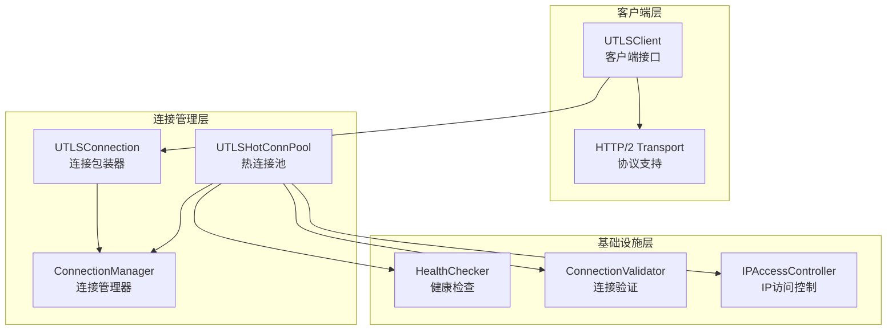
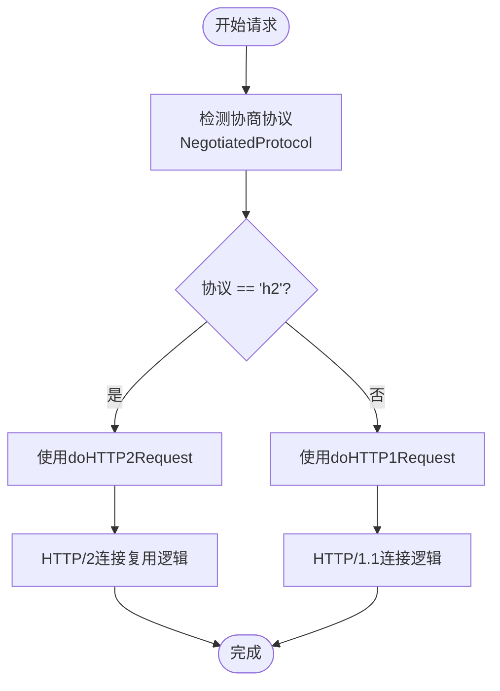
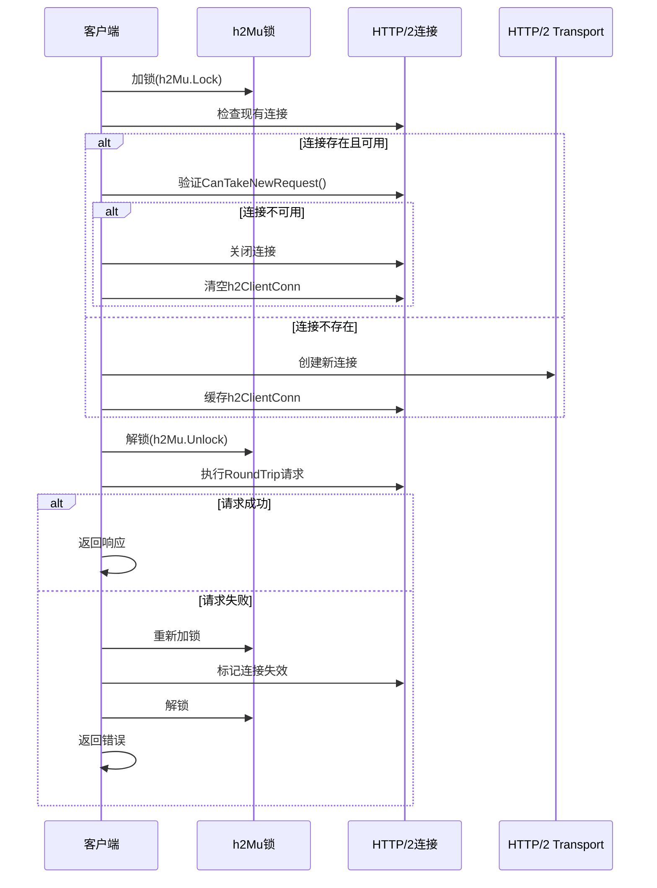
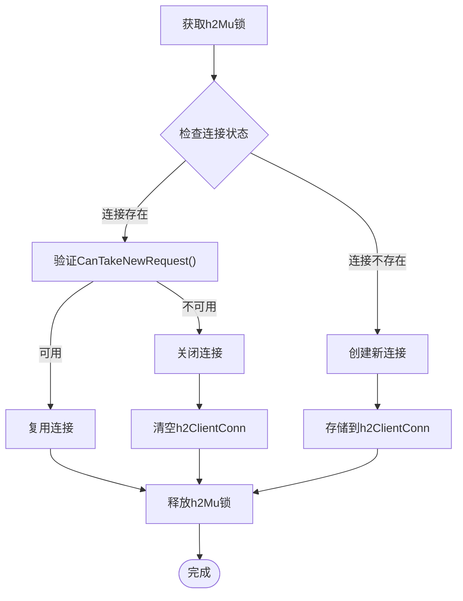
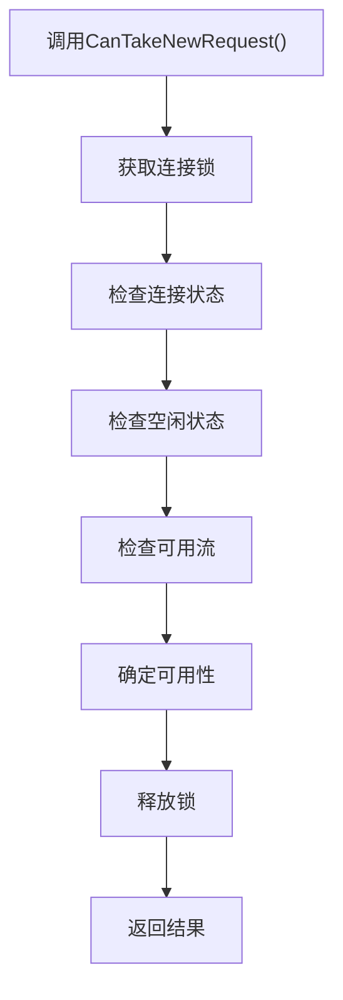
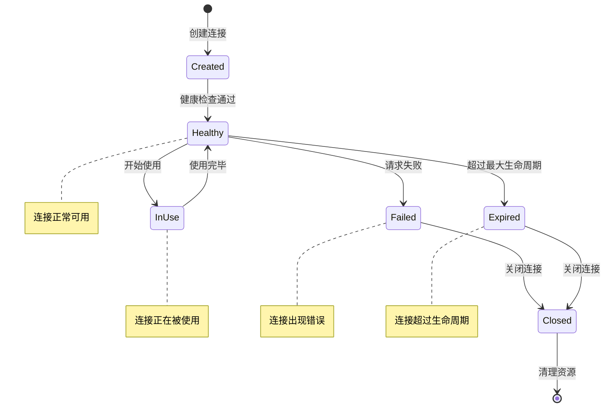
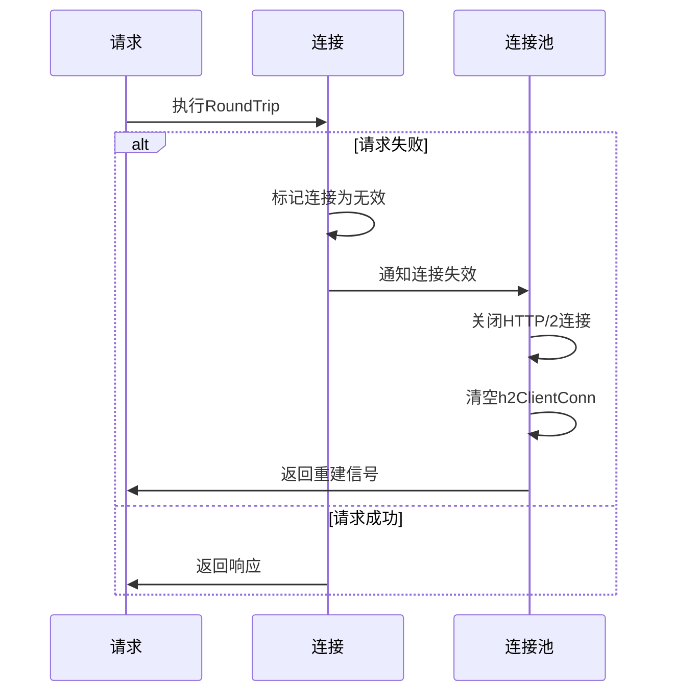
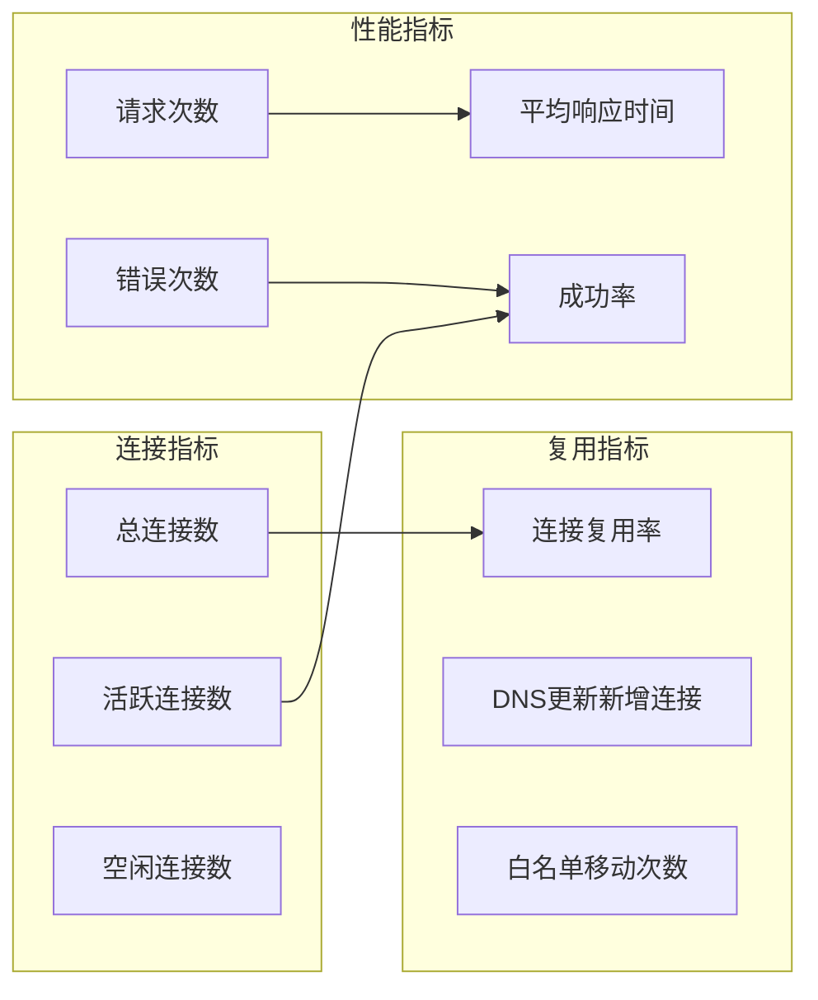

# HTTP/2 连接复用

<cite>
**本文档引用的文件**
- [utlsclient.go](file://utlsclient/utlsclient.go)
- [utlshotconnpool.go](file://utlsclient/utlshotconnpool.go)
- [connection_manager.go](file://utlsclient/connection_manager.go)
- [connection_helpers.go](file://utlsclient/connection_helpers.go)
- [connection_validator.go](file://utlsclient/connection_validator.go)
- [final_reuse_test.txt](file://test/results/archive/final_reuse_test.txt)
- [reuse_connection_output.txt](file://test/results/archive/reuse_connection_output.txt)
- [热连接池性能测试报告.md](file://test/reports/热连接池性能测试报告.md)
</cite>

## 目录
1. [引言](#引言)
2. [项目架构概览](#项目架构概览)
3. [核心组件分析](#核心组件分析)
4. [HTTP/2连接复用机制](#http2连接复用机制)
5. [doHTTP2Request方法深度解析](#dohttp2request方法深度解析)
6. [连接状态管理](#连接状态管理)
7. [性能优化与监控](#性能优化与监控)
8. [最佳实践](#最佳实践)
9. [总结](#总结)

## 引言

HTTP/2连接复用是现代Web应用中提高性能的关键技术之一。本文档深入分析了一个基于Go语言的HTTP/2连接复用实现，展示了如何通过互斥锁安全地管理连接状态，实现高效的连接复用机制。该系统不仅减少了TLS握手开销，还在高并发场景下显著提升了性能。

## 项目架构概览

该项目采用分层架构设计，主要包含以下核心模块：



**图表来源**
- [utlsclient.go](file://utlsclient/utlsclient.go#L37-L43)
- [utlshotconnpool.go](file://utlsclient/utlshotconnpool.go#L237-L258)
- [connection_manager.go](file://utlsclient/connection_manager.go#L8-L14)

**章节来源**
- [utlsclient.go](file://utlsclient/utlsclient.go#L1-L50)
- [utlshotconnpool.go](file://utlsclient/utlshotconnpool.go#L1-L100)

## 核心组件分析

### UTLSConnection结构体

UTLSConnection是连接的核心抽象，包含了HTTP/2连接复用所需的所有状态信息：

```mermaid
classDiagram
class UTLSConnection {
+net.Conn conn
+*utls.UConn tlsConn
+string targetIP
+string targetHost
+Profile fingerprint
+string acceptLanguage
+interface{} h2ClientConn
+sync.Mutex h2Mu
+time.Time created
+time.Time lastUsed
+bool inUse
+bool healthy
+int64 requestCount
+int64 errorCount
+sync.Mutex mu
+*sync.Cond cond
+Close() error
+IsHealthy() bool
+RequestCount() int64
+Stats() ConnectionStats
}
class ConnectionManager {
+sync.RWMutex mu
+map[string]*UTLSConnection connections
+map[string][]string hostMapping
+*PoolConfig config
+AddConnection(conn) void
+GetConnection(ip) *UTLSConnection
+RemoveConnection(ip) void
+GetConnectionsForHost(host) []*UTLSConnection
}
UTLSConnection --> ConnectionManager : "managed by"
```

**图表来源**
- [utlsclient.go](file://utlsclient/utlsclient.go#L37-L43)
- [utlshotconnpool.go](file://utlsclient/utlshotconnpool.go#L204-L234)
- [connection_manager.go](file://utlsclient/connection_manager.go#L8-L14)

### 连接池配置

连接池通过PoolConfig进行统一配置管理，支持灵活的参数调整：

| 配置项 | 类型 | 默认值 | 说明 |
|--------|------|--------|------|
| MaxConnections | int | 100 | 最大连接数 |
| MaxConnsPerHost | int | 10 | 每个主机最大连接数 |
| ConnTimeout | time.Duration | 30s | 连接超时时间 |
| IdleTimeout | time.Duration | 60s | 空闲超时时间 |
| MaxLifetime | time.Duration | 300s | 连接最大生命周期 |
| HealthCheckInterval | time.Duration | 30s | 健康检查间隔 |

**章节来源**
- [utlshotconnpool.go](file://utlsclient/utlshotconnpool.go#L170-L202)

## HTTP/2连接复用机制

### 协议协商与选择

系统首先检测TLS连接的协议协商结果，决定使用HTTP/1.1还是HTTP/2：



**图表来源**
- [utlsclient.go](file://utlsclient/utlsclient.go#L130-L141)

### HTTP/2多路复用优势

HTTP/2多路复用通过单个TCP连接同时处理多个HTTP请求，带来以下性能优势：

1. **减少连接开销**：避免了多次TCP三次握手和TLS握手
2. **带宽利用率高**：单连接内实现请求并发
3. **延迟降低**：消除连接建立的时间开销
4. **资源节省**：减少系统连接数和内存占用

**章节来源**
- [utlsclient.go](file://utlsclient/utlsclient.go#L130-L141)

## doHTTP2Request方法深度解析

### 方法流程图



**图表来源**
- [utlsclient.go](file://utlsclient/utlshotconnpool.go#L144-L188)

### h2Mu互斥锁安全机制

h2Mu互斥锁确保HTTP/2连接状态的安全访问：



**图表来源**
- [utlsclient.go](file://utlsclient/utlsclient.go#L146-L188)

### CanTakeNewRequest检查机制

CanTakeNewRequest方法是连接可用性检查的核心：



**图表来源**
- [utlsclient.go](file://utlsclient/utlsclient.go#L150-L155)

**章节来源**
- [utlsclient.go](file://utlsclient/utlsclient.go#L144-L188)

## 连接状态管理

### 连接生命周期



### 连接重建机制

当RoundTrip请求失败时，系统会自动触发连接重建：



**图表来源**
- [utlsclient.go](file://utlsclient/utlsclient.go#L178-L186)

### 连接验证策略

系统针对不同协议采用不同的验证策略：

| 协议类型 | 验证方法 | 验证内容 |
|----------|----------|----------|
| HTTP/2 | 状态检查 | 连接健康状态、生命周期 |
| HTTP/1.1 | HEAD请求 | 响应状态码、连接可用性 |

**章节来源**
- [utlshotconnpool.go](file://utlsclient/utlshotconnpool.go#L629-L675)
- [utlshotconnpool.go](file://utlsclient/utlshotconnpool.go#L677-L723)

## 性能优化与监控

### 性能提升效果

根据测试数据显示，HTTP/2连接复用带来了显著的性能提升：

| 阶段 | 平均响应时间 | 特点 |
|------|-------------|------|
| 预热阶段 | ~13ms/连接 | 需要建立TLS连接（TCP握手+TLS握手） |
| 热连接阶段 | ~4ms/请求 | 直接复用现有连接，无握手开销 |
| 性能提升 | 3倍以上 | 热连接比新建连接快3倍以上 |

### 监控指标

系统提供了丰富的监控指标：



**图表来源**
- [utlshotconnpool.go](file://utlsclient/utlshotconnpool.go#L261-L277)

### 高并发场景优化

系统通过以下机制确保高并发场景下的稳定性：

1. **读写锁分离**：ConnectionManager使用RWMutex实现读写分离
2. **条件变量**：UTLSConnection使用sync.Cond实现连接等待机制
3. **原子操作**：请求计数使用atomic操作保证线程安全
4. **双重检查**：连接获取时的双重检查防止竞态条件

**章节来源**
- [connection_manager.go](file://utlsclient/connection_manager.go#L1-L50)
- [utlshotconnpool.go](file://utlsclient/utlshotconnpool.go#L1212-L1272)

## 最佳实践

### 连接池配置建议

根据不同的使用场景，推荐以下配置参数：

| 场景类型 | MaxConnections | MaxConnsPerHost | ConnTimeout | IdleTimeout |
|----------|----------------|-----------------|-------------|-------------|
| 高并发短连接 | 200-500 | 5-10 | 10s | 30s |
| 中等并发长连接 | 100-200 | 3-5 | 30s | 60s |
| 低并发稳定连接 | 50-100 | 2-3 | 60s | 120s |

### 调试和监控

1. **启用调试日志**：通过projlogger设置适当的日志级别
2. **定期健康检查**：利用HealthChecker定期验证连接状态
3. **监控连接统计**：通过Stats方法获取详细的连接使用情况
4. **性能基准测试**：使用提供的测试工具验证系统性能

### 故障排除

常见问题及解决方案：

| 问题 | 症状 | 解决方案 |
|------|------|----------|
| 连接超时 | 请求频繁失败 | 调整ConnTimeout参数 |
| 内存泄漏 | 连接数持续增长 | 检查连接清理逻辑 |
| 性能下降 | 响应时间增加 | 优化健康检查频率 |
| 协议协商失败 | HTTP/2连接建立失败 | 检查TLS配置和指纹 |

**章节来源**
- [utlsclient.go](file://utlsclient/utlsclient.go#L1-L100)
- [final_reuse_test.txt](file://test/results/archive/final_reuse_test.txt#L1-L47)

## 总结

本文档详细分析了基于Go语言的HTTP/2连接复用实现，展示了如何通过精心设计的互斥锁机制、连接状态管理和监控体系，实现高效可靠的连接复用。该系统不仅显著提升了性能，还具备良好的扩展性和稳定性。

关键特性包括：
- **安全的连接管理**：通过h2Mu互斥锁确保连接状态的一致性
- **智能的连接复用**：基于CanTakeNewRequest的可用性检查
- **自动的故障恢复**：请求失败时的连接重建机制
- **全面的监控体系**：丰富的统计指标和调试功能
- **高并发支持**：完善的并发控制和资源管理

这种实现方式为高并发Web应用提供了优秀的HTTP/2连接复用解决方案，值得在类似场景中推广和应用。