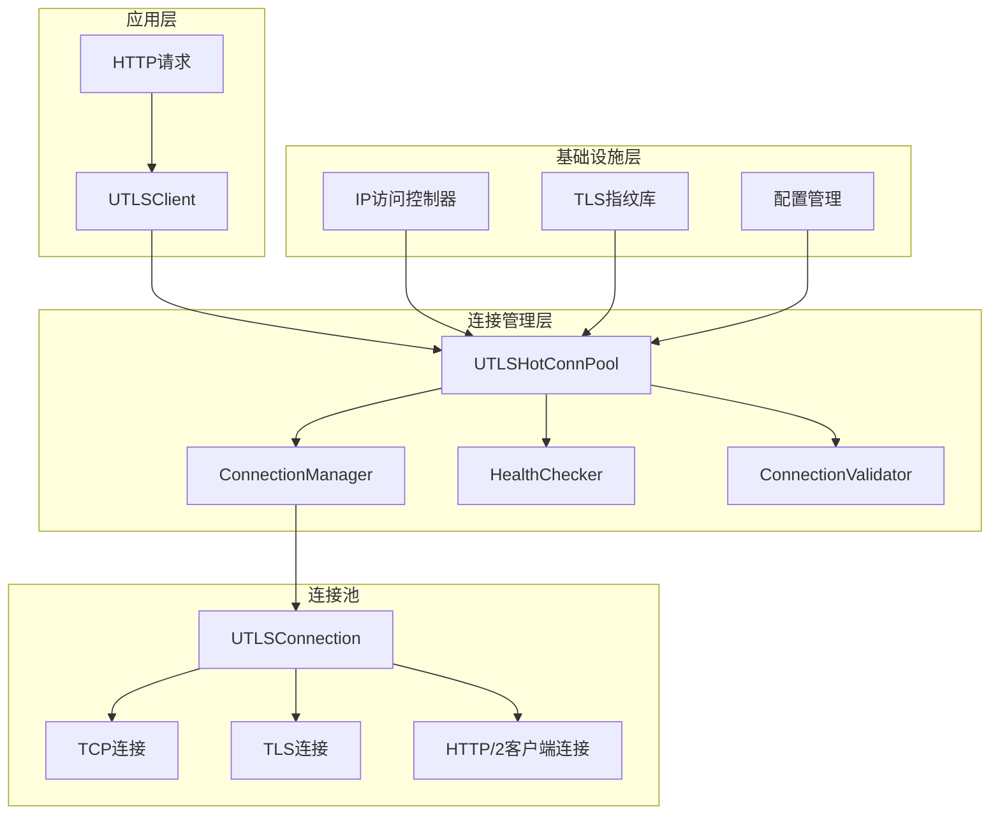
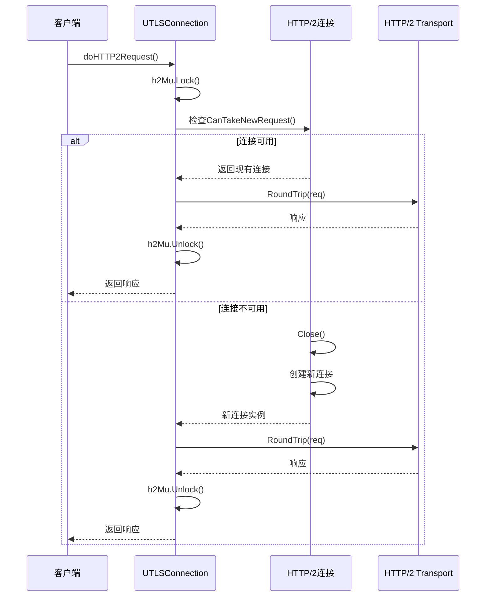
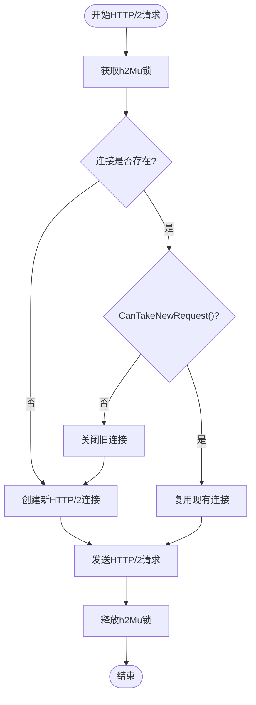
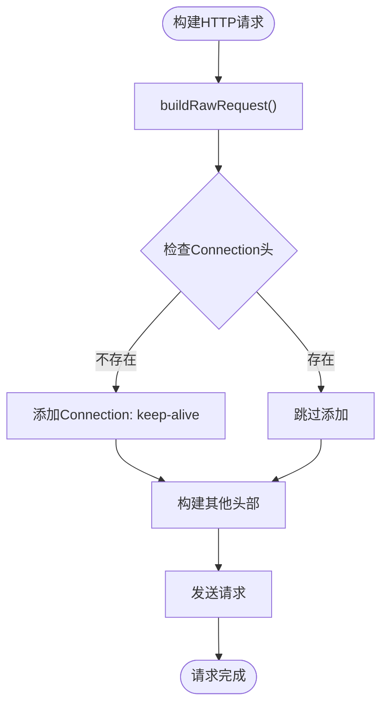
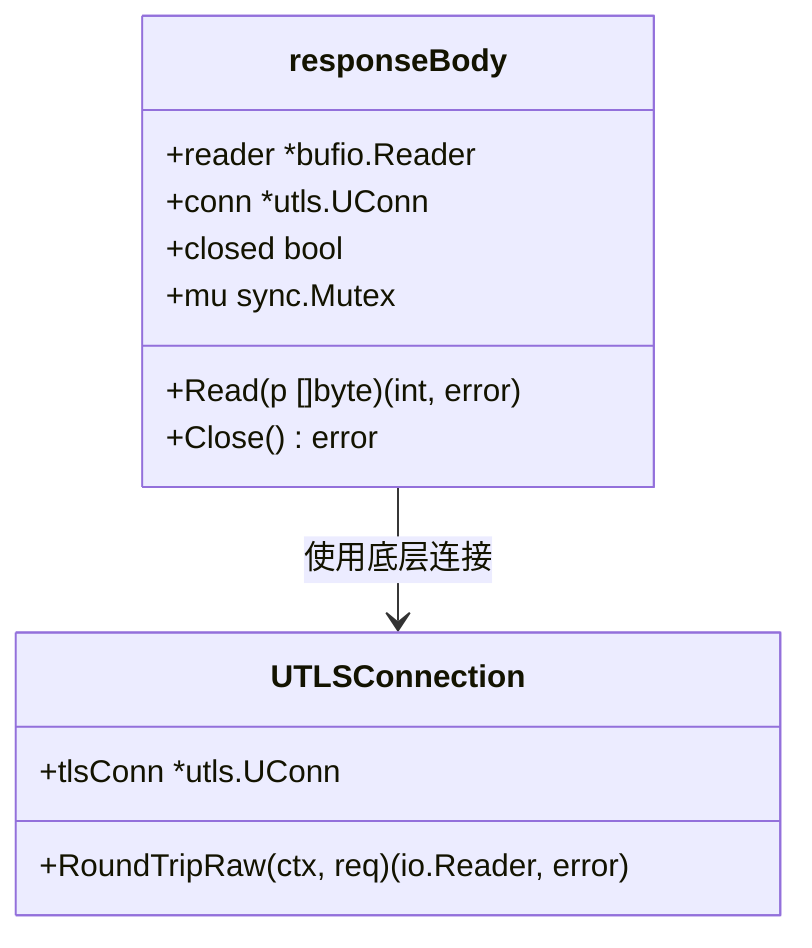
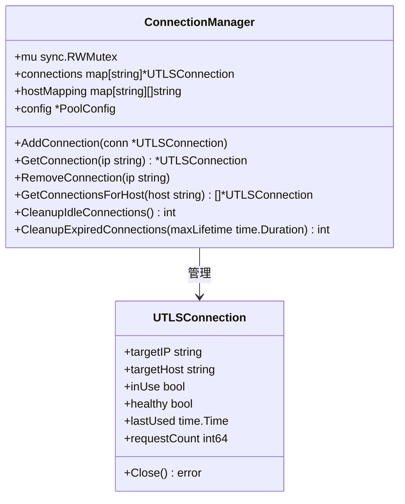
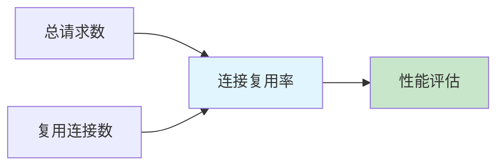
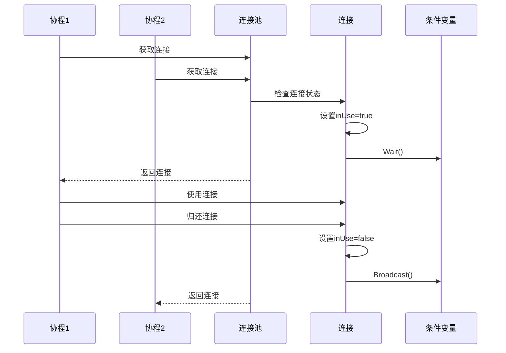
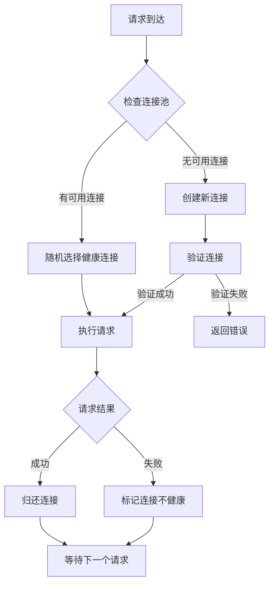

# 连接复用优化

<cite>
**本文档引用的文件**
- [utlsclient.go](file://utlsclient/utlsclient.go)
- [utlshotconnpool.go](file://utlsclient/utlshotconnpool.go)
- [connection_manager.go](file://utlsclient/connection_manager.go)
- [connection_helpers.go](file://utlsclient/connection_helpers.go)
- [utlsfingerprint.go](file://utlsclient/utlsfingerprint.go)
- [health_checker.go](file://utlsclient/health_checker.go)
- [ip_access_controller.go](file://utlsclient/ip_access_controller.go)
</cite>

## 目录
1. [简介](#简介)
2. [项目架构概览](#项目架构概览)
3. [HTTP/2连接复用机制](#http2连接复用机制)
4. [HTTP/1.1长连接实现](#http11长连接实现)
5. [连接生命周期管理](#连接生命周期管理)
6. [性能优化策略](#性能优化策略)
7. [高并发场景最佳实践](#高并发场景最佳实践)
8. [故障排除指南](#故障排除指南)
9. [总结](#总结)

## 简介

本文档深入分析了crawler-platform项目中连接复用优化的实现机制，重点关注HTTP/2和HTTP/1.1两种协议下的连接复用策略。该系统通过智能的连接池管理、协议协商检测和状态监控，实现了高效的连接复用，显著提升了网络请求性能。

## 项目架构概览

系统采用分层架构设计，核心组件包括连接池管理器、HTTP客户端、连接验证器和健康检查器。

**图表来源**
- [utlsclient.go](file://utlsclient/utlsclient.go#L37-L42)
- [utlshotconnpool.go](file://utlsclient/utlshotconnpool.go#L237-L258)
- [connection_manager.go](file://utlsclient/connection_manager.go#L8-L14)

**章节来源**
- [utlsclient.go](file://utlsclient/utlsclient.go#L1-L50)
- [utlshotconnpool.go](file://utlsclient/utlshotconnpool.go#L1-L100)

## HTTP/2连接复用机制

### h2Mu互斥锁管理

HTTP/2连接复用的核心在于`h2Mu`互斥锁的精确管理。该锁保护`h2ClientConn`字段，确保HTTP/2客户端连接的安全访问。

**图表来源**
- [utlsclient.go](file://utlsclient/utlsclient.go#L150-L188)

### CanTakeNewRequest检查逻辑

`CanTakeNewRequest`方法是HTTP/2连接复用的关键检查点。它确保连接能够接受新的请求，避免连接过载。

**图表来源**
- [utlsclient.go](file://utlsclient/utlsclient.go#L150-L188)

### 连接重建机制

当HTTP/2连接出现故障时，系统自动触发连接重建，确保服务连续性。

**章节来源**
- [utlsclient.go](file://utlsclient/utlsclient.go#L150-L188)

## HTTP/1.1长连接实现

### Connection: keep-alive头设置

HTTP/1.1长连接通过显式的`Connection: keep-alive`头部实现。系统在构建原始HTTP请求时自动添加该头部。

**图表来源**
- [utlsclient.go](file://utlsclient/utlsclient.go#L216-L256)

### responseBody.Close方法设计

HTTP/1.1连接的复用关键在于`responseBody.Close`方法的设计。该方法不关闭底层连接，而是标记响应体已关闭，让连接保持活跃状态。

**图表来源**
- [utlsclient.go](file://utlsclient/utlsclient.go#L334-L363)

**章节来源**
- [utlsclient.go](file://utlsclient/utlsclient.go#L191-L363)

## 连接生命周期管理

### ConnectionManager的GetConnection和AddConnection方法

连接管理器负责连接的全生命周期管理，包括连接的获取、添加、移除和清理。

**图表来源**
- [connection_manager.go](file://utlsclient/connection_manager.go#L8-L14)

### 连接状态监控

系统通过多种机制监控连接状态，确保连接的健康性和可用性。

| 监控维度 | 检查频率 | 触发条件 | 处理策略 |
|---------|---------|---------|---------|
| 健康状态 | 实时检查 | 连接使用时 | 标记不健康并移除 |
| 空闲超时 | 定期清理 | idleTimeout | 关闭空闲连接 |
| 生命周期 | 定期检查 | maxLifetime | 强制重建连接 |
| 错误计数 | 实时更新 | 请求失败时 | 更新错误统计 |

**章节来源**
- [connection_manager.go](file://utlsclient/connection_manager.go#L1-L218)
- [utlshotconnpool.go](file://utlsclient/utlshotconnpool.go#L1263-L1324)

## 性能优化策略

### 连接复用率计算

系统通过统计指标计算连接复用率，评估连接池效率。

### 并发控制优化

系统采用多层次的并发控制机制，确保高并发场景下的稳定性。

**图表来源**
- [utlshotconnpool.go](file://utlsclient/utlshotconnpool.go#L1247-L1271)

**章节来源**
- [utlshotconnpool.go](file://utlsclient/utlshotconnpool.go#L261-L277)

## 高并发场景最佳实践

### 连接池配置优化

针对高并发场景，推荐以下配置参数：

| 参数名称 | 推荐值 | 说明 |
|---------|--------|------|
| MaxConnections | 200-500 | 根据服务器承载能力调整 |
| MaxConnsPerHost | 20-50 | 每主机最大连接数 |
| MaxIdleConns | 50-100 | 最大空闲连接数 |
| IdleTimeout | 30-60秒 | 空闲连接超时时间 |
| MaxLifetime | 300-600秒 | 连接最大生命周期 |

### 负载均衡策略

系统支持多种负载均衡策略，包括随机选择、权重分配和健康状态优先。

**图表来源**
- [utlshotconnpool.go](file://utlsclient/utlshotconnpool.go#L441-L480)

**章节来源**
- [utlshotconnpool.go](file://utlsclient/utlshotconnpool.go#L170-L201)

## 故障排除指南

### 常见连接问题诊断

| 问题症状 | 可能原因 | 解决方案 |
|---------|---------|---------|
| 连接频繁重建 | 连接不健康 | 检查健康检查配置 |
| 性能下降 | 连接池耗尽 | 增加MaxConnections |
| 内存泄漏 | 连接未正确归还 | 检查连接使用逻辑 |
| 超时错误 | 网络不稳定 | 调整超时参数 |

### 监控指标分析

系统提供丰富的监控指标，帮助识别和解决连接问题：

- **连接统计**: 总连接数、活跃连接数、空闲连接数
- **请求统计**: 总请求数、成功请求数、失败请求数
- **性能指标**: 平均响应时间、连接复用率
- **健康状态**: 健康连接数、异常连接数

**章节来源**
- [utlshotconnpool.go](file://utlsclient/utlshotconnpool.go#L261-L277)

## 总结

crawler-platform的连接复用优化系统通过以下关键技术实现了高效的连接管理：

1. **智能协议检测**: 自动检测HTTP/1.1和HTTP/2协议，采用相应的复用策略
2. **精细化锁管理**: 使用h2Mu互斥锁保护HTTP/2连接，确保并发安全
3. **优雅的连接复用**: HTTP/1.1通过responseBody设计实现连接复用
4. **全面的生命周期管理**: 从创建到销毁的完整连接管理流程
5. **高性能的并发控制**: 多层次的并发控制机制保证高并发稳定性

该系统在提升网络请求性能的同时，保持了良好的稳定性和可维护性，为高并发应用场景提供了可靠的连接复用解决方案。