# 高级主题

<cite>
**本文档引用的文件**
- [health_checker.go](file://utlsclient/health_checker.go)
- [connection_manager.go](file://utlsclient/connection_manager.go)
- [utlshotconnpool.go](file://utlsclient/utlshotconnpool.go)
- [connection_validator.go](file://utlsclient/connection_validator.go)
- [interfaces.go](file://utlsclient/interfaces.go)
- [ip_access_controller.go](file://utlsclient/ip_access_controller.go)
- [constants.go](file://utlsclient/constants.go)
- [utlsclient.go](file://utlsclient/utlsclient.go)
- [example_hotconnpool_usage.go](file://examples/utlsclient/example_hotconnpool_usage.go)
- [config.toml](file://config/config.toml)
</cite>

## 目录
1. [概述](#概述)
2. [健康检查器架构](#健康检查器架构)
3. [连接管理器生命周期](#连接管理器生命周期)
4. [HTTP/2连接复用机制](#http2连接复用机制)
5. [系统内部工作流程](#系统内部工作流程)
6. [高级配置选项](#高级配置选项)
7. [扩展点和接口设计](#扩展点和接口设计)
8. [系统设计权衡](#系统设计权衡)
9. [性能优化策略](#性能优化策略)
10. [故障排除指南](#故障排除指南)

## 概述

UTLSHotConnPool是一个高度优化的热连接池系统，专为大规模网络爬虫和自动化工具设计。该系统采用组件化架构，通过健康检查、连接管理和协议协商等机制，实现了高效的连接复用和资源管理。

### 核心特性

- **智能健康检查**：基于时间窗口和错误计数的双重健康评估
- **HTTP/2原生支持**：自动协议协商和连接复用
- **并发安全设计**：读写锁和条件变量确保线程安全
- **动态配置管理**：支持运行时配置更新和热重载
- **黑白名单控制**：细粒度的IP访问控制机制

## 健康检查器架构

### 工作原理

健康检查器采用分层检查策略，结合主动健康检查和被动错误监控：

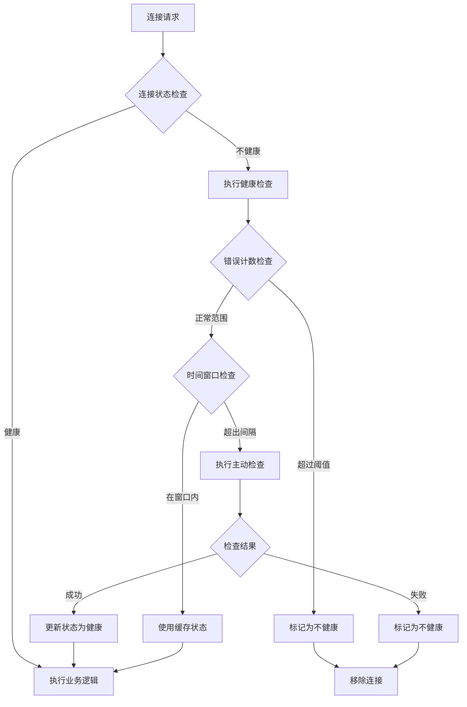
```mermaid
flowchart TD
A[连接请求] --> B{连接状态检查}
B --> |健康| C[执行业务逻辑]
B --> |不健康| D[执行健康检查]
D --> E{错误计数检查}
E --> |超过阈值| F[标记为不健康]
E --> |正常范围| G{时间窗口检查}
G --> |超出间隔| H[执行主动检查]
G --> |在窗口内| I[使用缓存状态]
H --> J{检查结果}
J --> |成功| K[更新状态为健康]
J --> |失败| L[标记为不健康]
F --> M[移除连接]
K --> C
I --> C
L --> M
```

**图表来源**
- [health_checker.go](file://utlsclient/health_checker.go#L24-L61)

### 检查策略详解

#### 1. 错误计数阈值机制
系统维护每个连接的错误计数，当错误次数超过10次时，立即标记为不健康：

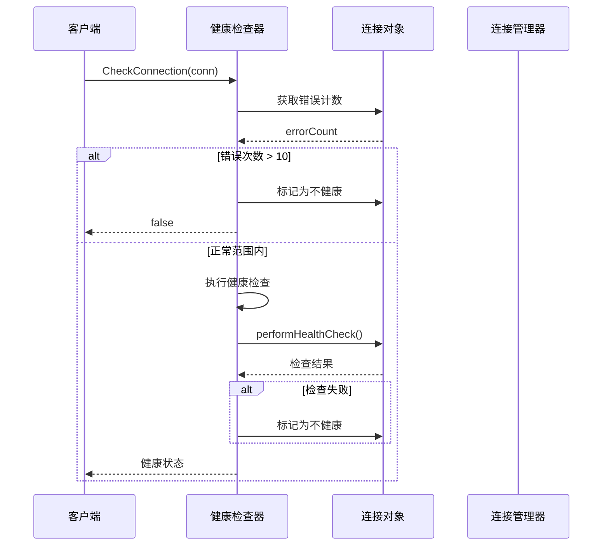
```mermaid
sequenceDiagram
participant Client as 客户端
participant HC as 健康检查器
participant Conn as 连接对象
participant Manager as 连接管理器
Client->>HC : CheckConnection(conn)
HC->>Conn : 获取错误计数
Conn-->>HC : errorCount
alt 错误次数 > 10
HC->>Conn : 标记为不健康
HC-->>Client : false
else 正常范围内
HC->>HC : 执行健康检查
HC->>Conn : performHealthCheck()
Conn-->>HC : 检查结果
alt 检查失败
HC->>Conn : 标记为不健康
end
HC-->>Client : 健康状态
end
```

**图表来源**
- [health_checker.go](file://utlsclient/health_checker.go#L36-L56)

#### 2. 时间窗口健康检查
系统采用时间窗口策略，避免频繁的健康检查：

| 检查类型 | 默认间隔 | 触发条件 |
|---------|---------|---------|
| 主动健康检查 | 30秒 | 连接空闲时间超过健康检查间隔 |
| 错误计数检查 | 实时 | 每次错误发生时 |
| 批量清理 | 60秒 | 定期清理不健康连接 |

**章节来源**
- [health_checker.go](file://utlsclient/health_checker.go#L46-L58)

### 超时处理机制

#### 多层次超时控制

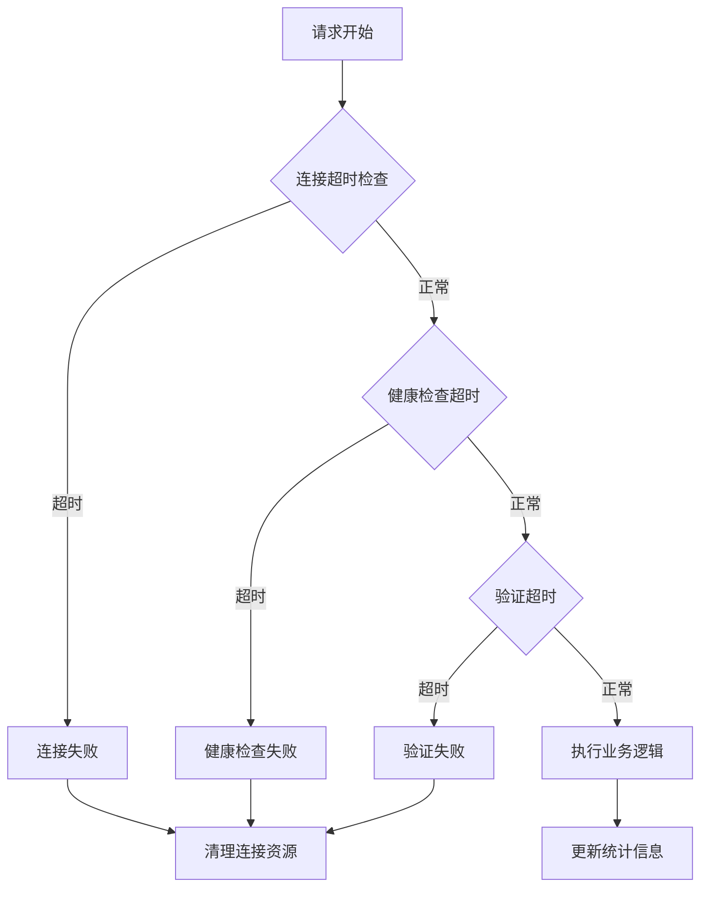
```mermaid
graph TD
A[请求开始] --> B{连接超时检查}
B --> |超时| C[连接失败]
B --> |正常| D{健康检查超时}
D --> |超时| E[健康检查失败]
D --> |正常| F{验证超时}
F --> |超时| G[验证失败]
F --> |正常| H[执行业务逻辑]
C --> I[清理连接资源]
E --> I
G --> I
H --> J[更新统计信息]
```

**图表来源**
- [connection_validator.go](file://utlsclient/connection_validator.go#L70-L82)

## 连接管理器生命周期

### 生命周期管理

连接管理器负责连接的全生命周期管理，包括创建、维护、清理和销毁：

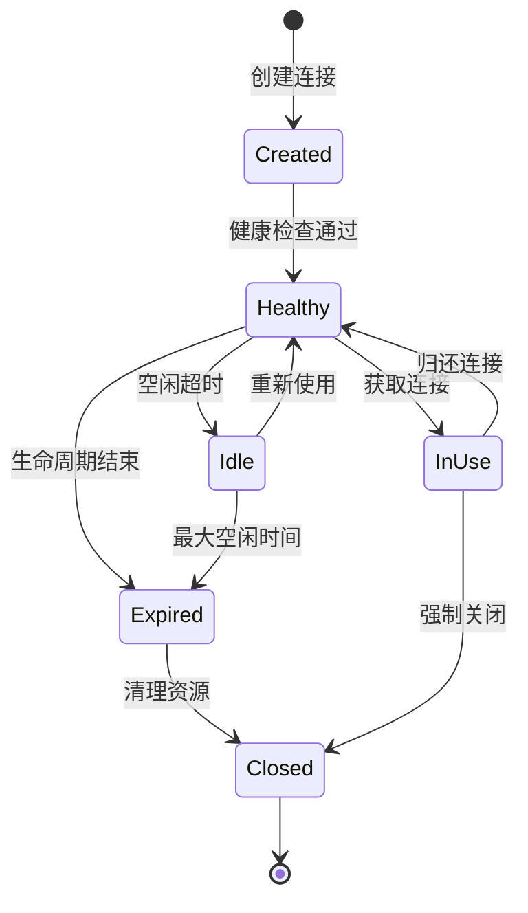
```mermaid
stateDiagram-v2
[*] --> Created : 创建连接
Created --> Healthy : 健康检查通过
Healthy --> InUse : 获取连接
InUse --> Healthy : 归还连接
Healthy --> Idle : 空闲超时
Idle --> Healthy : 重新使用
Healthy --> Expired : 生命周期结束
Idle --> Expired : 最大空闲时间
Expired --> Closed : 清理资源
InUse --> Closed : 强制关闭
Closed --> [*]
```

**图表来源**
- [connection_manager.go](file://utlsclient/connection_manager.go#L26-L73)

### 并发控制机制

#### 读写锁策略

连接管理器采用读写锁分离策略，优化并发性能：

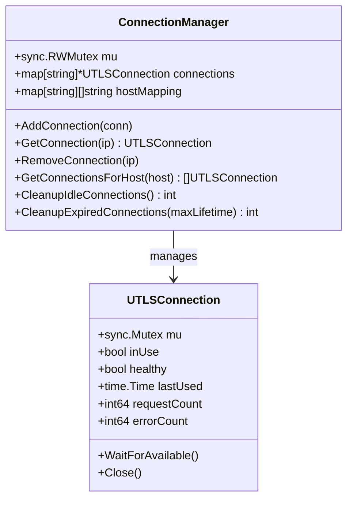
```mermaid
classDiagram
class ConnectionManager {
+sync.RWMutex mu
+map[string]*UTLSConnection connections
+map[string][]string hostMapping
+AddConnection(conn)
+GetConnection(ip) UTLSConnection
+RemoveConnection(ip)
+GetConnectionsForHost(host) []UTLSConnection
+CleanupIdleConnections() int
+CleanupExpiredConnections(maxLifetime) int
}
class UTLSConnection {
+sync.Mutex mu
+bool inUse
+bool healthy
+time.Time lastUsed
+int64 requestCount
+int64 errorCount
+WaitForAvailable()
+Close()
}
ConnectionManager --> UTLSConnection : manages
```

**图表来源**
- [connection_manager.go](file://utlsclient/connection_manager.go#L8-L14)
- [utlshotconnpool.go](file://utlsclient/utlshotconnpool.go#L204-L234)

### 状态同步机制

#### 条件变量通知

系统使用条件变量实现连接状态的高效通知：

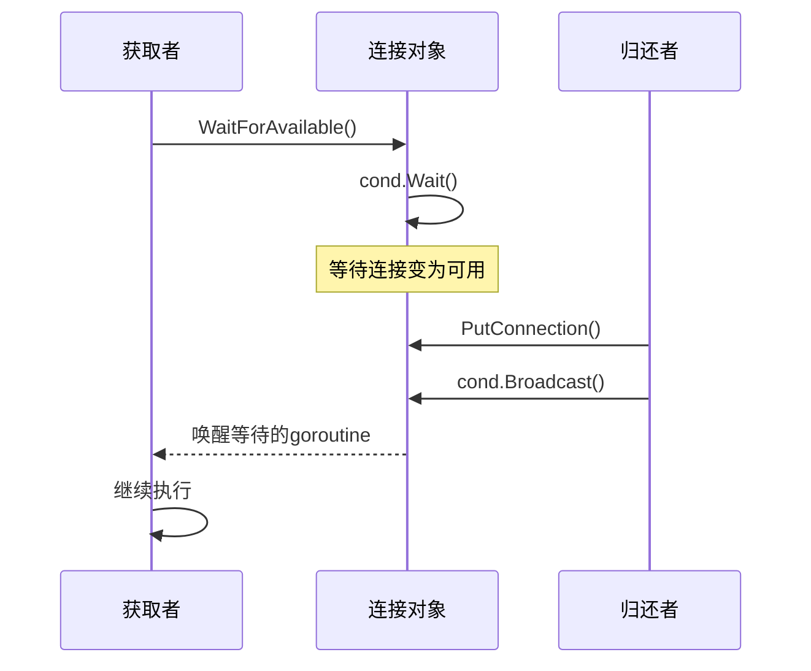
```mermaid
sequenceDiagram
participant Getter as 获取者
participant Conn as 连接对象
participant Setter as 归还者
Getter->>Conn : WaitForAvailable()
Conn->>Conn : cond.Wait()
Note over Conn : 等待连接变为可用
Setter->>Conn : PutConnection()
Setter->>Conn : cond.Broadcast()
Conn-->>Getter : 唤醒等待的goroutine
Getter->>Getter : 继续执行
```

**图表来源**
- [utlshotconnpool.go](file://utlsclient/utlshotconnpool.go#L779-L785)

**章节来源**
- [connection_manager.go](file://utlsclient/connection_manager.go#L26-L73)
- [utlshotconnpool.go](file://utlsclient/utlshotconnpool.go#L760-L785)

## HTTP/2连接复用机制

### 协议协商过程

系统能够智能检测和利用HTTP/2协议的优势：

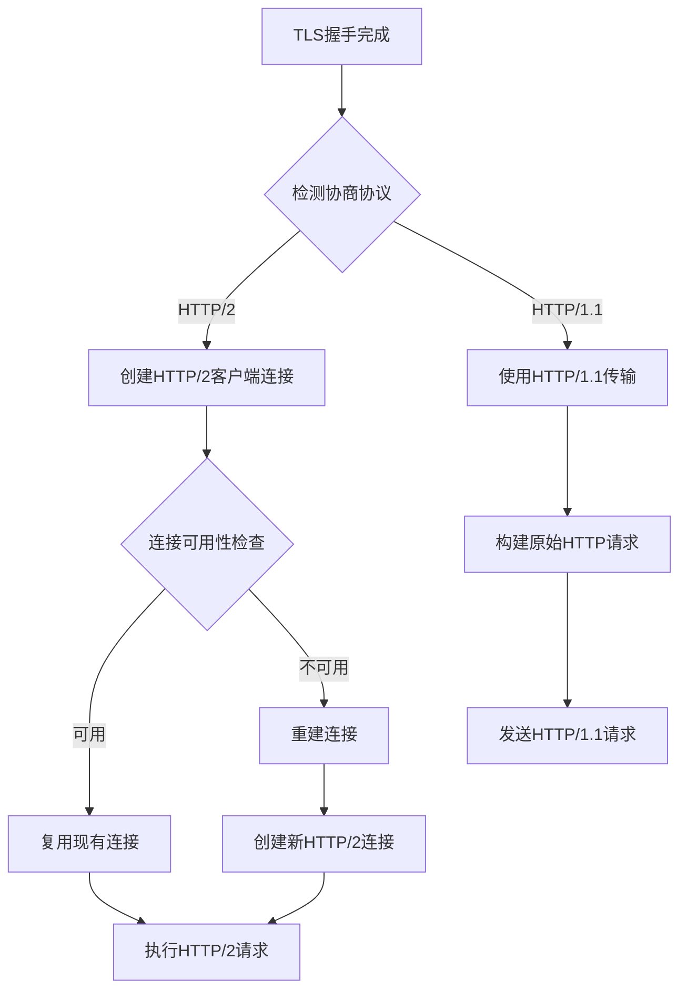
```mermaid
flowchart TD
A[TLS握手完成] --> B{检测协商协议}
B --> |HTTP/2| C[创建HTTP/2客户端连接]
B --> |HTTP/1.1| D[使用HTTP/1.1传输]
C --> E{连接可用性检查}
E --> |可用| F[复用现有连接]
E --> |不可用| G[重建连接]
F --> H[执行HTTP/2请求]
G --> I[创建新HTTP/2连接]
I --> H
D --> J[构建原始HTTP请求]
J --> K[发送HTTP/1.1请求]
```

**图表来源**
- [utlsclient.go](file://utlsclient/utlsclient.go#L130-L141)

### 性能优势分析

#### HTTP/2 vs HTTP/1.1对比

| 特性 | HTTP/1.1 | HTTP/2 |
|------|----------|--------|
| 连接复用 | 每个请求新建连接 | 单一连接多路复用 |
| 头部压缩 | 无压缩 | HPACK压缩 |
| 服务器推送 | 不支持 | 支持 |
| 连接开销 | 高 | 低 |
| 并发性能 | 串行处理 | 并行处理 |

#### 连接复用统计

根据性能测试数据，HTTP/2连接复用显著提升系统效率：

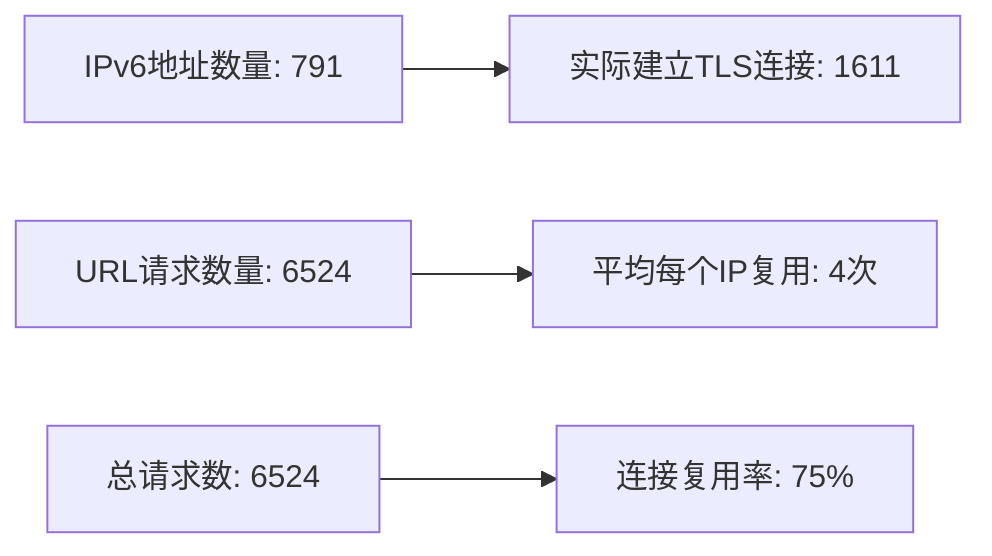
```mermaid
graph LR
A[IPv6地址数量: 791] --> B[实际建立TLS连接: 1611]
C[URL请求数量: 6524] --> D[平均每个IP复用: 4次]
E[总请求数: 6524] --> F[连接复用率: 75%]
```

**图表来源**
- [热连接池性能测试报告.md](file://test/reports/热连接池性能测试报告.md#L158-L216)

### 实现细节

#### HTTP/2客户端连接管理

```mermaid
classDiagram
class UTLSConnection {
+interface{} h2ClientConn
+sync.Mutex h2Mu
+CanTakeNewRequest() bool
+Close()
}
class HTTP2Transport {
+NewClientConn(conn) ClientConn
+RoundTrip(req) Response
}
UTLSConnection --> HTTP2Transport : manages
```

**图表来源**
- [utlsclient.go](file://utlsclient/utlsclient.go#L143-L189)

**章节来源**
- [utlsclient.go](file://utlsclient/utlsclient.go#L130-L141)
- [utlshotconnpool.go](file://utlsclient/utlshotconnpool.go#L629-L675)

## 系统内部工作流程

### 连接获取流程

#### 标准连接获取

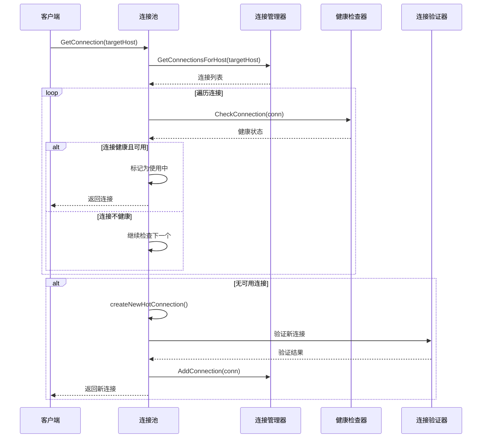
```mermaid
sequenceDiagram
participant Client as 客户端
participant Pool as 连接池
participant CM as 连接管理器
participant HC as 健康检查器
participant Validator as 连接验证器
Client->>Pool : GetConnection(targetHost)
Pool->>CM : GetConnectionsForHost(targetHost)
CM-->>Pool : 连接列表
loop 遍历连接
Pool->>HC : CheckConnection(conn)
HC-->>Pool : 健康状态
alt 连接健康且可用
Pool->>Pool : 标记为使用中
Pool-->>Client : 返回连接
else 连接不健康
Pool->>Pool : 继续检查下一个
end
end
alt 无可用连接
Pool->>Pool : createNewHotConnection()
Pool->>Validator : 验证新连接
Validator-->>Pool : 验证结果
Pool->>CM : AddConnection(conn)
Pool-->>Client : 返回新连接
end
```

**图表来源**
- [utlshotconnpool.go](file://utlsclient/utlshotconnpool.go#L441-L480)

#### 带路径验证的连接获取

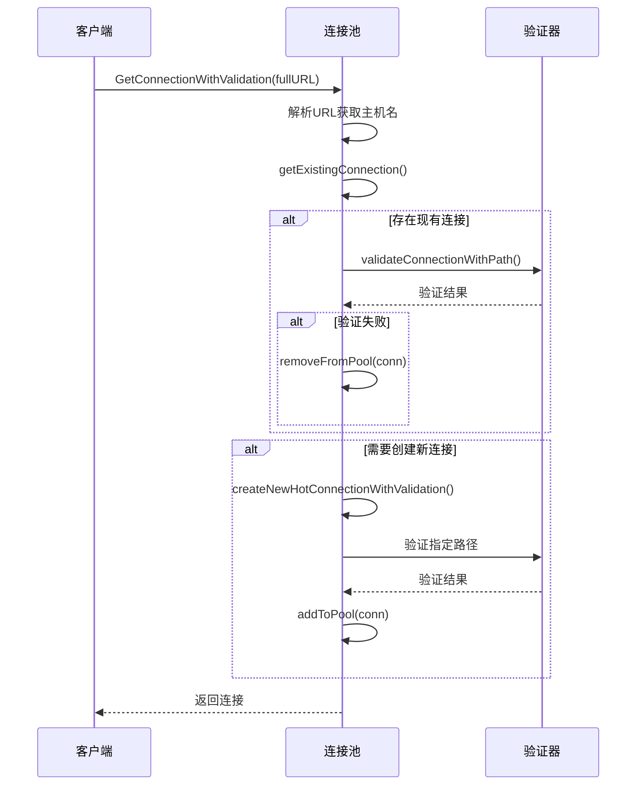
```mermaid
sequenceDiagram
participant Client as 客户端
participant Pool as 连接池
participant Validator as 验证器
Client->>Pool : GetConnectionWithValidation(fullURL)
Pool->>Pool : 解析URL获取主机名
Pool->>Pool : getExistingConnection()
alt 存在现有连接
Pool->>Validator : validateConnectionWithPath()
Validator-->>Pool : 验证结果
alt 验证失败
Pool->>Pool : removeFromPool(conn)
end
end
alt 需要创建新连接
Pool->>Pool : createNewHotConnectionWithValidation()
Pool->>Validator : 验证指定路径
Validator-->>Pool : 验证结果
Pool->>Pool : addToPool(conn)
end
Pool-->>Client : 返回连接
```

**图表来源**
- [utlshotconnpool.go](file://utlsclient/utlshotconnpool.go#L362-L396)

### 连接验证流程

#### 多层次验证机制

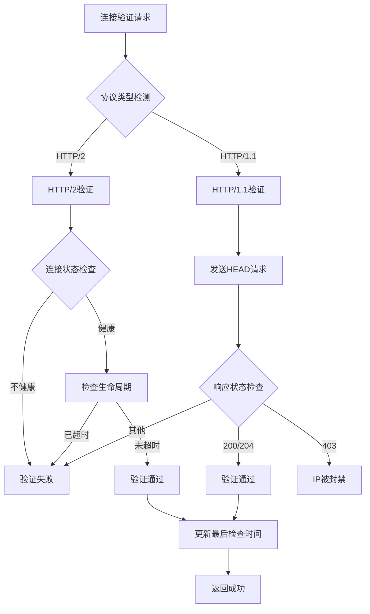
```mermaid
flowchart TD
A[连接验证请求] --> B{协议类型检测}
B --> |HTTP/2| C[HTTP/2验证]
B --> |HTTP/1.1| D[HTTP/1.1验证]
C --> E{连接状态检查}
E --> |健康| F[检查生命周期]
E --> |不健康| G[验证失败]
F --> |未超时| H[验证通过]
F --> |已超时| G
D --> I[发送HEAD请求]
I --> J{响应状态检查}
J --> |200/204| K[验证通过]
J --> |403| L[IP被封禁]
J --> |其他| G
H --> M[更新最后检查时间]
K --> M
M --> N[返回成功]
```

**图表来源**
- [utlshotconnpool.go](file://utlsclient/utlshotconnpool.go#L618-L744)

**章节来源**
- [utlshotconnpool.go](file://utlsclient/utlshotconnpool.go#L351-L396)
- [connection_validator.go](file://utlsclient/connection_validator.go#L22-L97)

## 高级配置选项

### 配置文件结构

系统支持完整的TOML配置文件，包含连接池、黑白名单和各种超时参数：

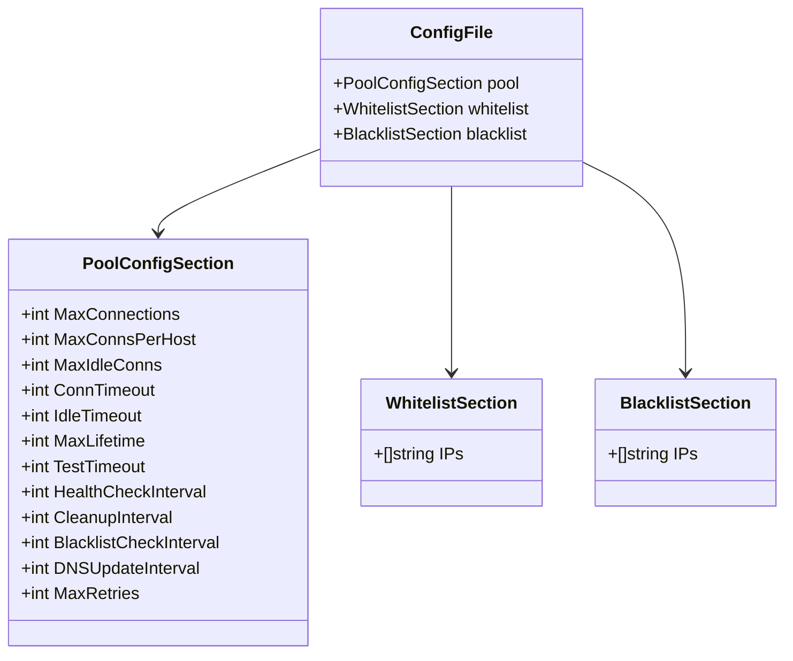
```mermaid
classDiagram
class ConfigFile {
+PoolConfigSection pool
+WhitelistSection whitelist
+BlacklistSection blacklist
}
class PoolConfigSection {
+int MaxConnections
+int MaxConnsPerHost
+int MaxIdleConns
+int ConnTimeout
+int IdleTimeout
+int MaxLifetime
+int TestTimeout
+int HealthCheckInterval
+int CleanupInterval
+int BlacklistCheckInterval
+int DNSUpdateInterval
+int MaxRetries
}
class WhitelistSection {
+[]string IPs
}
class BlacklistSection {
+[]string IPs
}
ConfigFile --> PoolConfigSection
ConfigFile --> WhitelistSection
ConfigFile --> BlacklistSection
```

**图表来源**
- [utlshotconnpool.go](file://utlsclient/utlshotconnpool.go#L53-L85)

### 默认配置参数

| 参数名称 | 默认值 | 说明 | 调优建议 |
|---------|--------|------|---------|
| MaxConnections | 100 | 最大连接数 | 根据服务器承载能力调整 |
| MaxConnsPerHost | 10 | 每主机最大连接数 | 避免单主机过载 |
| ConnTimeout | 30s | 连接超时时间 | 根据网络状况调整 |
| IdleTimeout | 60s | 空闲超时时间 | 平衡资源和性能 |
| MaxLifetime | 300s | 连接最大生命周期 | 避免长时间使用 |
| HealthCheckInterval | 30s | 健康检查间隔 | 根据稳定性要求调整 |
| CleanupInterval | 60s | 清理间隔 | 平衡内存和CPU使用 |

### 动态配置更新

系统支持运行时配置更新，无需重启服务：

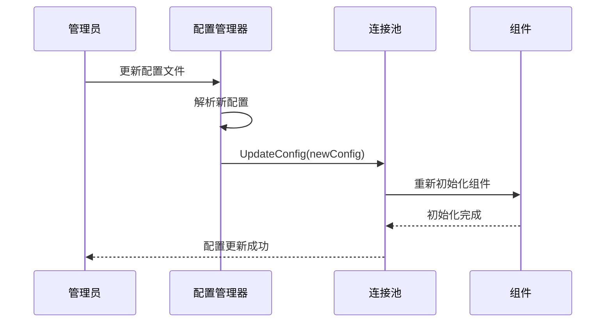
```mermaid
sequenceDiagram
participant Admin as 管理员
participant Config as 配置管理器
participant Pool as 连接池
participant Components as 组件
Admin->>Config : 更新配置文件
Config->>Config : 解析新配置
Config->>Pool : UpdateConfig(newConfig)
Pool->>Components : 重新初始化组件
Components-->>Pool : 初始化完成
Pool-->>Admin : 配置更新成功
```

**图表来源**
- [utlshotconnpool.go](file://utlsclient/utlshotconnpool.go#L137-L168)

**章节来源**
- [config.toml](file://config/config.toml#L1-L35)
- [utlshotconnpool.go](file://utlsclient/utlshotconnpool.go#L53-L168)

## 扩展点和接口设计

### 核心接口定义

系统采用接口驱动的设计，提供了多个扩展点：

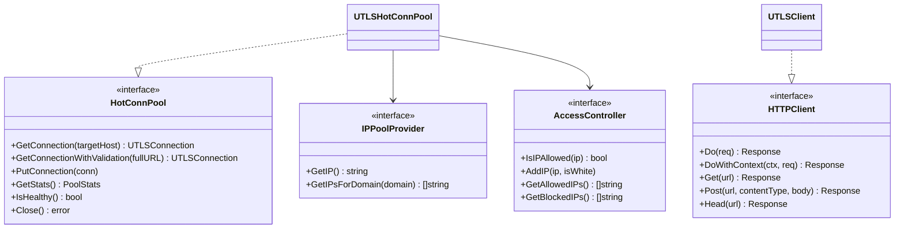
```mermaid
classDiagram
class HotConnPool {
<<interface>>
+GetConnection(targetHost) UTLSConnection
+GetConnectionWithValidation(fullURL) UTLSConnection
+PutConnection(conn)
+GetStats() PoolStats
+IsHealthy() bool
+Close() error
}
class IPPoolProvider {
<<interface>>
+GetIP() string
+GetIPsForDomain(domain) []string
}
class AccessController {
<<interface>>
+IsIPAllowed(ip) bool
+AddIP(ip, isWhite)
+GetAllowedIPs() []string
+GetBlockedIPs() []string
}
class HTTPClient {
<<interface>>
+Do(req) Response
+DoWithContext(ctx, req) Response
+Get(url) Response
+Post(url, contentType, body) Response
+Head(url) Response
}
UTLSHotConnPool ..|> HotConnPool
UTLSHotConnPool --> IPPoolProvider
UTLSHotConnPool --> AccessController
UTLSClient ..|> HTTPClient
```

**图表来源**
- [interfaces.go](file://utlsclient/interfaces.go#L9-L81)

### 自定义扩展实现

#### IP池提供商扩展

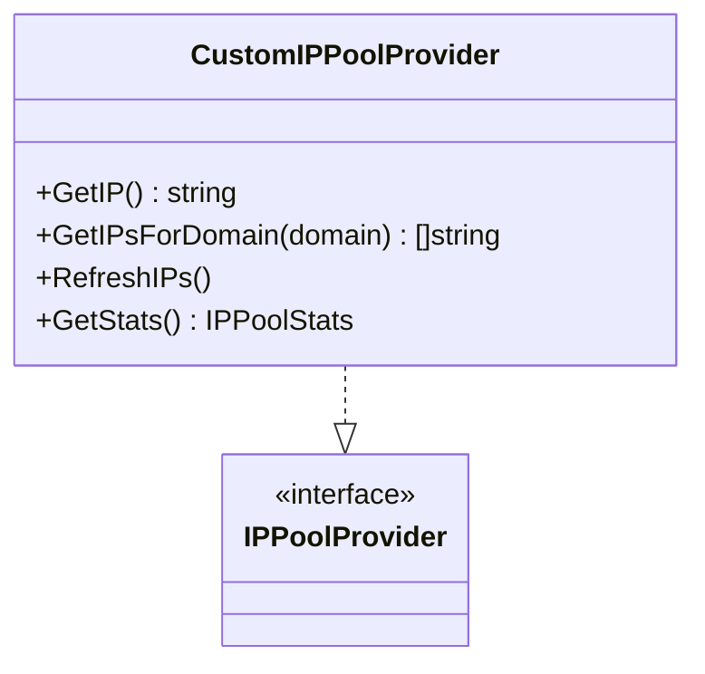
```mermaid
classDiagram
class CustomIPPoolProvider {
+GetIP() string
+GetIPsForDomain(domain) []string
+RefreshIPs()
+GetStats() IPPoolStats
}
class IPPoolProvider {
<<interface>>
}
CustomIPPoolProvider ..|> IPPoolProvider
```

#### 访问控制器扩展

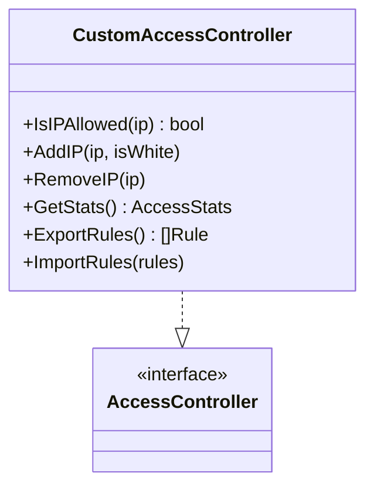
```mermaid
classDiagram
class CustomAccessController {
+IsIPAllowed(ip) bool
+AddIP(ip, isWhite)
+RemoveIP(ip)
+GetStats() AccessStats
+ExportRules() []Rule
+ImportRules(rules)
}
class AccessController {
<<interface>>
}
CustomAccessController ..|> AccessController
```

### 依赖注入机制

系统支持依赖注入，允许用户替换默认实现：

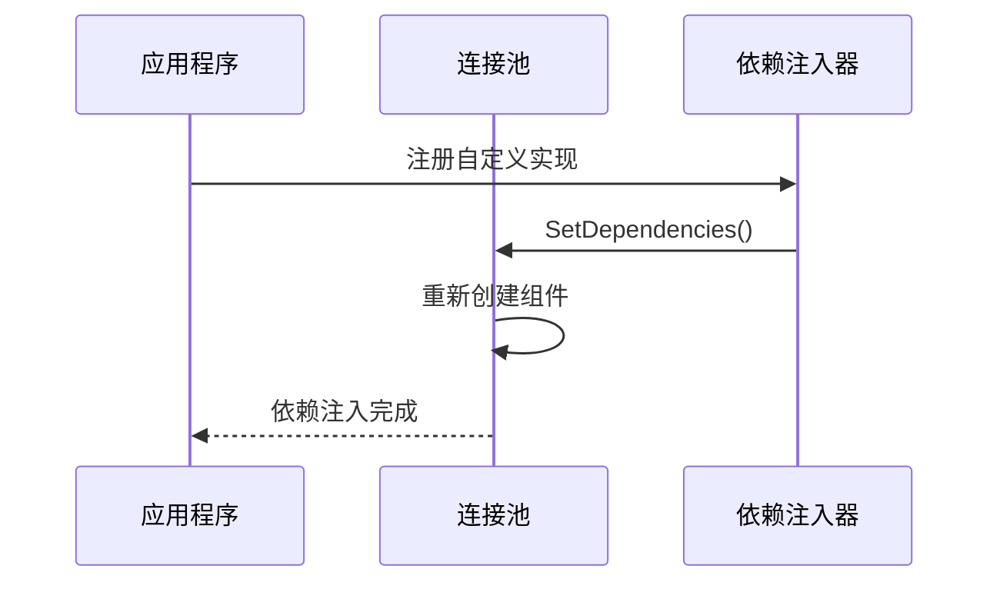
```mermaid
sequenceDiagram
participant App as 应用程序
participant Pool as 连接池
participant DI as 依赖注入器
App->>DI : 注册自定义实现
DI->>Pool : SetDependencies()
Pool->>Pool : 重新创建组件
Pool-->>App : 依赖注入完成
```

**图表来源**
- [utlshotconnpool.go](file://utlsclient/utlshotconnpool.go#L321-L348)

**章节来源**
- [interfaces.go](file://utlsclient/interfaces.go#L9-L81)
- [utlshotconnpool.go](file://utlsclient/utlshotconnpool.go#L321-L348)

## 系统设计权衡

### 性能 vs 资源平衡

#### 内存使用优化

系统在内存使用和性能之间进行了精心平衡：

| 设计决策 | 内存影响 | 性能影响 | 适用场景 |
|---------|---------|---------|---------|
| 连接池大小限制 | 限制最大内存使用 | 提高连接复用率 | 高并发场景 |
| 健康检查频率 | 增加CPU开销 | 提高连接可靠性 | 敏感应用 |
| 连接生命周期 | 影响内存回收 | 减少连接重建开销 | 长时间运行 |
| 缓存策略 | 增加内存使用 | 提高响应速度 | 读密集场景 |

#### 并发控制策略

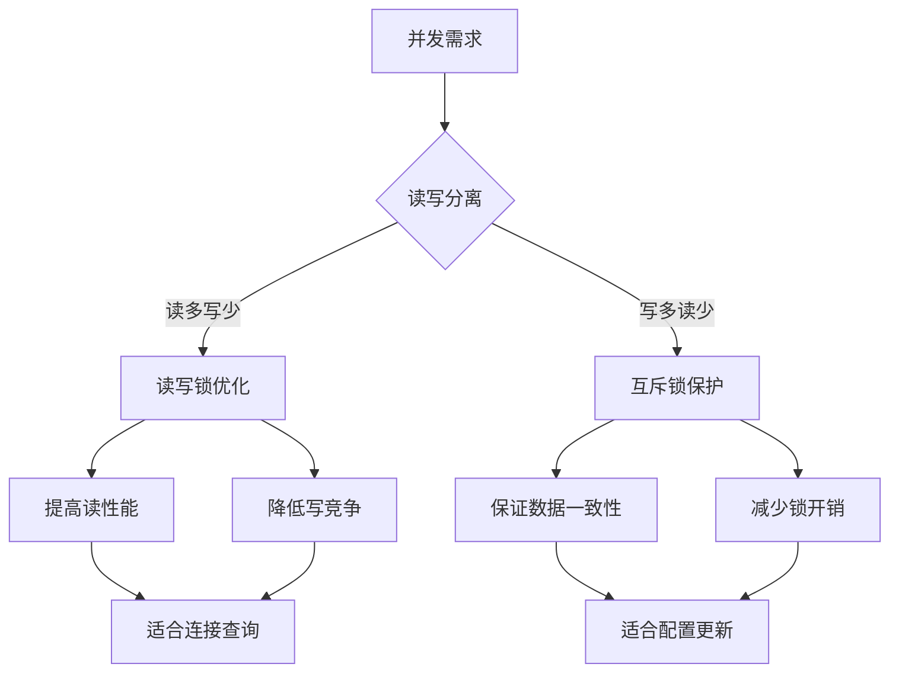
```mermaid
graph TD
A[并发需求] --> B{读写分离}
B --> |读多写少| C[读写锁优化]
B --> |写多读少| D[互斥锁保护]
C --> E[提高读性能]
C --> F[降低写竞争]
D --> G[保证数据一致性]
D --> H[减少锁开销]
E --> I[适合连接查询]
F --> I
G --> J[适合配置更新]
H --> J
```

### 可靠性 vs 可用性权衡

#### 错误处理策略

系统采用多层次的错误处理策略：

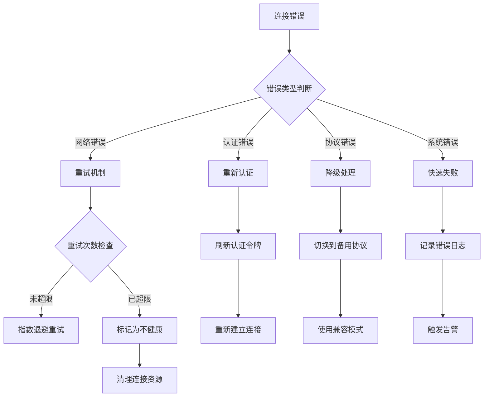
```mermaid
flowchart TD
A[连接错误] --> B{错误类型判断}
B --> |网络错误| C[重试机制]
B --> |认证错误| D[重新认证]
B --> |协议错误| E[降级处理]
B --> |系统错误| F[快速失败]
C --> G{重试次数检查}
G --> |未超限| H[指数退避重试]
G --> |已超限| I[标记为不健康]
D --> J[刷新认证令牌]
E --> K[切换到备用协议]
F --> L[记录错误日志]
I --> M[清理连接资源]
J --> N[重新建立连接]
K --> O[使用兼容模式]
L --> P[触发告警]
```

**图表来源**
- [constants.go](file://utlsclient/constants.go#L47-L86)

### 扩展性考虑

#### 水平扩展支持

```mermaid
graph LR
A[负载均衡器] --> B[实例1]
A --> C[实例2]
A --> D[实例3]
B --> E[共享配置中心]
C --> E
D --> E
B --> F[共享IP池]
C --> F
D --> F
B --> G[监控系统]
C --> G
D --> G
```

**章节来源**
- [constants.go](file://utlsclient/constants.go#L47-L86)
- [utlshotconnpool.go](file://utlsclient/utlshotconnpool.go#L321-L348)

## 性能优化策略

### 连接复用优化

#### 复用率提升技术

系统通过多种技术手段提升连接复用率：

```mermaid
graph TD
A[连接复用优化] --> B[智能预热]
A --> C[预测性维护]
A --> D[动态调整]
B --> E[启动时预建立连接]
B --> F[基于历史数据预分配]
C --> G[主动健康检查]
C --> H[预测性清理]
D --> I[自适应超时调整]
D --> J[动态池大小调节]
E --> K[减少首次请求延迟]
F --> K
G --> L[提高连接可用性]
H --> L
I --> M[平衡性能和稳定性]
J --> M
```

### 内存管理优化

#### 垃圾回收友好设计

```mermaid
classDiagram
class OptimizedConnection {
+sync.Pool pool
+对象池化
+零拷贝设计
+及时释放资源
}
class MemoryManager {
+定期清理
+内存压力监控
+垃圾回收优化
}
OptimizedConnection --> MemoryManager : managed_by
```

### 网络I/O优化

#### 异步处理机制

```mermaid
sequenceDiagram
participant IO as I/O线程
participant Worker as 工作线程
participant Pool as 连接池
participant Network as 网络层
IO->>Worker : 异步I/O事件
Worker->>Pool : 获取连接
Pool-->>Worker : 返回连接
Worker->>Network : 执行网络操作
Network-->>Worker : 返回结果
Worker->>Pool : 归还连接
Pool->>IO : 注册下次事件
```

**章节来源**
- [utlshotconnpool.go](file://utlsclient/utlshotconnpool.go#L779-L800)

## 故障排除指南

### 常见问题诊断

#### 连接池健康状态检查

```mermaid
flowchart TD
A[连接池异常] --> B{检查健康状态}
B --> |不健康| C[查看统计信息]
B --> |健康| D[检查配置]
C --> E{错误类型分析}
E --> |连接超时| F[检查网络连通性]
E --> |验证失败| G[检查目标服务]
E --> |资源不足| H[增加资源限制]
D --> I{配置有效性检查}
I --> |配置错误| J[修正配置参数]
I --> |配置正确| K[检查依赖服务]
F --> L[网络诊断工具]
G --> M[服务状态检查]
H --> N[资源扩容]
J --> O[配置重载]
K --> P[依赖服务检查]
```

### 性能监控指标

#### 关键性能指标(KPI)

| 指标类别 | 具体指标 | 正常范围 | 告警阈值 |
|---------|---------|---------|---------|
| 连接状态 | 连接池利用率 | 60-80% | >90% |
| 连接状态 | 健康连接比例 | >95% | <90% |
| 响应性能 | 平均响应时间 | <100ms | >500ms |
| 错误率 | 连接失败率 | <1% | >5% |
| 复用效率 | 连接复用率 | >70% | <50% |

#### 监控仪表板设计

```mermaid
graph LR
A[连接池监控] --> B[实时指标]
A --> C[历史趋势]
A --> D[告警通知]
B --> E[连接数统计]
B --> F[健康状态]
B --> G[性能指标]
C --> H[使用率趋势]
C --> I[错误率变化]
C --> J[响应时间曲线]
D --> K[阈值告警]
D --> L[异常通知]
D --> M[自动恢复]
```

### 故障恢复策略

#### 自动恢复机制

```mermaid
stateDiagram-v2
[*] --> Normal : 正常运行
Normal --> Degraded : 性能下降
Normal --> Failed : 严重故障
Degraded --> Normal : 自动恢复
Degraded --> Failed : 恢复失败
Failed --> Recovering : 启动恢复
Recovering --> Normal : 恢复成功
Recovering --> Failed : 恢复失败
Normal --> [*] : 正常退出
Failed --> [*] : 人工干预
```

**章节来源**
- [health_checker.go](file://utlsclient/health_checker.go#L114-L164)
- [connection_manager.go](file://utlsclient/connection_manager.go#L141-L217)

## 结论

UTLSHotConnPool作为一个高度优化的热连接池系统，在性能、可靠性和可扩展性方面都达到了很高的水平。通过智能的健康检查机制、高效的HTTP/2连接复用、完善的生命周期管理和灵活的配置系统，为大规模网络应用提供了强大的连接管理能力。

系统的组件化设计和丰富的扩展点，使其能够适应不同的应用场景和需求。同时，完善的监控和故障排除机制，确保了系统在生产环境中的稳定运行。

对于开发者而言，理解这些高级主题有助于更好地使用和扩展该系统，充分发挥其性能优势，构建更加高效和可靠的网络应用。