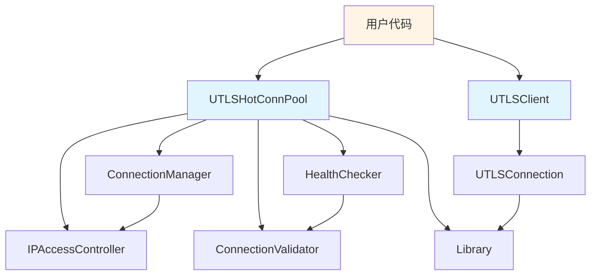
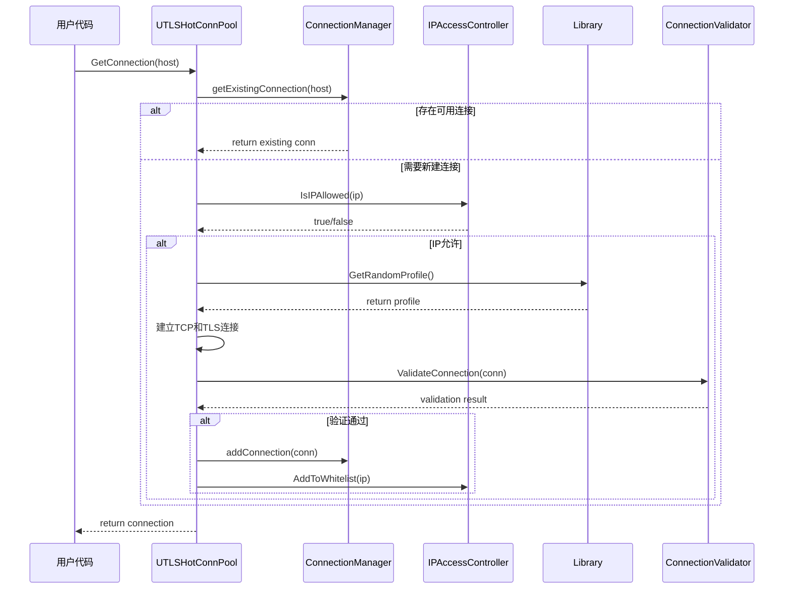
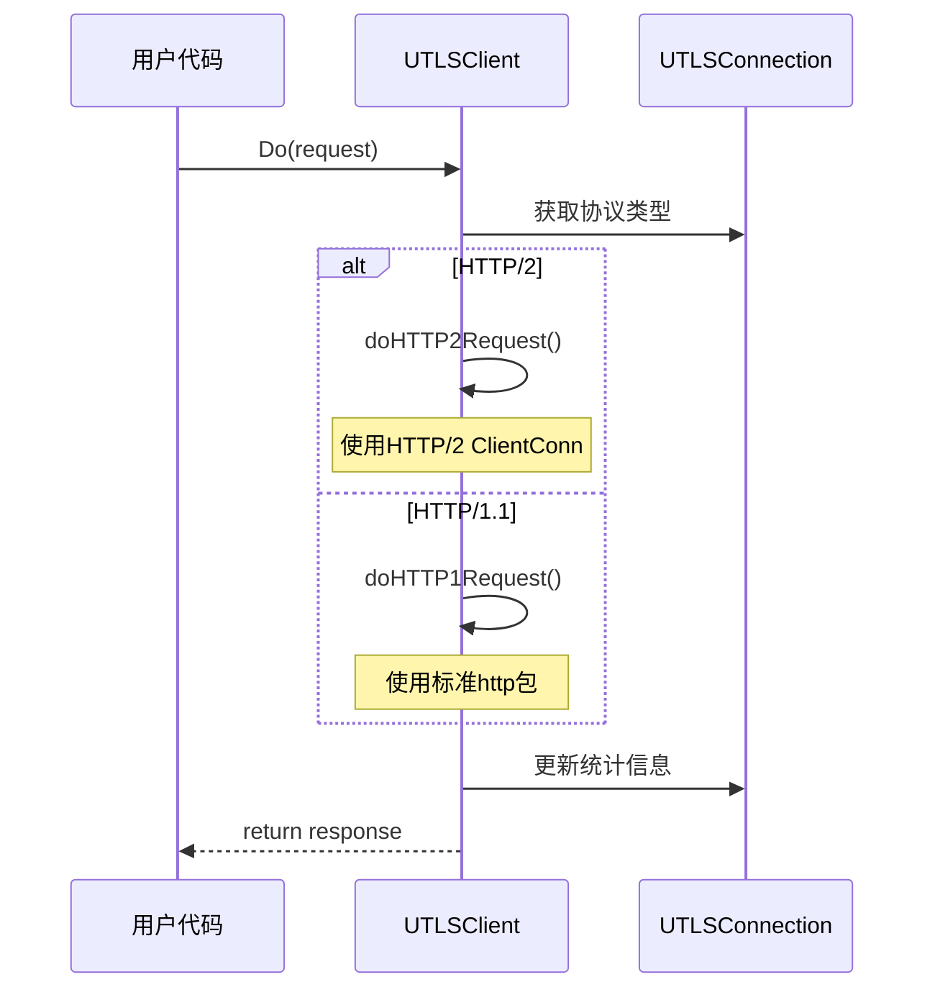
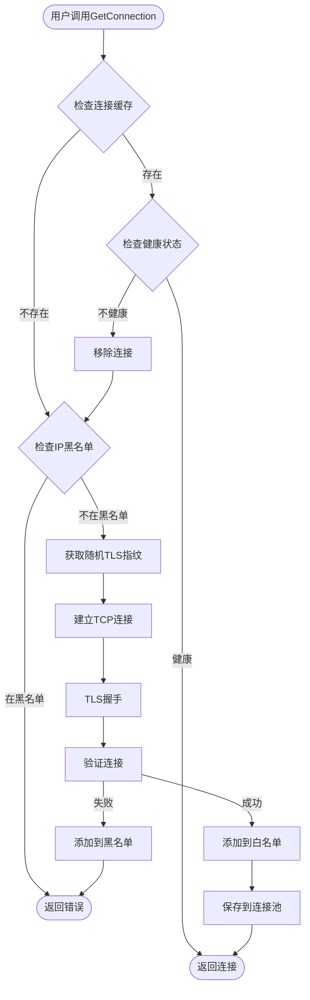
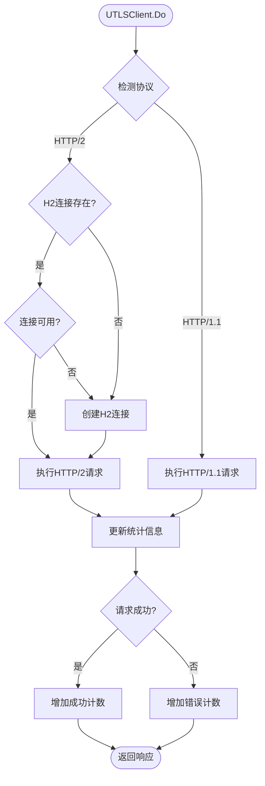
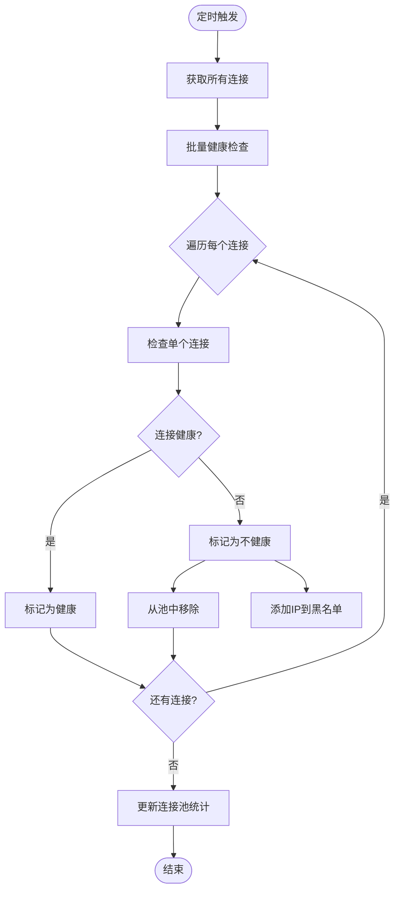
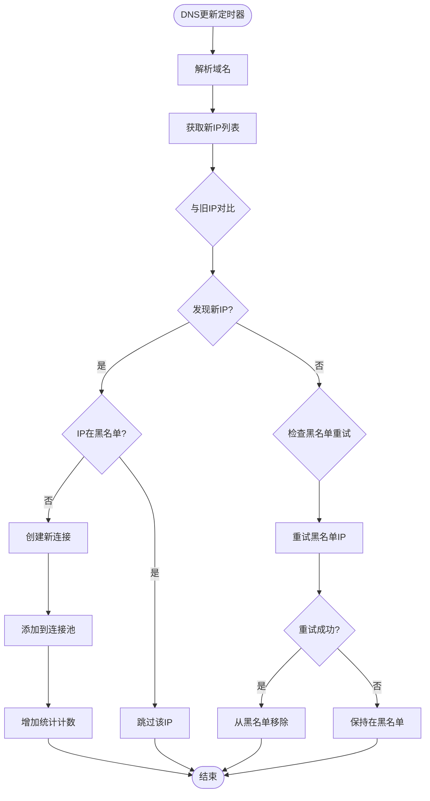

# 系统架构文档

> **文档版本**: v0.0.15  
> **最后更新**: 2025-11-20  
> **维护者**: crawler-platform团队

## 目录

- [系统概览](#系统概览)
- [架构原则](#架构原则)
- [模块视图](#模块视图)
- [数据流视图](#数据流视图)
- [并发模型](#并发模型)
- [扩展点设计](#扩展点设计)

## 系统概览

### 项目定位

crawler-platform 是一个专注于反爬虫场景的**高性能网络爬虫基础设施平台**，通过TLS指纹伪装和热连接池技术，提供接近真实浏览器的网络访问能力。

### 核心价值

- ✅ **显著降低被识别风险**: 通过33种真实浏览器TLS指纹和90种语言组合，模拟真实用户行为
- ✅ **大幅提升请求性能**: 热连接池技术实现3-6倍性能提升
- ✅ **简化复杂配置**: 封装TLS配置和连接管理的复杂性，提供简单易用的API
- ✅ **生产级可靠性**: 完善的健康检查、自动重试、死锁预防机制

### 主要应用场景

| 场景 | 描述 | 技术要点 |
|------|------|----------|
| 大规模数据采集 | 需要高并发、高性能的网络请求 | 热连接池、连接复用 |
| Google Earth数据获取 | 解析四叉树、地形、影像数据 | Protobuf解析、数据处理 |
| 反爬虫场景 | 绕过基于TLS指纹的检测 | TLS指纹伪装、随机化 |
| 高性能连接复用 | 需要频繁访问同一域名 | HTTP/2复用、连接池 |

### 技术选型理由

| 技术 | 选择理由 |
|------|----------|
| **uTLS库** | 提供真实浏览器TLS指纹模拟能力，支持多种浏览器特征 |
| **HTTP/2** | 实现高效的连接复用，单连接可处理多个并发请求 |
| **组件化设计** | 模块职责清晰，便于扩展和定制 |
| **接口优先** | 降低模块间耦合，支持灵活替换实现 |
| **Protobuf** | 高效的二进制序列化，适合Google Earth数据处理 |

## 架构原则

### 1. 模块化设计

每个模块职责单一，边界清晰：

- **utlsclient**: HTTP客户端核心实现
- **utlshotconnpool**: 连接池管理
- **connection_manager**: 连接生命周期管理
- **health_checker**: 健康检查
- **connection_validator**: 连接验证
- **ip_access_controller**: IP访问控制

### 2. 接口优先

通过接口定义模块间契约，降低耦合：

```go
// IPPoolProvider 定义IP池提供者接口
type IPPoolProvider interface {
    GetIP() (string, error)
    GetIPsForDomain(domain string) []string
}

// AccessController 定义访问控制器接口
type AccessController interface {
    IsIPAllowed(ip string) bool
    AddIP(ip string, isWhite bool)
    GetAllowedIPs() []string
    GetBlockedIPs() []string
}

// HTTPClient 定义HTTP客户端接口
type HTTPClient interface {
    Do(req *http.Request) (*http.Response, error)
    DoWithContext(ctx context.Context, req *http.Request) (*http.Response, error)
}
```

### 3. 组件可替换性

通过接口实现组件的可插拔设计：

- IP池提供者可以是本地IP池或远程域名IP池
- 访问控制器可以自定义黑白名单策略
- HTTP客户端实现可以替换

### 4. 并发安全保证

多级锁机制确保并发安全：

- **连接池级锁**: 保护全局统计信息
- **连接管理器锁**: 保护连接集合
- **连接级锁**: 保护单个连接状态
- **HTTP/2连接锁**: 保护HTTP/2客户端连接

## 模块视图

### 核心模块清单

```
crawler-platform/
├── utlsclient/              # HTTP客户端核心
│   ├── utlsclient.go       # HTTP/1.1和HTTP/2客户端实现
│   ├── utlshotconnpool.go  # 热连接池
│   ├── utlsfingerprint.go  # TLS指纹库
│   ├── connection_manager.go      # 连接管理器
│   ├── health_checker.go          # 健康检查器
│   ├── connection_validator.go    # 连接验证器
│   ├── ip_access_controller.go    # IP访问控制器
│   └── interfaces.go              # 接口定义
├── GoogleEarth/             # Google Earth数据处理
│   ├── pb/                 # Protobuf生成代码
│   ├── quadtree_*.go       # 四叉树处理
│   ├── terrain.go          # 地形处理
│   └── gecrypt.go          # 加密解密
├── config/                  # 配置管理
├── logger/                  # 日志系统
├── localippool/            # 本地IP池
└── remotedomainippool/     # 远程域名IP池
```

### 模块职责定义

#### 1. utlsclient模块

**职责**: HTTP客户端核心实现，支持HTTP/1.1和HTTP/2

**关键类型**:
- `UTLSClient`: HTTP客户端，提供Do、Get、Post等方法
- `UTLSConnection`: 连接包装器，封装TCP连接和TLS连接

**依赖**:
- utlsfingerprint: 获取TLS指纹
- connection_helpers: 连接辅助函数

**对外接口**:
```go
func NewUTLSClient(conn *UTLSConnection) *UTLSClient
func (c *UTLSClient) Do(req *http.Request) (*http.Response, error)
func (c *UTLSClient) Get(url string) (*http.Response, error)
func (c *UTLSClient) Post(url string, contentType string, body io.Reader) (*http.Response, error)
```

#### 2. utlshotconnpool模块

**职责**: 连接池化、生命周期管理、健康检查

**关键类型**:
- `UTLSHotConnPool`: 热连接池实现
- `PoolConfig`: 连接池配置

**依赖**:
- connection_manager: 连接管理
- health_checker: 健康检查
- connection_validator: 连接验证
- ip_access_controller: IP访问控制

**对外接口**:
```go
func NewUTLSHotConnPool(config *PoolConfig) *UTLSHotConnPool
func (p *UTLSHotConnPool) GetConnection(targetHost string) (*UTLSConnection, error)
func (p *UTLSHotConnPool) PutConnection(conn *UTLSConnection)
func (p *UTLSHotConnPool) GetStats() PoolStats
```

#### 3. connection_manager模块

**职责**: 连接创建、存储、检索、清理

**关键类型**:
- `ConnectionManager`: 连接管理器

**功能**:
- 维护host到连接的映射
- 管理连接的添加、删除、查找
- 处理连接限制策略

#### 4. health_checker模块

**职责**: 连接可用性检测、批量健康检查

**关键类型**:
- `HealthChecker`: 健康检查器

**功能**:
- 定期批量检查连接健康状态
- 调用connection_validator验证连接
- 更新连接健康标记

#### 5. connection_validator模块

**职责**: 连接有效性验证、路径可达性测试

**关键类型**:
- `ConnectionValidator`: 连接验证器

**功能**:
- 基础健康检查
- 路径验证
- 完整URL验证
- 严格内容验证

#### 6. ip_access_controller模块

**职责**: 黑白名单管理、IP访问权限控制

**关键类型**:
- `IPAccessController`: IP访问控制器

**功能**:
- 维护IP黑白名单
- 检查IP是否允许访问
- 动态添加/移除IP

#### 7. utlsfingerprint模块

**职责**: 提供33种浏览器TLS指纹配置

**关键类型**:
- `Library`: 指纹库
- `Profile`: 指纹配置

**功能**:
- 随机选择TLS指纹
- 生成随机Accept-Language头
- 提供浏览器User-Agent

#### 8. GoogleEarth模块

**职责**: 四叉树数据解析、地形处理、坐标转换

**关键文件**:
- `quadtree_numbering.go`: 四叉树编号转换
- `quadtree_path.go`: 四叉树路径处理
- `terrain.go`: 地形数据处理
- `gecrypt.go`: 加密解密

### 模块依赖关系



### 模块交互时序

#### 连接获取流程



#### 请求执行流程



## 数据流视图

### 连接建立流程



### 请求处理流程



### 健康检查流程



### IP池管理流程



## 并发模型

### 多级锁策略

系统采用**四级锁机制**确保并发安全，同时避免死锁：

#### 1. 连接池级锁 (UTLSHotConnPool.mu)

- **类型**: `sync.RWMutex`
- **保护对象**: 连接池级别的统计信息和全局状态
- **锁粒度**: 粗粒度，仅在读写统计信息时使用
- **锁定时机**: 
  - `GetStats()`: 读锁
  - `IsHealthy()`: 读锁
  - `Close()`: 写锁

```go
// 示例: 获取统计信息
func (p *UTLSHotConnPool) GetStats() PoolStats {
    p.mu.RLock()
    defer p.mu.RUnlock()
    
    return p.stats
}
```

#### 2. 连接管理器锁 (ConnectionManager.mu)

- **类型**: `sync.RWMutex`
- **保护对象**: `connections` map 和 `hosts` map
- **锁粒度**: 中粒度，连接集合操作时使用
- **锁定时机**:
  - 添加连接: 写锁
  - 删除连接: 写锁
  - 查找连接: 读锁

```go
// 示例: 添加连接
func (m *ConnectionManager) addConnection(conn *UTLSConnection) {
    m.mu.Lock()
    defer m.mu.Unlock()
    
    m.connections[key] = conn
    m.hosts[host] = append(m.hosts[host], conn)
}
```

#### 3. 连接级锁 (UTLSConnection.mu)

- **类型**: `sync.Mutex`
- **保护对象**: 单个连接的状态字段(`inUse`, `healthy`等)
- **锁粒度**: 细粒度，单连接操作时使用
- **锁定时机**:
  - 状态变更
  - 统计更新
  - 标记使用中/空闲

```go
// 示例: 更新连接状态
func (c *UTLSConnection) markInUse() {
    c.mu.Lock()
    defer c.mu.Unlock()
    
    c.inUse = true
    c.lastUsed = time.Now()
}
```

#### 4. HTTP/2连接锁 (UTLSConnection.h2Mu)

- **类型**: `sync.Mutex`
- **保护对象**: `h2ClientConn` 字段
- **锁粒度**: 细粒度，HTTP/2连接操作时使用
- **锁定时机**:
  - HTTP/2连接创建
  - HTTP/2连接访问
  - HTTP/2连接检查

```go
// 示例: 访问HTTP/2连接
func (c *UTLSConnection) getH2ClientConn() *http2.ClientConn {
    c.h2Mu.Lock()
    defer c.h2Mu.Unlock()
    
    return c.h2ClientConn
}
```

### 锁获取顺序

为了避免死锁，严格遵循以下锁获取顺序：

```
池级锁 → 管理器锁 → 连接级锁 → HTTP/2连接锁
```

**规则**:
1. 永远按照从粗到细的顺序获取锁
2. 不能在持有细粒度锁时尝试获取粗粒度锁
3. 如需同时持有多级锁，必须按顺序获取

### 死锁预防机制

#### 1. 避免嵌套锁

**问题场景**: 在持有管理器锁时调用需要连接级锁的方法

**解决方案**: 在获取连接级锁前释放管理器锁

```go
// ❌ 错误示例 - 可能死锁
func getConnection(host string) *UTLSConnection {
    m.mu.Lock()  // 管理器锁
    conn := m.connections[host]
    conn.markInUse()  // 需要连接级锁 - 嵌套锁!
    m.mu.Unlock()
    return conn
}

// ✅ 正确示例 - 先释放管理器锁
func getConnection(host string) *UTLSConnection {
    m.mu.Lock()
    conn := m.connections[host]
    m.mu.Unlock()  // 先释放管理器锁
    
    if conn != nil {
        conn.markInUse()  // 再获取连接级锁
    }
    return conn
}
```

#### 2. 双重检查模式

**问题场景**: 需要在无锁检查后再加锁验证

**解决方案**: 使用双重检查模式减少锁竞争

```go
// 双重检查模式
func getOrCreateConnection(host string) *UTLSConnection {
    // 第一次检查 - 无锁
    conn := m.quickLookup(host)
    if conn != nil && conn.IsHealthy() {
        return conn
    }
    
    // 第二次检查 - 加锁
    m.mu.Lock()
    defer m.mu.Unlock()
    
    conn = m.connections[host]
    if conn != nil && conn.IsHealthy() {
        return conn
    }
    
    // 创建新连接
    return m.createNewConnection(host)
}
```

#### 3. 超时机制

**问题场景**: 操作可能长时间阻塞

**解决方案**: 使用context控制操作时长

```go
func getConnectionWithTimeout(ctx context.Context, host string) (*UTLSConnection, error) {
    resultCh := make(chan *UTLSConnection, 1)
    errCh := make(chan error, 1)
    
    go func() {
        conn, err := getConnection(host)
        if err != nil {
            errCh <- err
        } else {
            resultCh <- conn
        }
    }()
    
    select {
    case conn := <-resultCh:
        return conn, nil
    case err := <-errCh:
        return nil, err
    case <-ctx.Done():
        return nil, ctx.Err()
    }
}
```

### 并发安全保证

#### 1. 导出方法并发安全

所有导出的公开方法都是**并发安全**的，可以被多个goroutine同时调用：

- `UTLSHotConnPool.GetConnection()` ✅
- `UTLSHotConnPool.PutConnection()` ✅
- `UTLSClient.Do()` ✅
- `ConnectionManager.addConnection()` ✅

#### 2. 内部状态保护

所有内部状态变更都通过锁保护：

```go
type UTLSConnection struct {
    mu          sync.Mutex
    inUse       bool      // 通过mu保护
    healthy     bool      // 通过mu保护
    requestCount int64    // 使用atomic操作
    errorCount   int64    // 使用atomic操作
}
```

#### 3. 原子操作

对于简单的计数器，使用`atomic`包提高性能：

```go
// 增加请求计数
atomic.AddInt64(&conn.requestCount, 1)

// 增加错误计数
atomic.AddInt64(&conn.errorCount, 1)
```

#### 4. 避免共享可变状态

尽可能避免在goroutine间共享可变状态：

- 使用通道传递数据
- 使用不可变数据结构
- 每个goroutine独立的本地状态

## 扩展点设计

### 1. IPPoolProvider接口

允许自定义IP池实现：

```go
type IPPoolProvider interface {
    GetIP() (string, error)
    GetIPsForDomain(domain string) []string
}
```

**内置实现**:
- `LocalIPPool`: 本地IP池
- `RemoteDomainIPPool`: 远程域名IP池

**扩展示例**:

```go
// 自定义IP池 - 从Redis获取
type RedisIPPool struct {
    client *redis.Client
}

func (p *RedisIPPool) GetIP() (string, error) {
    return p.client.SPop(context.Background(), "ip_pool").Result()
}

func (p *RedisIPPool) GetIPsForDomain(domain string) []string {
    ips, _ := p.client.SMembers(context.Background(), "ip:"+domain).Result()
    return ips
}

// 使用自定义IP池
pool := utlsclient.NewUTLSHotConnPool(config)
pool.SetIPPool(&RedisIPPool{client: redisClient})
```

### 2. AccessController接口

允许自定义访问控制策略：

```go
type AccessController interface {
    IsIPAllowed(ip string) bool
    AddIP(ip string, isWhite bool)
    GetAllowedIPs() []string
    GetBlockedIPs() []string
    RemoveFromBlacklist(ip string)
    AddToWhitelist(ip string)
}
```

**扩展示例**:

```go
// 基于时间窗口的访问控制
type TimeWindowAccessController struct {
    failures map[string][]time.Time
    threshold int
    window time.Duration
    mu sync.RWMutex
}

func (c *TimeWindowAccessController) IsIPAllowed(ip string) bool {
    c.mu.RLock()
    defer c.mu.RUnlock()
    
    failures := c.failures[ip]
    now := time.Now()
    
    // 统计时间窗口内的失败次数
    count := 0
    for _, t := range failures {
        if now.Sub(t) < c.window {
            count++
        }
    }
    
    return count < c.threshold
}
```

### 3. HTTPClient接口

允许自定义HTTP客户端实现：

```go
type HTTPClient interface {
    Do(req *http.Request) (*http.Response, error)
    DoWithContext(ctx context.Context, req *http.Request) (*http.Response, error)
    Get(url string) (*http.Response, error)
    Post(url string, contentType string, body io.Reader) (*http.Response, error)
    Head(url string) (*http.Response, error)
}
```

**扩展示例**:

```go
// 带速率限制的HTTP客户端
type RateLimitedClient struct {
    client *utlsclient.UTLSClient
    limiter *rate.Limiter
}

func (c *RateLimitedClient) Do(req *http.Request) (*http.Response, error) {
    // 等待速率限制
    if err := c.limiter.Wait(context.Background()); err != nil {
        return nil, err
    }
    
    return c.client.Do(req)
}
```

### 4. 自定义指纹库

扩展TLS指纹库：

```go
// 添加自定义指纹
func addCustomFingerprint(lib *utlsclient.Library) {
    customProfile := utlsclient.Profile{
        Name: "CustomBrowser v1.0",
        HelloID: utls.HelloCustom,
        UserAgent: "CustomBrowser/1.0",
        // ... 其他配置
    }
    
    lib.AddProfile(customProfile)
}
```

### 扩展最佳实践

1. **保持接口兼容**: 扩展时不要破坏现有接口
2. **文档完善**: 为自定义实现编写详细文档
3. **测试充分**: 编写单元测试和集成测试
4. **性能考虑**: 注意并发安全和性能影响
5. **错误处理**: 提供清晰的错误信息

## 相关文档

- [快速开始指南](QUICKSTART.md)
- [配置参考](docs/configuration/config-reference.md)
- [API参考](docs/api/)
- [开发指南](docs/development/)
- [性能测试报告](test/reports/热连接池性能测试报告.md)

## 版本历史

| 版本 | 日期 | 变更说明 |
|------|------|----------|
| v0.0.15 | 2025-11-20 | 初始架构文档创建 |
