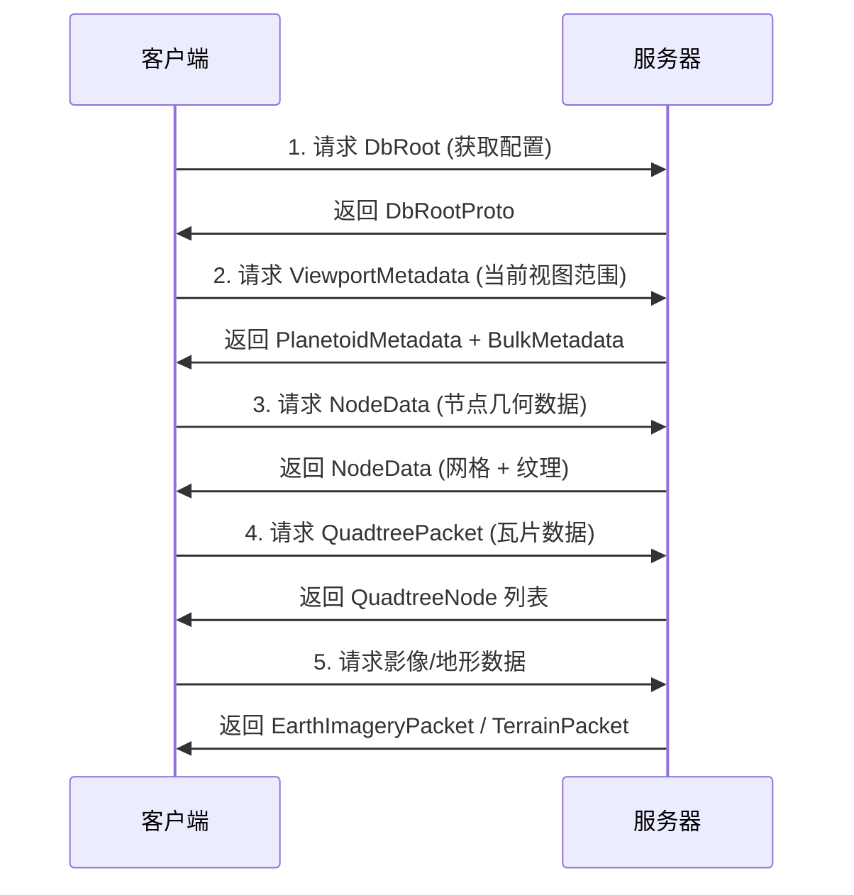

# GoogleEarth Proto 协议文档

## 概述

本文档提供 Google Earth Protocol Buffers 协议的完整中文说明。这些协议定义了 Google Earth 客户端与服务器之间的数据传输格式，涵盖了地球可视化所需的所有核心数据结构。

## 协议架构

Google Earth 数据系统采用分层架构设计：

```
┌─────────────────────────────────────────┐
│      数据库根层 (DbRoot)                 │
│  - 全局配置                              │
│  - 客户端选项                            │
│  - 服务器 URL                            │
└──────────────────┬──────────────────────┘
                   │
┌──────────────────┴──────────────────────┐
│    空间索引层 (RockTree + QuadTreeSet)   │
│  - 空间分块管理                          │
│  - LOD 层级控制                          │
│  - 瓦片元数据                            │
└──────────────────┬──────────────────────┘
                   │
┌──────────────────┴──────────────────────┐
│  数据内容层 (Diorama + Imagery + Terrain)│
│  - 3D 模型几何体                         │
│  - 卫星影像数据                          │
│  - 地形高程网格                          │
└─────────────────────────────────────────┘
```

## 协议文件清单

### 核心协议（必需）

| 协议文件 | Go 包 | 功能说明 | 文档链接 |
|---------|-------|---------|---------|
| **RockTree.proto** | GoogleEarth.RockTree | 空间索引与节点数据管理，是 Google Earth 的核心协议 | [RockTree.md](./RockTree.md) |
| **dbroot.proto** | GoogleEarth.dbroot | 数据库根配置、客户端选项和全局设置 | [dbroot.md](./dbroot.md) |
| **quadtreeset.proto** | GoogleEarth.Q2 | 四叉树数据集，组织瓦片的空间层次结构 | [quadtreeset.md](./quadtreeset.md) |

### 数据内容协议

| 协议文件 | Go 包 | 功能说明 | 文档链接 |
|---------|-------|---------|---------|
| **diorama_streaming.proto** | GoogleEarth | 全景流数据（3D 建筑、模型） | [diorama_streaming.md](./diorama_streaming.md) |
| **streaming_imagery.proto** | GoogleEarth | 影像流数据（卫星图、航拍） | [streaming_imagery.md](./streaming_imagery.md) |
| **terrain.proto** | GoogleEarth.Terrain | 地形数据（高程、水面） | [terrain.md](./terrain.md) |

## 快速开始

### 1. 环境准备

确保已安装以下工具：

```bash
# 检查 protoc 编译器版本
protoc --version  # 推荐 v3.12+

# 检查 Go protobuf 插件版本
protoc-gen-go --version  # 推荐 v1.28+
```

### 2. 导入生成的 Go 代码

```go
import (
    pb "crawler-platform/GoogleEarth/pb"
)
```

### 3. 添加依赖

在项目的 `go.mod` 中确保包含：

```go
require (
    google.golang.org/protobuf v1.36.10
)
```

## 使用流程

### 典型的数据加载流程



### 核心概念理解

#### 1. 节点（Node）

- **定义**：地球表面的一个空间分块区域
- **标识**：通过 NodeKey (path + epoch) 唯一标识
- **组织**：使用四叉树结构递归细分
- **内容**：包含该区域的几何网格、纹理和元数据

#### 2. LOD（Level of Detail）细节层次

- **用途**：根据视距动态加载不同精度的数据
- **实现**：通过 `meters_per_texel` 计算合适的细节级别
- **优化**：远处区域使用低精度，近处使用高精度

#### 3. 时间戳（Epoch）

- **作用**：数据版本控制和缓存管理
- **类型**：
  - `epoch`: 元数据版本
  - `imagery_epoch`: 影像数据版本
  - `cache_node_epoch`: 缓存版本

#### 4. 四叉树（Quadtree）

- **结构**：每个节点最多有4个子节点（东北、西北、东南、西南）
- **路径**：使用字符串路径表示位置（如 "0123" 表示递归子节点）
- **索引**：快速定位任意精度的地理区域

## 通用使用模式

### 创建消息

```go
// 示例：创建节点键值
nodeKey := &pb.NodeKey{
    Path:  proto.String("0123"),
    Epoch: proto.Uint32(12345),
}
```

### 序列化

```go
// 二进制序列化
data, err := proto.Marshal(nodeKey)
if err != nil {
    log.Fatal("序列化失败:", err)
}

// JSON 序列化（用于调试）
jsonData, err := protojson.Marshal(nodeKey)
```

### 反序列化

```go
// 二进制反序列化
nodeKey := &pb.NodeKey{}
err := proto.Unmarshal(data, nodeKey)
if err != nil {
    log.Fatal("反序列化失败:", err)
}

// JSON 反序列化
err = protojson.Unmarshal(jsonData, nodeKey)
```

### 访问字段

```go
// 使用 Get 方法（自动处理 nil）
path := nodeKey.GetPath()        // 返回值或默认值
epoch := nodeKey.GetEpoch()      // 返回值或0

// 直接访问（需要检查 nil）
if nodeKey.Path != nil {
    path := *nodeKey.Path
}
```

## 最佳实践

### 1. 性能优化

- **批量请求**：使用 `BulkMetadataRequest` 批量获取多个节点的元数据
- **缓存策略**：根据 epoch 值实现本地缓存，避免重复下载
- **按需加载**：只请求当前视口需要的节点数据

### 2. 内存管理

- **及时释放**：处理完大数据包后及时释放内存
- **对象池**：对频繁创建的消息对象使用对象池
- **流式处理**：对大文件使用流式解析而非一次性加载

### 3. 错误处理

```go
// 检查必填字段
if nodeData.NodeKey == nil {
    return errors.New("缺少必填字段 NodeKey")
}

// 验证数据完整性
if len(nodeData.Meshes) == 0 {
    log.Warn("节点没有网格数据")
}
```

### 4. 版本兼容性

- **向后兼容**：新增字段使用 optional，避免破坏现有客户端
- **版本检查**：使用 epoch 字段判断数据版本
- **优雅降级**：遇到未知字段时忽略而非报错

## 数据流示例

### 完整的节点加载流程

```go
package main

import (
    "log"
    pb "crawler-platform/GoogleEarth/pb"
    "google.golang.org/protobuf/proto"
)

func loadNodeData(path string, epoch uint32) error {
    // 1. 创建节点请求
    request := &pb.NodeDataRequest{
        NodeKey: &pb.NodeKey{
            Path:  proto.String(path),
            Epoch: proto.Uint32(epoch),
        },
        TextureFormat: pb.Texture_JPG.Enum(),
        OmitTexture:   proto.Bool(false),
    }
    
    // 2. 序列化请求（实际应用中发送到服务器）
    reqData, err := proto.Marshal(request)
    if err != nil {
        return err
    }
    
    // 3. 发送请求并获取响应（此处省略网络代码）
    // respData := sendToServer(reqData)
    
    // 4. 反序列化响应
    var nodeData pb.NodeData
    // err = proto.Unmarshal(respData, &nodeData)
    
    // 5. 处理节点数据
    log.Printf("加载节点 %s, 包含 %d 个网格", 
        nodeData.NodeKey.GetPath(), 
        len(nodeData.Meshes))
    
    // 6. 处理网格
    for i, mesh := range nodeData.Meshes {
        log.Printf("  网格 %d: %d 个顶点, %d 个纹理", 
            i, 
            len(mesh.GetVertices()),
            len(mesh.Texture))
    }
    
    return nil
}
```

## 常见问题

### Q1: proto2 和 proto3 有什么区别？

**A**: 本项目主要使用 proto2（RockTree、diorama_streaming、streaming_imagery、terrain、quadtreeset），部分使用 proto3（dbroot）。主要区别：
- proto2: 支持 required/optional 关键字，字段默认为 optional
- proto3: 所有字段都是 optional，移除了 required

### Q2: 如何处理 proto2 的 group 语法？

**A**: proto2 的 group 在 Go 中生成为嵌套结构体，例如：
```go
// proto: repeated group Object = 16 { ... }
// Go: DioramaMetadata_Object
```

### Q3: 为什么有些字段是指针类型？

**A**: proto2 中的 optional 字段在 Go 中生成为指针，这样可以区分"未设置"和"设置为零值"。使用 `GetXxx()` 方法可以安全访问。

### Q4: 如何选择合适的纹理格式？

**A**: 根据平台和性能需求选择：
- JPG: 通用格式，兼容性好
- DXT1/DXT5: PC 平台硬件压缩
- ETC1/HETC2: 移动平台硬件压缩
- PVRTC: iOS 平台优化

## 参考资源

### 官方文档

- [Protocol Buffers 官方文档](https://protobuf.dev/)
- [Go Protocol Buffers 教程](https://protobuf.dev/getting-started/gotutorial/)
- [protobuf-go API 参考](https://pkg.go.dev/google.golang.org/protobuf)

### 相关规范

- [WGS84 坐标系统](https://en.wikipedia.org/wiki/World_Geodetic_System)
- [四叉树数据结构](https://en.wikipedia.org/wiki/Quadtree)
- [LOD 细节层次技术](https://en.wikipedia.org/wiki/Level_of_detail_(computer_graphics))

### 项目资源

- [生成的 Go 代码](../../GoogleEarth/pb/)
- [Proto 源文件](../../GoogleEarth/proto/)

## 维护指南

### 重新生成代码

当 proto 文件发生变更时：

```bash
cd /home/stone/crawler-platform

# 生成所有 proto 文件的 Go 代码
protoc --go_out=GoogleEarth/pb \
       --go_opt=paths=source_relative \
       --proto_path=GoogleEarth/proto \
       GoogleEarth/proto/*.proto

# 验证编译
cd GoogleEarth/pb && go build .
```

### 更新依赖

```bash
# 更新 protobuf 库到最新版本
go get -u google.golang.org/protobuf

# 更新 go.mod
go mod tidy
```

## 贡献

如果发现文档错误或有改进建议，请：

1. 检查对应的 proto 源文件
2. 验证生成的 Go 代码
3. 提交问题报告或改进建议

---

**最后更新**: 2025-11-19  
**协议版本**: v1.0  
**生成工具**: protoc 3.21.12, protoc-gen-go v1.36.5
