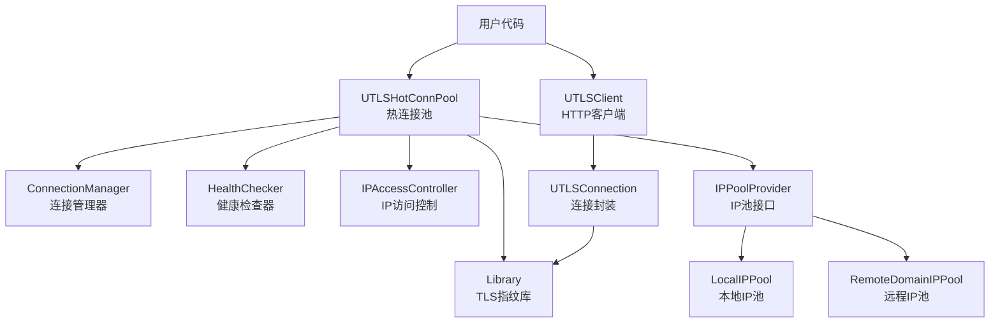

# 模块文档导航

本目录包含crawler-platform项目的各个核心模块的详细文档。

## 模块清单

| 模块 | 文档 | 说明 |
|------|------|------|
| 本地 IP 池 | [localippool.md](localippool.md) | 本地地址池、预热策略 |
| 远程域名 IP 池 | [remotedomainippool.md](remotedomainippool.md) | 远程域名分配/降级 |
| 黑白名单 IP 管理 | [whiteblackippool.md](whiteblackippool.md) | 黑白名单策略、链路隔离 |
| uTLS 指纹 | [utlsfingerprint.md](utlsfingerprint.md) | TLS 指纹库、UA/语言随机化 |
| 热连接池实现 | [utlshotconnpool.md](utlshotconnpool.md) | 热连接生命周期与调度 |
| uTLS 客户端文档集 | [docs/utlsclient/README.md](../utlsclient/README.md) | HTTP 客户端、连接管理、日志等 |
| Google Earth 数据处理 | [docs/googleearth/README.md](../googleearth/README.md) | 四叉树、地形、加密解密 |

> 说明：原先分散在 `docs/` 根目录的模块文档已经统一归档到本目录或对应子目录，避免重复和路径混乱。

## 快速导航

| 模块 | 文档 | 代码位置 | 相关测试 |
|------|------|----------|----------|
| Local IP Pool | [localippool.md](localippool.md) | `localippool/` | `test/store`（共享逻辑） |
| Remote Domain IP Pool | [remotedomainippool.md](remotedomainippool.md) | `remotedomainippool/` | `test/store` |
| White/Black IP Pool | [whiteblackippool.md](whiteblackippool.md) | `remotedomainippool/whiteblackippool.go` | `test/store` |
| uTLS Fingerprint | [utlsfingerprint.md](utlsfingerprint.md) | `utlsclient/utlsfingerprint.go` | `test/utlsclient/utlsfingerprint_test.go` |
| UTLS 热连接池 | [utlshotconnpool.md](utlshotconnpool.md) | `utlsclient/utlshotconnpool.go` | `test/utlsclient/utlshotconnpool_test.go` |
| uTLS Client 详细文档 | [utlsclient/README.md](../utlsclient/README.md) | `utlsclient/` | `test/utlsclient/*_test.go` |
| Google Earth | [googleearth/README.md](../googleearth/README.md) | `GoogleEarth/` | `test/googleearth/*` |

## 模块关系图

## 相关文档

- [系统架构](../../ARCHITECTURE.md) - 整体架构设计
- [API参考](../api/) - 详细的API文档
- [配置参考](../configuration/config-reference.md) - 配置说明
- [快速开始](../../QUICKSTART.md) - 快速上手指南

## 贡献指南

如果需要添加新模块或更新现有模块文档:

1. 创建对应的`.md`文件
2. 在本README中添加导航链接
3. 更新模块关系图
4. 提交Pull Request

详见 [贡献指南](../development/contributing.md)
