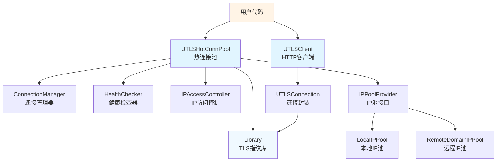

# 模块文档导航

本目录包含crawler-platform项目的各个核心模块的详细文档。

## 核心模块

### [uTLS客户端模块](utlsclient.md)
HTTP客户端核心实现，支持HTTP/1.1和HTTP/2协议，提供Do、Get、Post等方法。

**关键特性**:
- HTTP/1.1 和 HTTP/2 自动协商
- 请求超时和重试机制
- 调试模式支持

### [热连接池模块](hot-connection-pool.md)
连接池化管理，实现连接复用、生命周期管理和健康检查。

**关键特性**:
- 3-6倍性能提升
- 自动健康检查
- 连接统计信息

### [TLS指纹模块](tls-fingerprint.md)
提供33种真实浏览器TLS指纹，支持User-Agent和Accept-Language随机化。

**关键特性**:
- 33种浏览器指纹
- 90种语言组合
- 97.8%独特性

### [IP池管理模块](ip-pool-management.md)
管理本地IP池和远程域名IP池，支持黑白名单机制。

**关键特性**:
- 本地/远程IP池
- 黑白名单管理
- 自动IP降级

### [Google Earth数据处理](googleearth.md)
四叉树数据解析、地形处理、坐标转换和加密解密。

**关键特性**:
- 四叉树系统
- 地形数据处理
- Protobuf解析

## 快速导航

| 模块 | 文档 | 代码位置 | 测试 |
|------|------|----------|------|
| uTLS客户端 | [utlsclient.md](utlsclient.md) | `utlsclient/utlsclient.go` | `test/utlsclient/utlsclient_test.go` |
| 热连接池 | [hot-connection-pool.md](hot-connection-pool.md) | `utlsclient/utlshotconnpool.go` | `test/utlsclient/utlshotconnpool_test.go` |
| TLS指纹 | [tls-fingerprint.md](tls-fingerprint.md) | `utlsclient/utlsfingerprint.go` | `test/utlsclient/utlsfingerprint_test.go` |
| IP池管理 | [ip-pool-management.md](ip-pool-management.md) | `localippool/`, `remotedomainippool/` | - |
| Google Earth | [googleearth.md](googleearth.md) | `GoogleEarth/` | `test/googleearth/` |

## 模块关系图

## 相关文档

- [系统架构](../../ARCHITECTURE.md) - 整体架构设计
- [API参考](../api/) - 详细的API文档
- [配置参考](../configuration/config-reference.md) - 配置说明
- [快速开始](../../QUICKSTART.md) - 快速上手指南

## 贡献指南

如果需要添加新模块或更新现有模块文档:

1. 创建对应的`.md`文件
2. 在本README中添加导航链接
3. 更新模块关系图
4. 提交Pull Request

详见 [贡献指南](../development/contributing.md)
